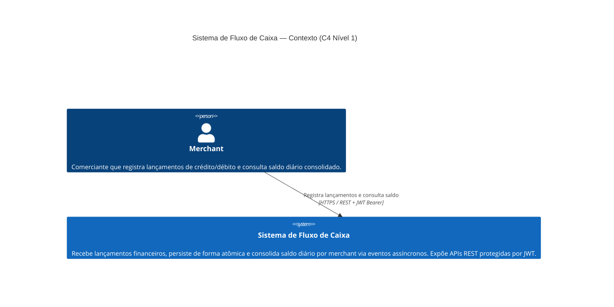
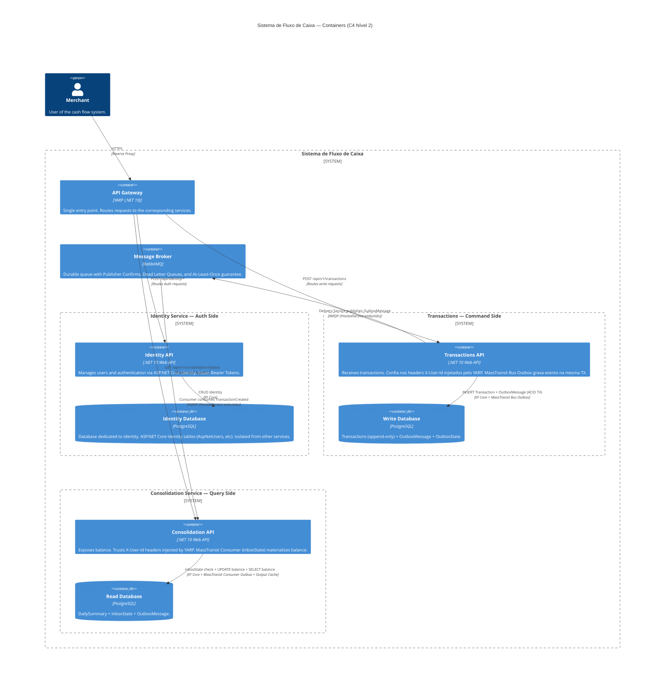
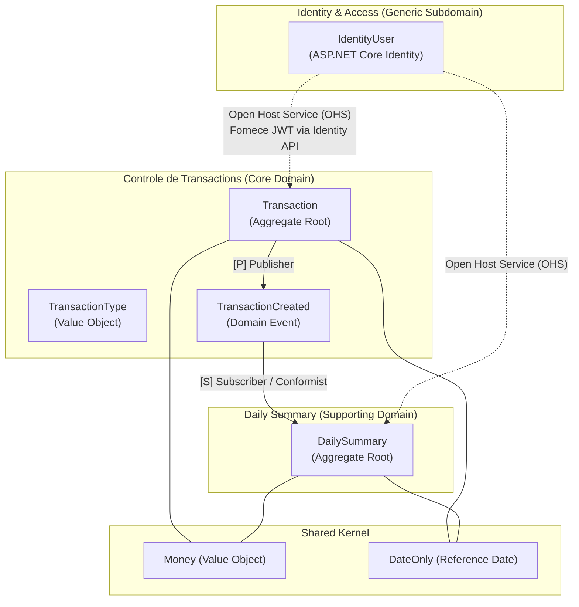
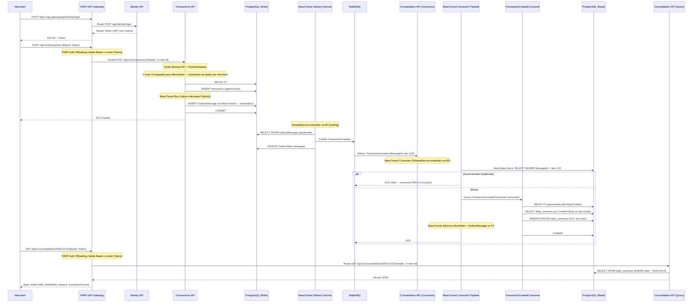
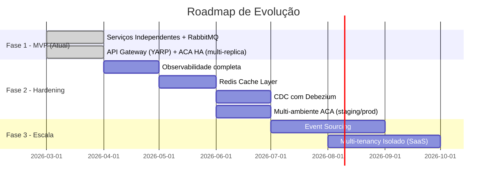

# Documento de Arquitetura — Sistema de Fluxo de Caixa

> **Autor:** Gabriel Padilha  
> **Stack:** C# / .NET 10  
> **Data:** Março 2026

---

## Sumário

1. [Visão Geral da Arquitetura](#1-visão-geral-da-arquitetura)
2. [Restrições e Requisitos](#2-restrições-e-requisitos)
3. [Decomposição de Domínio (DDD)](#3-decomposição-de-domínio-ddd)
4. [Architecture Decision Records (ADRs)](#4-architecture-decision-records-adrs)
    - [ADR-001: Topologia](#adr-001-topologia--serviços-independentes-com-api-gateway-sobre-monolito-modular)
    - [ADR-002: Mensageria](#adr-002-mensageria--rabbitmq--masstransit-bus-outbox--consumer-outboxinbox)
    - [ADR-003: Banco de Dados](#adr-003-banco-de-dados--postgresql-unificado-com-schemas-separados)
    - [ADR-004: Resiliência](#adr-004-resiliência--masstransit-retry-npgsql-e-httpclient-polly-v8)
    - [ADR-005: Concorrência](#adr-005-concorrência--append-only-writes--optimistic-concurrency--particionamento-de-consumer)
    - [ADR-006: API Gateway e Autenticação](#adr-006-api-gateway-e-autenticação-centralizada-yarp--aspnet-core-identity)
    - [ADR-007: Dead Letter Queue](#adr-007-dead-letter-queue-dlq--topologia-redelivery-e-recuperação-operacional)
    - [ADR-008: Alta Disponibilidade do Gateway](#adr-008-alta-disponibilidade-do-api-gateway-via-azure-container-apps--net-aspire)
    - [ADR-009: Testes E2E com .NET Aspire](#adr-009-estratégia-de-testes-e2e-com-net-aspire)
    - [ADR-010: Handlers via DI Direto](#adr-010-handlers-via-injeção-direta-de-dependência-sem-mediatrmediator)
5. [Fluxo de Dados e Integração](#5-fluxo-de-dados-e-integração)
6. [Garantia de NFRs](#6-garantia-de-nfrs)
7. [Boas Práticas e Padrões de Código](#7-boas-práticas-e-padrões-de-código)
8. [Evolução](#8-evolução)
- [Authorization Roadmap](#authorization-roadmap)
- [Apêndice: API Endpoints](#apêndice-api-endpoints-visão-do-cliente-via-gateway)
- [Apêndice: .NET Aspire AppHost](#apêndice-net-aspire-apphost)

---

## 1. Visão Geral da Arquitetura

### Resumo Executivo

O sistema adota uma arquitetura de **quatro processos deployáveis independentes** com Event-Driven Architecture (EDA) e CQRS: dois serviços de domínio (Transactions e Consolidation), um serviço de Identidade e um API Gateway (YARP). Os serviços de domínio comunicam-se exclusivamente via mensageria assíncrona (RabbitMQ) orquestrada pelo **MassTransit**. Cada serviço é deployado como um processo independente, garantindo que a falha em um **jamais** afete a disponibilidade dos demais.

| Princípio | Implementação |
|---|---|
| **Isolamento de Falhas** | Processos separados — crash do consolidation não afeta transactions |
| **CQRS** |  Transactions (Command) +  Consolidation (Query) |
| **Event-Driven** | Coreografia via eventos com **MassTransit** (Bus Outbox → RabbitMQ → Consumer Outbox/Inbox) |
| **Append-Only Writes** | Transactions são imutáveis (INSERT-only), eliminando race conditions |
| **Idempotência** | MassTransit Consumer Outbox garante exactly-once via `InboxState` built-in |
| **Observabilidade** | .NET Aspire + OpenTelemetry (traces, metrics, logs) |

### Topologia — Por que NÃO Monolito Modular

O requisito mais crítico do sistema é:

> *"O serviço de controle de transactions NÃO PODE ficar indisponível se o sistema de daily consolidation cair."*

Um Monolito Modular (processo único) **não pode** atender a este requisito: uma `OutOfMemoryException`, `StackOverflowException` ou crash não-tratado em qualquer módulo derruba o processo inteiro — incluindo módulos saudáveis. **Isolamento de falhas real exige isolamento de processo.**

#### Espectro Topológico e Posição Escolhida

```
Monolito  →  Monolito Modular  →  Serviços Independentes  →  Microsserviços
(1 proc.)    (1 proc., N mods)    (2 proc., repo único)      (N proc., N repos)
                                         ▲
                                    ESCOLHIDO
```

A posição escolhida é **Serviços Independentes com Shared Codebase e API Gateway** — o ponto de equilíbrio entre isolamento de falhas, experiência do cliente (BFF) e simplicidade operacional:

| Aspecto | Monolito Modular ❌ | Serviços Independentes c/ Gateway ✅ | Microsserviços Full ❌ |
|---|---|---|---|
| Isolamento de falhas | Não garante | Garantido (processos separados) | Garantido |
| Complexidade operacional | Baixa | Moderada (4 processos: YARP + 3 APIs) | Alta (K8s, service mesh) |
| Repositório | 1 repo | 1 repo (shared codebase) | N repos |
| Deploy | 1 artefato | 4 artefatos (Gateway, Identity, Transactions, Consolidation) | N artefatos + orquestração |
| API Gateway | Desnecessário | **YARP (Yet Another Reverse Proxy)** | Necessário |
| Shared Kernel | In-process | Projeto NuGet interno | Contratos via DTOs/Protobuf |
| Custo infra | Mínimo | Baixo | Alto |

### Diagrama de Contexto (C4 Model — Nível 1)

O diagrama de contexto mostra o sistema como caixa-preta e suas interações com atores externos. No escopo atual, o único ator é o **Merchant** (comerciante) que interage via APIs REST protegidas por JWT. Não há integrações com sistemas externos (ERP, bancos, gateways de pagamento) — essa é uma decisão deliberada de escopo para a versão 1.0.



### Diagrama de Containers (C4 Model — Nível 2)



### Estrutura do Projeto (Vertical Slice Architecture + DDD)

> **Nota**: O projeto adota **Vertical Slice Architecture** combinado com **Domain-Driven Design**, organizando o código por *Features* (Funcionalidades) em vez de camadas técnicas horizontais. O **Domain** é o núcleo invariante — Aggregate Roots, Value Objects e Domain Events protegem regras de negócio. As **Feature Slices** são orquestradoras — coordenam o fluxo (endpoint → validation → handler → domínio → persistência → resposta). O MassTransit elimina a necessidade de processos separados para Outbox e Consumer. Ambos rodam como `IHostedService` embutidos nas respectivas APIs.

```
src/
├── CashFlow.Domain/                          # Núcleo Invariante (Aggregates, VOs, Events, Ports)
│   ├── SharedKernel/                         #   Entity<T>, ValueObject, Result<T>, DomainEvent, Money
│   ├── Transactions/                     #   Transaction (AR), TransactionId, TransactionType,
│   │                                         #   TransactionCreated (Event), ITransactionRepository (port)
│   └── Consolidation/                         #   DailySummary (AR), DailySummaryId,
│                                             #   IDailySummaryRepository (port)
│
├── CashFlow.Gateway/                         # Projeto YARP (.NET 10) atuando como API Gateway / BFF
│
├── CashFlow.Identity.API/                    # API HTTP independente para Autenticação
│   └── Features/
│       └── Authentication/                   #   Endpoints MapIdentityApi
│
├── CashFlow.Transactions.API/                 # API HTTP + MassTransit Bus Outbox (Command Side)
│   ├── Features/
│   │   ├── CreateTransaction/                  #   Endpoint (Carter), Command, Handler, Validator, Response
│   │   └── GetTransaction/                  #   Endpoint (Carter), Query+Handler (single-file), Response
│   ├── Persistence/                          #   DbContext, Repository, EF Configurations
│   │   ├── TransactionsDbContext.cs
│   │   ├── TransactionRepository.cs           #   ITransactionRepository implementation (adapter)
│   │   └── Configurations/
│   │       └── TransactionConfiguration.cs    #   IEntityTypeConfiguration<Transaction>
│   └── Program.cs
│
├── CashFlow.Consolidation.API/                 # API HTTP + MassTransit Consumer Outbox (Query Side)
│   ├── Features/
│   │   ├── GetDailyBalance/                 #   Endpoint (Carter), Query+Handler (single-file), Response
│   │   └── TransactionCreated/                 #   MassTransit Consumer + ConsumerDefinition
│   ├── Persistence/                          #   DbContext, Repository, EF Configurations
│   │   ├── ConsolidationDbContext.cs
│   │   ├── DailySummaryRepository.cs           #   IDailySummaryRepository implementation (adapter)
│   │   └── Configurations/
│   │       └── DailySummaryConfiguration.cs
│   └── Program.cs
│
├── CashFlow.AppHost/                         # .NET Aspire — orquestração local de todos os recursos
├── CashFlow.ServiceDefaults/                 # OpenTelemetry, HealthChecks, Resiliência compartilhada

tests/
├── CashFlow.UnitTests/                       # xUnit + FluentAssertions — domain logic e handlers
├── CashFlow.IntegrationTests/                # WebApplicationFactory + Testcontainers — testando a fatia inteira
├── CashFlow.ArchitectureTests/               # NetArchTest — dependências de camada + disciplina VSA
├── CashFlow.E2ETests/                        # DistributedApplicationTestingBuilder — fluxo completo via AppHost
```

#### Convenção de Arquivos por Feature Slice

| Tipo de Feature | Convenção | Exemplo |
|---|---|---|
| **Command** (write, validation, domain logic) | Multi-file: Endpoint + Command + Handler + Validator + Response (separados) | `CreateTransaction/` |
| **Query** (read simples, sem validation complexa) | Single-file: Query + Handler no mesmo arquivo + Response separado | `GetTransaction/` |
| **Event Consumer** (MassTransit) | Single-file: Consumer + ConsumerDefinition no mesmo arquivo | `TransactionCreated/` |

> **Regra de Ownership:** Se um artefato serve a uma **única feature**, ele fica dentro da feature. Se serve a **múltiplas features** (DbContext, EF Configurations, Repository), ele fica na pasta `Persistence/` compartilhada do serviço. Isso NÃO viola o VSA — a proibição é de camadas horizontais **entre projetos** (`Application.csproj`, `Infrastructure.csproj`). Uma pasta `Persistence/` **dentro** do mesmo `.csproj` da API é organização interna, não uma camada arquitetural.

**Processos em Runtime (4 deployáveis)**:
| Processo | Responsabilidade | MassTransit | Auth / Rede |
|---|---|---|---|
| `CashFlow.Gateway` (YARP) | Ponto único de entrada. **Valida Auth e injeta Headers.** | — | Oculta a malha e controla acesso |
| `CashFlow.Identity.API` | Cadastro e Login de Usuários | — | Emite Bearer Token via `MapIdentityApi` |
| `CashFlow.Transactions.API` | Recebe e persiste transactions | Bus Outbox + Delivery Service | Confia nos Headers do YARP (`X-User-Id`) |
| `CashFlow.Consolidation.API` | Consome eventos + expõe consolidation | Consumer Outbox/Inbox | Confia nos Headers do YARP (`X-User-Id`) |

---

## 2. Restrições e Requisitos

### Requisitos Técnicos

| # | Requisito | Status |
|---|---|---|
| RT-1 | Implementação em C# | ✅ .NET 10 |
| RT-2 | Testes | ✅ Unit, Integration, Architecture, Load, **E2E (Aspire)** |
| RT-3 | Boas práticas (SOLID, Design Patterns) | ✅ Vertical Slice Architecture + DDD (Ports & Adapters) |
| RT-4 | Repositório público (GitHub) | ✅ |
| RT-5 | README com instruções de como a aplicação funciona e como rodar localmente | ✅ `README.md` na raiz com diagrama Mermaid, exemplos curl, instruções de execução local via Aspire e Docker |

### Requisitos Não Funcionais

| # | NFR | Estratégia |
|---|---|---|
| NFR-1 | Transactions disponível se consolidation cair | Processos separados + comunicação assíncrona via RabbitMQ |
| NFR-2 | Consolidation suporta 50 req/s | PostgreSQL indexed query (~5000 q/s) + Output Cache |
| NFR-3 | ≤5% perda de requisições | Durable queues + Publisher Confirms + Inbox + DLQ → perda ~0% |
| NFR-4 | Throughput de ingestão de eventos ≥ 50 msg/s | 2 consumers + UsePartitioner(8) → ~66 msg/s com ~0% DbUpdateConcurrencyException |

---

## 3. Decomposição de Domínio (DDD)

### 3.1 Linguagem Ubíqua (Ubiquitous Language)

A comunicação entre a equipe de desenvolvimento e os especialistas de domínio (merchants/financeiro) baseia-se nos seguintes termos formais:

*   **Transaction:** O registro individual de uma movimentação financeira ocorrida no fluxo de caixa. É imutável após ser concretizado.
*   **Debit:** A cash outflow (expense, payment).
*   **Credit:** A cash inflow (sale, receipt).
*   **Value:** A quantia monetária (sempre positiva) associada a uma transaction.
*   **Daily Summary:** A visão materializada do fluxo de caixa de um dia específico, totalizando todos os credits e debits e exibindo o balance final.
*   **Balance:** O resultado da subtração dos totais de debits em relação aos totais de credits em um Daily Summary.
*   **Merchant:** O usuário (tenant lógico) que registra e visualiza seu fluxo de caixa diário.

### 3.2 Modelagem Estratégica: Subdomínios e Bounded Contexts

O espaço do problema foi particionado conforme as diretrizes do DDD Estratégico para focar o esforço técnico onde há maior value de negócio:

1.  **Controle de Transactions (Core Domain):** É o coração do negócio. Onde a precisão financeira, a captura da movimentação e a disponibilidade são críticas e geram o value principal para o merchant.
2.  **Daily Summary (Supporting Domain):** Apoia o *Core Domain* fornecendo uma visão compilada e rápida do balance. Não possui lógica de aprovação ou criação de regras financeiras, apenas tabulação e projeção rápida para leitura (Read Model).
3.  **Identidade e Acessos (Generic Subdomain):** Necessário para segurança, mas não oferece diferencial competitivo (qualquer sistema tem login). Utiliza-se uma solução "de prateleira" (ASP.NET Core Identity) encapsulada em seu próprio contexto.

### 3.3 Context Map

O relacionamento entre os contextos é governado por coreografia de eventos, garantindo baixo acoplamento em tempo de execução.



> **Nota de Design:** O contexto de *Daily Summary* atua de forma **Conformista (Conformist)** em relação aos eventos de *Transactions*, pois consome o evento `TransactionCreated` exatamente no formato publicado pelo upstream, sem necessidade de uma *Anti-Corruption Layer (ACL)* complexa dado que os serviços compartilham o mesmo repositório e compreendem o *Shared Kernel* (ex: o Value Object `Money`). Detalhes técnicos de rede (como chaves de Data Protection) foram removidos deste mapa para manter o foco exclusivo no domínio.

### 3.4 Bounded Context 1 — Controle de Transactions (Core Domain)

**Responsabilidade**: Registrar transações financeiras (debits e credits) com precisão e alta disponibilidade. O *Aggregate* atua como fronteira de consistência transacional.

**Localização no código**: `CashFlow.Domain/Transactions/` — contém o Aggregate Root, Value Objects, Domain Events e a **interface** do Repository (`ITransactionRepository` — port). A implementação do Repository (adapter) vive em `CashFlow.Transactions.API/Persistence/`.

**Aggregate Root `Transaction`**: Imutavel apos criacao (Append-Only). Propriedades: `MerchantId` (Value Object), `ReferenceDate`, `Type` (Credit/Debit), `Value` (Money), `Description`, `CreatedAt`, `CreatedBy`. Construtor privado; criacao exclusivamente via factory method `Transaction.Create(...)` que usa Result Pattern — retorna `Result.Failure` se o valor nao for positivo ou a descricao estiver vazia. O factory method emite o Domain Event `TransactionCreated` na mesma transacao (preservando a fronteira de consistencia).

**Value Objects (Shared Kernel)**:
- **`MerchantId`** — `readonly record struct` que rejeita `Guid.Empty` no construtor, garantindo isolamento de dados por merchant.
- **`Money`** — `sealed record` com validacao ISO 4217 (moeda de 3 letras), operadores `+` e `-` com validacao de moeda compativel, e factory `Money.Zero`.
- **`TransactionType`** — enum com valores `Credit = 1` e `Debit = 2`.

**Invariantes Protegidas**: O value financeiro deve ser estritamente positivo (a natureza de credit/debit é dada pelo `TransactionType`), a description é obrigatória, e a imutabilidade é garantida pós-criação. O `TimeProvider` injetável permite testes determinísticos.

### 3.5 Bounded Context 2 — Daily Summary (Supporting Domain)

**Responsabilidade**: Materializar e projetar o balance consolidation por dia para leitura de altíssima performance. Atua reagindo a Domain Events.

**Localização no código**: `CashFlow.Domain/Consolidation/` — contém o Aggregate Root, Value Objects e a **interface** do Repository (`IDailySummaryRepository` — port). A implementação do Repository (adapter) vive em `CashFlow.Consolidation.API/Persistence/`. O endpoint de leitura (`GetDailyBalance`) acessa o `ConsolidationDbContext` **diretamente** via projeção LINQ (sem Repository), pois é o lado Query do CQRS — não há invariantes a proteger em uma operação de leitura.

**Aggregate Root `DailySummary`**: Possui propriedades `MerchantId` (Value Object, isolamento por merchant), `Date`, `TotalCredits`, `TotalDebits` (ambos `Money`, mutaveis apenas via metodo de dominio), `Balance` (propriedade derivada: `TotalCredits - TotalDebits`, nao persistida para evitar desalinhamento de estado), `TransactionCount` e `UpdatedAt`. Concorrencia via `xmin` (shadow property no EF Core). O metodo `ApplyTransaction(type, value)` valida que o valor e positivo, incrementa o total correspondente (credit ou debit), incrementa o contador e atualiza o timestamp. O factory method `CreateForDay(merchantId, date)` cria uma instancia com totais zerados. O `TimeProvider` injetavel permite testes deterministicos.

---

## 4. Architecture Decision Records (ADRs)

### ADR-001: Topologia — Serviços Independentes com API Gateway sobre Monolito Modular

| Campo | Value |
|---|---|
| **Status** | Aceito |
| **Contexto** | O NFR exige que o serviço de transactions continue disponível mesmo que o consolidation caia. Um monolito modular (processo único) não pode atender: um crash não-tratado em qualquer módulo derruba o processo inteiro. Adicionalmente, com múltiplos serviços independentes expostos, é necessário um ponto único de entrada para centralizar autenticação, roteamento e observabilidade — evitando que cada serviço backend precise gerenciar validation de tokens e exposição direta à rede pública. |
| **Decisão** | Adotar **quatro processos independentes**: dois serviços de negócio (Transactions e Consolidation), um serviço de identidade (Identity.API) e um API Gateway (YARP) como ponto único de entrada. Repositório compartilhado, comunicação assíncrona via RabbitMQ e organização interna via **Vertical Slice Architecture + DDD** (Domain Core como núcleo invariante, Feature Slices como orquestradoras). |
| **Justificativa** | O isolamento de falhas real exige isolamento de processo. Um crash na API do consolidation não afeta a API de transactions. O API Gateway (YARP) centraliza a validation do Bearer Token e propaga a identidade via headers (`X-User-Id`), removendo essa responsabilidade dos serviços de domínio — ver ADR-006. O Identity.API encapsula o serviço de autenticação em seu próprio processo, garantindo que uma eventual queda de Transactions.API não impeça novos logins. Cada API embute seus respectivos `IHostedService` do MassTransit (Delivery Service e Consumer), criando simetria arquitetural. O repositório compartilhado mantém a simplicidade operacional. A adoção de **Vertical Slices + DDD** permite criar funcionalidades coesas (Endpoint, Command/Query, Handler e DTOs juntos na feature) enquanto mantém as invariantes de negócio encapsuladas no **Domain Core** (Aggregates, Value Objects, Domain Events) — com interfaces de Repository como **ports** no Domain e **adapters** em `Persistence/`, seguindo o modelo Ports & Adapters. Carter gerencia as Minimal APIs focadas na feature. |

**Trade-offs**:

| Serviços Independentes c/ Gateway ✅ | Monolito Modular ❌ | Microsserviços Full ❌ |
|---|---|---|
| Isolamento de falhas real | Falha compartilhada | Isolamento máximo |
| 4 artefatos de deploy (Gateway, Identity, Transactions, Consolidation) | 1 artefato | N artefatos + K8s |
| 1 repo, CI/CD unificado | 1 repo | N repos, N pipelines |
| **YARP** como API Gateway leve (processo .NET, sem infra extra) | Desnecessário | API Gateway necessário (Kong, Envoy, etc.) |
| Auth centralizado no Gateway (ADR-006) | Auth em cada módulo | Auth distribuído ou IDP externo |
| **Custo: Baixo** | **Custo: Mínimo** | **Custo: Alto** |

**Threshold de migração**: Quando a equipe superar 5 devs ou a carga ultrapassar 500 req/s, avaliar extração para microsserviços com repos separados e substituição do YARP por um API Gateway dedicado (Kong, Envoy ou Azure API Management).

> **Risco identificado — YARP como SPOF (R1 — ALTO)**: O YARP, como ponto único de entrada, é um *Single Point of Failure* (SPOF) mais crítico do que os serviços de domínio que ele protege. Uma queda do processo do Gateway torna todo o sistema inacessível externamente, mesmo que Transactions e Consolidation estejam saudáveis. **Mitigação documentada no ADR-008**: o YARP roda como **Azure Container App com múltiplas réplicas e ingress externo**. O ACA gerencia automaticamente o balanceamento de tráfego, health checks e reinicializações, eliminando o SPOF — sem necessidade de Nginx, HAProxy ou gestão manual de Kubernetes. O YARP é **stateless por design** — não mantém estado de sessão próprio —, permitindo escala horizontal direta sem sincronização de estado entre instâncias. A alta disponibilidade do Gateway está disponível imediatamente via ACA. Ver **ADR-008** para a solução completa de alta disponibilidade do Gateway via ACA + .NET Aspire.

---

### ADR-002: Mensageria — RabbitMQ + MassTransit (Bus Outbox + Consumer Outbox/Inbox)

| Campo | Value |
|---|---|
| **Status** | Aceito |
| **Contexto** | A comunicação entre transactions e consolidation deve ser assíncrona, durável e tolerante a falhas. O dual-write problem (gravar no DB e publicar no broker como operações separadas) pode causar perda de eventos. |
| **Decisão** | **RabbitMQ** como message broker + **MassTransit** como framework de mensageria, usando nativamente o **Bus Outbox** (produtor) e o **Consumer Outbox** (que inclui Inbox para idempotência). |

#### Como o MassTransit resolve Outbox + Inbox nativamente

O MassTransit possui dois componentes no seu **Transactional Outbox** (pacote `MassTransit.EntityFrameworkCore`):

**1. Bus Outbox** (Produtor — no  Transactions):
- Quando configurado com `UseBusOutbox()`, o MassTransit **substitui** as implementações de `ISendEndpointProvider` e `IPublishEndpoint` por versões que gravam na tabela `OutboxMessage` do banco — **não no broker**.
- As mensagens são gravadas **na mesma transação** do `DbContext.SaveChangesAsync()`.
- Um **Delivery Service** (`IHostedService` embutido na API) faz polling na tabela `OutboxMessage` e entrega ao broker.
- A tabela `OutboxState` garante **ordenação** e **lock distribuído** para múltiplas instâncias.

**2. Consumer Outbox** (Consumidor — na API do Consolidation, como `IHostedService` embutido):
- É uma **combinação de Inbox + Outbox** no consumer.
- **Inbox** (tabela `InboxState`): rastreia mensagens recebidas por `MessageId` por endpoint. Garante **exactly-once consumer behavior**.
- **Outbox do Consumer**: se o consumer publicar/enviar mensagens durante processamento, elas são armazenadas até o consumer completar com sucesso.

> **Impacto**: Isso elimina a necessidade de implementar Outbox e Inbox manualmente. O MassTransit gerencia as 3 tabelas (`InboxState`, `OutboxMessage`, `OutboxState`) automaticamente via EF Core.

#### Outbox Pattern — O Problema que o MassTransit Resolve

```
Sem Outbox (PERIGOSO — dual-write):
1. INSERT Transaction    ← ✅ Sucesso
2. COMMIT
3. Publish("evento")   ← ❌ RabbitMQ fora? Evento PERDIDO.

Com MassTransit Bus Outbox (SEGURO — transação ACID):
1. BEGIN TRANSACTION
2.   INSERT Transaction                    ← Dados de negócio
3.   INSERT OutboxMessage (via MassTransit)← Evento na mesma TX (automático)
4. COMMIT                                 ← ACID: ambos ou nenhum
5. [Delivery Service] Poll + Publish      ← IHostedService embutido na API
```

#### Inbox Pattern — Como o MassTransit Garante Idempotência

```
Sem Inbox (PERIGOSO):
1. Consumer recebe "TransactionCreated"
2. UPDATE balance += 100           ← ✅
3. ACK                           ← ❌ Timeout! RabbitMQ reenvia.
4. UPDATE balance += 100 (de novo) ← DUPLICADO! Balance errado.

Com MassTransit Consumer Outbox (InboxState — SEGURO):
1. Consumer recebe "TransactionCreated" (MessageId: abc-123)
2. MassTransit verifica InboxState: SELECT WHERE MessageId = 'abc-123'
   → Não existe → Prossegue
3. BEGIN TRANSACTION (gerenciado pelo MassTransit)
4.   Executa Consumer (ApplyTransaction no Consolidation)
5.   INSERT InboxState (MessageId: abc-123)
6.   INSERT OutboxMessage (se consumer publicar algo)
7. COMMIT
8. ACK ao RabbitMQ
--- Se reenviado (MessageId: abc-123): ---
9. MassTransit verifica InboxState → JÁ EXISTE → SKIP automático
```

#### Configuração Concreta — Produtor (Transactions API)

No `Program.cs` da Transactions API, o MassTransit e configurado com `AddEntityFrameworkOutbox<TransactionsDbContext>` usando `UsePostgres()` (lock provider) e `UseBusOutbox()` (habilita o Bus Outbox com Delivery Service embutido). O transport e RabbitMQ configurado com `cfg.Host("rabbitmq://messaging")` e `cfg.ConfigureEndpoints(context)` para auto-discovery de consumers.

#### Configuração Concreta — Consumer (Consolidation API)

No `Program.cs` da Consolidation API, o MassTransit registra o `TransactionCreatedConsumer` com sua `ConsumerDefinition`, configura o Consumer Outbox (que inclui Inbox) com EF Core via `AddEntityFrameworkOutbox<ConsolidationDbContext>` (sem `UseBusOutbox()` — consumer nao e produtor primario), e usa RabbitMQ como transport. O consumer roda como `IHostedService` embutido na API.

A `TransactionCreatedConsumerDefinition` configura a pipeline canônica completa (documentada no ADR-005): `UseCircuitBreaker` → `UseDelayedRedelivery` (5min, 15min, 60min) → `UseMessageRetry` com retry exponencial (5 tentativas, 100ms-30s, jitter 50ms, trata apenas `DbUpdateConcurrencyException`) → `UseEntityFrameworkOutbox` como middleware mais interno (gerencia a TX que envolve o consumer). O `UsePartitioner(8)` é configurado em nível de mensagem no consumer.

#### DbContext com Tabelas do MassTransit

Ambos os DbContexts incluem as entidades do MassTransit em `OnModelCreating`: o `TransactionsDbContext` registra `OutboxMessage` e `OutboxState` (produtor — InboxState nao e necessario). O `ConsolidationDbContext` registra `InboxState` (idempotencia), `OutboxMessage` (Consumer Outbox) e `OutboxState` (estado de entrega).

#### Comparativo: MassTransit vs Implementação Manual

| Aspecto | MassTransit ✅ | Implementação Manual ❌ |
|---|---|---|
| Tabelas | 3 tabelas auto-gerenciadas via EF Core Migrations | Tabelas manuais + SQL DDL manual |
| Outbox Publisher | `IHostedService` embutido (Delivery Service) | Worker process separado + polling loop manual (~100 linhas) |
| Inbox/Idempotência | `InboxState` automático por endpoint + `MessageId` | Tabela `inbox_messages` + lógica de dedup manual (~50 linhas) |
| Lock distribuído | `OutboxState` com lock nativo (PostgreSQL advisory locks) | Implementação manual de row-level lock |
| Retries | Declarativo (`UseMessageRetry`) + delayed redelivery | `try/catch` + loop manual |
| Processos necessários | **2** (API Transactions + API Consolidation) | **4** (API + Outbox Worker + Worker + API Consolidation) |
| Linhas de código | ~30 linhas de configuração | ~300+ linhas de infraestrutura |

#### Comparativo de Mensageria (Broker)

| Critério | RabbitMQ ✅ | Kafka | Azure Service Bus |
|---|---|---|---|
| Throughput p/ 50 msg/s | Trivial (~30k msg/s) | Overkill (~1M msg/s) | Suficiente |
| Complexidade | Baixa (1 container) | Média (1 container em modo KRaft desde 3.3+, mas configuração de tópicos, retenção e offset management mais complexos) | Nenhuma (PaaS) |
| Custo | Open-source | Open-source, mais infra | Pago (~$0.05/1k msgs) |
| Dead Letter Queue | Nativo | Requer implementação | Nativo |
| Ecossistema .NET | **MassTransit (maduro, built-in Outbox/Inbox)** | Confluent.Kafka (sem Outbox integrado) | Azure.Messaging |
| Vendor lock-in | Nenhum | Nenhum | Azure-only |

---

### ADR-003: Banco de Dados — PostgreSQL Unificado com Schemas Separados

| Campo | Value |
|---|---|
| **Status** | Aceito |
| **Contexto** | CQRS sugere stores separados para reads e writes. A questão é: PostgreSQL + PostgreSQL, PostgreSQL + Redis, ou outra combinação? |
| **Decisão** | **PostgreSQL** para ambos os lados (write e read), com **bancos separados por serviço** (`transactions-db`, `consolidation-db`, `identity-db`) dentro do mesmo servidor PostgreSQL. Cada banco usa seu próprio schema principal (`transactions`, `consolidation`) — o isolamento é em nível de banco (database), não apenas de schema, o que garante que as migrations EF Core de cada serviço sejam completamente independentes. |

> **Nota sobre isolamento de bancos vs. schemas**: O Aspire `postgres.AddDatabase("transactions-db")` cria um **banco (database) separado** dentro do servidor PostgreSQL — não um schema dentro do mesmo banco. A modelagem fisica usa schemas nomeados (`transactions.transaction`, `consolidation.daily_summary`) para organização dentro de cada banco dedicado. As migrations EF Core são geradas e aplicadas independentemente em cada banco: `dotnet ef database update --project CashFlow.Transactions.API` e `dotnet ef database update --project CashFlow.Consolidation.API` nunca interferem entre si.

#### Por que NÃO Redis para o consolidation?

| Critério | PostgreSQL ✅ | Redis ❌ (para este cenário) |
|---|---|---|
| 50 req/s de leitura | ~5000 q/s single node (**100x margem**) | ~100k q/s (**2000x margem** — overkill) |
| Durabilidade | ACID nativo, WAL, crash recovery | In-memory — AOF tem gap de ~1s de perda potencial |
| Complexidade operacional | 1 tech stack para operar | +1 tech stack (persistência poliglota) |
| Custo operacional | 0 (já usa PostgreSQL para writes) | Container adicional + configuração AOF/RDB |
| Transações ACID para Inbox | Nativo | Requer Lua scripts ou MULTI/EXEC |
| Consultas analíticas (relatório por período) | `SELECT ... WHERE date BETWEEN` com índice | Requer scan de chaves ou sorted sets |

**Decisão**: PostgreSQL é mais que suficiente para 50 req/s e oferece durabilidade, transações e queries analíticas nativas. Redis seria justificado apenas a partir de ~1000 req/s no consolidation — nesse caso, como **cache** à frente do PostgreSQL (não substituto).

> **Se fosse usar Redis**: Seria como cache layer com `IOutputCacheStore` do ASP.NET Core, mantendo PostgreSQL como source of truth. Mas para 50 req/s, `[OutputCache(Duration = 5)]` no endpoint já é suficiente.

#### Modelagem Física

**Schema `transactions`** (otimizado para writes — append-only): Tabela `transaction` com colunas `id` (UUID PK), `reference_date` (DATE), `type` (SMALLINT: 1=Credit, 2=Debit), `value_amount` (DECIMAL 18,2), `value_currency` (VARCHAR 3, default 'BRL'), `description` (VARCHAR 500), `created_at` (TIMESTAMPTZ), `created_by` (VARCHAR 128) e `merchant_id` (UUID, isolamento por tenant). Indice em `reference_date`. O concurrency token usa `xmin` nativo do PostgreSQL (configurado via EF Core: ``Property<uint>("xmin").IsRowVersion()``). Tabelas `OutboxMessage` e `OutboxState` do Bus Outbox gerenciadas pelo MassTransit via migrations.

**Schema `consolidation`** (otimizado para reads): Tabela `daily_summary` com colunas `id` (UUID PK), `merchant_id` (UUID), `date` (DATE), `total_credits_amount` (DECIMAL 18,2), `total_debits_amount` (DECIMAL 18,2), `transaction_count` (INT) e `updated_at` (TIMESTAMPTZ). Indice unico composto em `(merchant_id, date)`. Concurrency via `xmin` (shadow property no EF Core). Tabelas `InboxState`, `OutboxMessage` e `OutboxState` do Consumer Outbox gerenciadas pelo MassTransit via migrations.

> **Nota**: As tabelas `OutboxMessage`, `OutboxState` e `InboxState` do MassTransit são criadas automaticamente via `modelBuilder.AddOutboxMessageEntity()`, `AddOutboxStateEntity()` e `AddInboxStateEntity()`. Não é necessário DDL manual para elas.

---

### ADR-004: Resiliência — MassTransit Retry, Npgsql e HttpClient (Polly v8)

| Campo | Value |
|---|---|
| **Status** | Aceito |
| **Contexto** | A comunicação assíncrona (MassTransit/RabbitMQ) e as conexões com PostgreSQL precisam de proteção contra falhas transitórias. O YARP também precisa de circuit breaker para os serviços backend. A arquitetura não possui chamadas HTTP síncronas entre serviços de domínio — toda comunicação inter-serviço é via RabbitMQ. Portanto, a estratégia de resiliência foca nos canais reais: mensageria, banco de dados e o YARP. |
| **Decisão** | **(1)** MassTransit `UseMessageRetry` com backoff exponencial no consumer (declarado na `ConsumerDefinition` — já documentado no ADR-002). **(2)** Reconexão automática ao RabbitMQ via configuração `AutoRecover` nativa do MassTransit. **(3)** Retry policy do Npgsql para falhas transitórias de banco, configurada via connection string. **(4)** `AddStandardResilienceHandler()` nos HttpClients globais via `ServiceDefaults` — usado pelo YARP para os backends internos e pelos health checks. |

A configuracao de resilience e centralizada no `ServiceDefaults` via `AddStandardResilienceHandler()` nos HttpClients globais (usado pelo YARP para backends internos), com: retry exponencial (3 tentativas, 500ms de delay), circuit breaker (failure ratio 50%, minimum throughput 10, timeout de 5s por tentativa). O Npgsql usa retry policy configurada na connection string (`Retry Max Count=3; Retry Connection Timeout=5`).

> **Nota**: O retry do consumer MassTransit (`UseMessageRetry`) está configurado na `TransactionCreatedConsumerDefinition` (ADR-002). O `UseDelayedRedelivery()` para Dead Letter Queue está documentado no ADR-007.

---

### ADR-005: Concorrência — Append-Only Writes + Optimistic Concurrency + Particionamento de Consumer

| Campo | Value |
|---|---|
| **Status** | Aceito |
| **Contexto** | Duas transactions simultâneas no mesmo dia podem causar race conditions no consolidation. Com 2 ou mais consumers processando mensagens do mesmo `(MerchantId, ReferenceDate)` em paralelo, a taxa de `DbUpdateConcurrencyException` pode atingir 30-50% em pico — todos os eventos convergem para a mesma linha `daily_summary`. Mesmo com `UseMessageRetry`, esse nível de contenção eleva a latência e desperdiça ciclos de banco com retentativas desnecessárias (retry storm). |
| **Decisão** | Tres camadas de proteção complementares: **(1)** Transactions são **append-only** (INSERT-only, nunca UPDATE). **(2)** **Particionamento do consumer por `(MerchantId, ReferenceDate)`** via `UsePartitioner` do MassTransit — mensagens do mesmo merchant e dia são processadas **sequencialmente** no mesmo slot de particao, eliminando concorrência no caso mais comum. **(3)** **Optimistic Concurrency** via `xmin` (PostgreSQL) como safety net para casos residuais (ex: failover entre instâncias). |

#### Análise de Race Conditions

**O problema sem particionamento (com 2 consumers):**
```
Consumer A: lê balance=100  → calcula 100+50=150  → grava 150  ← COMMIT OK
Consumer B: lê balance=100  → calcula 100-30=70   → grava 70
            xmin esperado: 0, atual: 1            → DbUpdateConcurrencyException!
            → UseMessageRetry reprocessa → lê balance=150 → calcula 150-30=120 → OK
            Taxa de excecao em pico: 30-50% quando muitas transactions convergem pro mesmo dia
```

**A solução (3 camadas de proteção):**

1. **Transactions são INSERT-only**: Dois INSERTs concorrentes **nunca conflitam**. Não existe "atualizar balance" no write-side.
2. **Particionamento por `(MerchantId, ReferenceDate)`**: Mensagens do mesmo merchant e dia caem no mesmo slot de partição, processadas sequencialmente — sem concorrência, sem `DbUpdateConcurrencyException`. Merchants e dias diferentes processam em paralelo (escalabilidade mantida).
3. **Optimistic Concurrency como safety net**: `xmin` (PostgreSQL system column) protege contra casos residuais (failover, mensagens fora de ordem entre partições distintas).

#### Configuração do Particionamento (UsePartitioner)

```
Sem particionamento (PROBLEMA):
  Consumer 1 ──► TransactionCreated(ComA, 2026-03-03) ──► UPDATE consolidation(ComA, 03-03)
  Consumer 2 ──► TransactionCreated(ComA, 2026-03-03) ──► UPDATE consolidation(ComA, 03-03) ← CONFLITO!

Com UsePartitioner(8, key=(MerchantId:ReferenceDate)):
  Slot 3 ──► TransactionCreated(ComA, 2026-03-03) ──► processado SEQUENCIALMENTE
  Slot 3 ──► TransactionCreated(ComA, 2026-03-03) ──► aguarda o anterior → sem conflito
  Slot 7 ──► TransactionCreated(ComB, 2026-03-04) ──► processado em PARALELO com Slot 3 ← OK
```

A `TransactionCreatedConsumerDefinition` configura a pipeline de middlewares na ordem LIFO (ultimo registrado = mais externo):

1. **`UsePartitioner`** (mais externo) — roteia para slot por `(MerchantId:ReferenceDate)` com 8 slots antes de qualquer retry. Mensagens com a mesma chave sao processadas sequencialmente; chaves diferentes em paralelo. Elimina `DbUpdateConcurrencyException` de 30-50% para ~0%.
2. **`UseDelayedRedelivery`** — envia para DLQ com delay exponencial (5m, 15m, 60m) apos esgotar retries imediatos. Requer plugin `rabbitmq_delayed_message_exchange` (ADR-007).
3. **`UseMessageRetry`** — retry exponencial com jitter de 50ms (5 tentativas, 100ms a 30s) para casos residuais.
4. **`UseEntityFrameworkOutbox`** (mais interno, ultimo registrado) — gerencia a TX que envolve o consumer. DEVE ser o ultimo para que InboxState check, logica de negocio e COMMIT ocorram numa unica transacao.

#### Consumer com Lógica de Negócio

O `TransactionCreatedConsumer` foca exclusivamente na logica de negocio — a idempotencia (InboxState) e gerenciada automaticamente pelo MassTransit via `UseEntityFrameworkOutbox`. O fluxo do consumer: (1) busca ou cria o `DailySummary` do dia para o merchant, (2) aplica a transaction via `DailySummary.ApplyTransaction()` (logica de dominio), (3) salva — o MassTransit faz commit da TX que inclui InboxState + OutboxMessage, e (4) invalida o cache de output para o merchant+data via `EvictByTagAsync`. O `UsePartitioner` (ADR-005) garante que nenhum outro consumer processa o mesmo `(MerchantId, ReferenceDate)` simultaneamente.

> **Impacto do particionamento**: O `UsePartitioner` reduz `DbUpdateConcurrencyException` de **30-50% (sem particionamento, 2 consumers em pico) para ~0% (com particionamento)**. O `xmin` (PostgreSQL system column) e o retry exponencial com jitter cobrem os casos residuais (failover, restart de instancia). O throughput efetivo por instancia aumenta porque menos ciclos sao desperdicados em retentativas — o T_total efetivo cai de ~40ms (com contenção) de volta para ~30ms (baseline).

> **Dimensionamento dos slots**: 8 slots suporta até 8 combinações `(MerchantId, ReferenceDate)` em paralelo por instancia de consumer. Para sistemas com muitos merchants e períodos distintos, aumentar para 16 ou 32 slots via configuracao de ambiente.

---

### ADR-006: API Gateway e Autenticação Centralizada (YARP + ASP.NET Core Identity)

| Campo | Value |
|---|---|
| **Status** | Aceito |
| **Contexto** | Temos múltiplas APIs independentes e ocultas na rede interna. Propagar tokens para os serviços backend exigiria que todas as APIs precisassem saber como validar tokens, consultar chaves ativas do STS ou possuir um middleware robusto de JWT/Cookie. Adicionalmente, se a emissão do token e a validation dele rodassem em `Transactions.API`, uma queda nesse serviço isolado impediria o próprio acesso de leitura ao `Consolidation.API`. |
| **Decisão** | **1.** Extrair a emissão de Token para o `CashFlow.Identity.API`.<br>**2.** Adotar o padrão **Gateway Auth Offloading** no **YARP**.<br> O Gateway será o **único** serviço exposto à rede, encarregado de validar o Token Bearer. Em caso de sucesso, o YARP decodifica os Claims, os extrai e repassa a identidade aos serviços downstream através de Headers HTTP limpos (ex: `X-User-Id`).<br>**3.** Os serviços backend (Transactions e Consolidation) não valenciam tokens, simplesmente abrem portas HTTP(s) em binding local (rede Docker restrita) e confiam completamente na Identidade propagada pelo Gateway. |
| **Justificativa** | Fazer o *Auth Offloading* centraliza a segurança e remove o peso e risco estrutural dos microsserviços do Core Domain. **O token emitido pelo Identity.API é um Bearer JWT** (configurado via `AddBearerToken()` no ASP.NET Core Identity), permitindo que o YARP valide e decodifique os claims diretamente — sem chamadas síncronas adicionais ao Identity.API por requisição. Os microsserviços downstream são agnósticos ao mecanismo de autenticação e apenas observam os headers de contexto (`X-User-Id`) injetados pelo Gateway. Isso garante a premissa de Isolamento de Falhas: cada serviço possui seu próprio banco dedicado (Identity, Transactions e Consolidation em bancos separados), eliminando acoplamento de schema e competição por recursos de banco entre contextos distintos. |

**Trade-offs**:

| Auth Offloading no YARP ✅ | Validation Distribuída ❌ | Identity Server Externo (Keycloak) |
|---|---|---|
| **Segurança**: Focada no Perímetro | Fragmentada em cada serviço | Padrão OIDC Seguro |
| **Backend**: Extremamente Leve (Headers) | Exige middleware Auth em todos | Extremamente Robusto mas pesado |
| **Isolamento de Falhas**: Máximo Desacoplamento | Key sharing required | Single Point of Failure no IDP |
| **Network Trust**: Assume "Zero Trust" no Perimeter e "Full Trust" no Backend | Zero Trust Everywhere | Zero Trust Everywhere |

---

### ADR-007: Dead Letter Queue (DLQ) — Topologia, Redelivery e Recuperação Operacional

| Campo | Value |
|---|---|
| **Status** | Aceito |
| **Contexto** | A tabela de tratamento de falhas (Seção 5) menciona Dead Letter Queue para mensagens corrompidas, mas sem estratégia de recuperação operacional. Em produção, mensagens que excedem todas as tentativas de retry precisam ser armazenadas de forma auditável e recuperáveis via processo controlado, sem perda de dados e sem reprocessamento duplicado. |
| **Decisão** | Adotar topologia de DLQ dedicada no RabbitMQ com `UseDelayedRedelivery()` no MassTransit, exchange `cashflow_dlx` e fila `cashflow_dlq`. Alerta operacional via métrica Prometheus. Replay controlado via MassTransit Management ou script de requeue. |

#### Topologia da DLQ no RabbitMQ

```
Mensagem falha (esgotou retries imediatos)
    ↓
UseDelayedRedelivery() — reenvia com delay exponencial (5m, 15m, 60m)
    ↓ (ainda falha após redeliveries)
Exchange: cashflow_dlx  (Direct Exchange — Dead Letter Exchange)
    ↓
Fila: cashflow_dlq      (fila durável, sem TTL — preserva para inspeção)
```

#### Pré-requisito: Plugin `rabbitmq_delayed_message_exchange`

> **⚠️ ATENÇÃO — Dependência operacional crítica**: `UseDelayedRedelivery` do MassTransit requer o plugin `rabbitmq_delayed_message_exchange` instalado no RabbitMQ. Sem o plugin, o `UseDelayedRedelivery` **falha silenciosamente** — as mensagens que esgotam os retries imediatos são descartadas em vez de recolocadas na fila com delay, comprometendo toda a estratégia de DLQ.

O plugin pode ser habilitado via CLI (`rabbitmq-plugins enable rabbitmq_delayed_message_exchange`), via Dockerfile customizado baseado em `rabbitmq:3-management`, ou via comando inline no docker-compose. No .NET Aspire AppHost, o container RabbitMQ deve usar uma imagem com o plugin ou ser configurado via `WithDockerfile` apontando para um Dockerfile customizado.

#### Configuração no MassTransit

A `TransactionCreatedConsumerDefinition` canônica (definida no ADR-005) configura `UseMessageRetry` com backoff exponencial e jitter de 50ms (5 tentativas, 100ms a 30s), seguido de `UseDelayedRedelivery` com intervalos de 5, 15 e 60 minutos antes de encaminhar para a DLQ. O `UseEntityFrameworkOutbox` e sempre o middleware mais interno (ultimo registrado). O MassTransit encaminha automaticamente para a DLQ apos esgotar todas as redeliveries.

#### Processo de Replay de Mensagens Mortas

1. **Identificação**: Monitorar a fila `cashflow_dlq` via Grafana (métrica `masstransit_dead_letter_count`).
2. **Inspeção**: Acessar o RabbitMQ Management UI ou usar o MassTransit Management API para inspecionar o payload e o motivo da falha (header `x-death`).
3. **Correção**: Corrigir a causa raiz (bug no consumer, dado inválido no payload, schema incompatível).
4. **Replay controlado**: Reencaminhar mensagens da `cashflow_dlq` para a exchange original via RabbitMQ HTTP API (Management) ou MassTransit Management. O processo consiste em buscar as mensagens da DLQ, inspecionar o payload, e republicar na exchange original com o payload corrigido.

#### Alerta Operacional

Um alerta Prometheus (`DLQMensagensMortas`, severity: warning) monitora a metrica `masstransit_dead_letter_count{queue="cashflow_dlq"}` e dispara se houver mensagens na DLQ por mais de 5 minutos, indicando necessidade de investigacao da causa raiz.

> **Garantia**: Com `UseDelayedRedelivery()` configurado, nenhuma mensagem é silenciosamente descartada. Toda falha persistente é preservada na DLQ e gera alerta operacional, permitindo auditoria e replay controlado.

---

### ADR-008: Alta Disponibilidade do API Gateway via Azure Container Apps + .NET Aspire

| Campo | Value |
|---|---|
| **Status** | Aceito (atualizado para ACA) |
| **Contexto** | O ADR-001 identifica o YARP como SPOF da topologia: uma única instância do Gateway derruba o acesso externo a todos os serviços, mesmo que Transactions e Consolidation estejam saudáveis. O runtime de produção é **Azure Container Apps (ACA)** e a orquestração local é **.NET Aspire (AppHost)**. O YARP é o único ponto de entrada — sem HA, é um SPOF mais crítico do que os problemas que a arquitetura resolve. O Azure Developer CLI (`azd`) lê o AppHost e provisiona a infraestrutura ACA automaticamente, servindo como ponte entre desenvolvimento local (Docker) e produção (ACA). |
| **Decisão** | O YARP roda como **Azure Container App com ingress externo e múltiplas réplicas**. O ACA gerencia automaticamente o balanceamento de tráfego, health checks e reinicializações. A eliminação do SPOF é delegada ao ACA — não requer Nginx, HAProxy ou gestão manual de Kubernetes. O `azd` provisiona toda a infraestrutura a partir do AppHost. |

#### Por que o ACA resolve o SPOF melhor do que alternativas

| Critério | Nginx/HAProxy | Kubernetes (self-managed) | Azure Container Apps ✅ |
|---|---|---|---|
| Gestão de réplicas | Manual | Automático (Deployment) | Automático (min/max replicas) |
| Restart em falha | Manual ou systemd | Automático (kubelet) | Automático (plataforma gerenciada) |
| Rolling update sem downtime | Complexo | Nativo (`RollingUpdate`) | Nativo (revisões automáticas) |
| Health check integrado | Configuração separada | Readiness/Liveness probes | Health probes nativas |
| TLS/certificados | Manual (Let's Encrypt, etc.) | cert-manager ou manual | Automático (managed TLS) |
| Integração com Aspire | Não | Via aspirate (community) | Nativo via `azd` (oficial) |
| Complexidade operacional | Alta | Média (requer cluster K8s) | Baixa (serverless gerenciado) |
| Custo operacional | Servidor dedicado | Cluster K8s ($$) | Pay-per-use (escala a zero possível) |

#### Topologia no Azure Container Apps

```
Internet
  │
  ▼
ACA Environment (managed TLS + ingress)
  │
  ├── Gateway (YARP) ──── ingress: externo, min: 2, max: 5 replicas
  │     │
  │     ├──→ Identity API ──── ingress: interno
  │     ├──→ Transactions API ──── ingress: interno
  │     └──→ Consolidation API ──── ingress: interno
  │
  ├── PostgreSQL Flexible Server (managed, fora do ACA Environment)
  └── RabbitMQ ──── Container App interno (sem ingress externo)
```

O `azd` provisiona automaticamente:
- **Container Apps Environment** — rede isolada para todos os containers
- **Gateway** — Container App com `WithExternalHttpEndpoints()` → ingress externo
- **Identity, Transactions, Consolidation** — Container Apps com ingress interno (acessíveis apenas dentro do Environment)
- **Azure Container Registry (ACR)** — para armazenar as imagens
- **PostgreSQL Flexible Server** — banco de dados gerenciado
- **RabbitMQ** — Container App interno para mensageria

#### Configuração YARP: Active + Passive Health Checks

Os serviços backend possuem health checks configurados no YARP para que o gateway detecte backends indisponíveis e pare de roteá-los. O YARP e configurado via `AddReverseProxy().LoadFromConfig()` com rotas para Identity (`/api/identity/*`), Transactions (`/api/v1/transactions/*`) e Consolidation (`/api/v1/consolidation/*`). Cada cluster configura:

- **Active Health Check**: polling a cada 10 segundos no path `/health` com timeout de 5 segundos.
- **Passive Health Check**: policy `TransportFailureRate` que detecta falhas nas respostas reais sem polling adicional, removendo o destino do balanceamento ate o periodo de reativacao (2 minutos).

> **Nota**: Os endereços dos destinos usam o **Aspire Service Discovery** com prefixo `https+http://` (tenta HTTPS primeiro, HTTP como fallback). Em produção (ACA), resolvem via DNS interno do Container Apps Environment. O `.AddServiceDiscoveryDestinationResolver()` no `Program.cs` do Gateway habilita essa resolução automática.

#### Aspire AppHost — Ponte Dev/Prod

O .NET Aspire serve como ponte entre o ambiente de desenvolvimento local (Docker) e o ambiente de produção (ACA). No AppHost, o Gateway e declarado com `WithExternalHttpEndpoints()` e referencia os tres servicos (Identity, Transactions, Consolidation). Em producao, o `azd` le essa declaracao e configura o Gateway Container App com ingress externo; servicos sem `WithExternalHttpEndpoints()` recebem ingress interno automaticamente.

#### Deploy via Azure Developer CLI (`azd`)

O `azd` lê o AppHost e provisiona toda a infraestrutura automaticamente: `azd provision` gera Bicep in-memory a partir do AppHost e provisiona os recursos Azure; `azd deploy` builda as imagens via `dotnet publish /t:PublishContainer` e faz deploy para ACA. Não há Dockerfiles nem manifests manuais — o `azd` gera tudo a partir do AppHost. O workflow de CD está em `.github/workflows/cd.yml`.

#### Session Affinity vs. Stateless

O YARP suporta Session Affinity via cookie ou header, mas **não deve ser ativado** nesta arquitetura. Justificativa:

| Critério | Stateless (recomendado) | Session Affinity (não recomendado aqui) |
|---|---|---|
| Tolerância a falha de instância | Requisições redistribuídas automaticamente | Requisições afetadas perdem afinidade |
| Escala horizontal | Transparente | Requer sincronização de "stickiness" |
| Compatibilidade com Auth Offloading | Perfeita — cada instância valida o token independentemente | Desnecessária — autenticação é sem estado |
| Complexidade | Nenhuma | Adiciona estado ao load balancer |

O Auth Offloading do YARP (ADR-006) valida o Bearer Token e injeta `X-User-Id` em cada requisição individualmente, sem depender de estado de sessão entre chamadas. Portanto, Session Affinity é tecnicamente desnecessária e operacionalmente prejudicial.

#### Cálculo de Disponibilidade (múltiplas réplicas)

Assumindo disponibilidade de 99,9% por réplica com min 2 réplicas:

```
P(falha de 1 réplica) = 0,1% → probabilidade = 0,001
P(todas as réplicas cairem simultaneamente) = 0,001² = 1 × 10⁻⁶ → 0,0001%
Disponibilidade efetiva: ≥ 99,9999% (~6 noves — independente de falhas de réplica)

O SPOF move-se para o Azure Container Apps Environment (plataforma
gerenciada pela Microsoft — SLA típico: 99,95%).
```

**Trade-offs**:

| Aspecto | Value |
|---|---|
| **Elimina SPOF?** | Sim — ACA gerencia réplicas e reinicializações |
| **Complexidade adicionada?** | Mínima — ACA é serverless, sem gestão de cluster |
| **Rolling updates zero-downtime?** | Sim — revisões automáticas nativas |
| **TLS gerenciado?** | Sim — managed certificates automáticos |
| **Stateless (obrigatório)?** | Sim — YARP não mantém estado de sessão |
| **Custo?** | Pay-per-use — escala baseada em tráfego real |

#### Consequências

- Os serviços backend (`transactions`, `consolidation`) devem expor `/health` (já configurado via `AddHealthChecks()` do .NET Aspire).
- O `AppHost` mantém a orquestração para desenvolvimento local (Docker).
- Em produção, o `azd` provisiona e deploya a partir do AppHost — sem manifests manuais.
- O YARP deve ser **stateless** (sem sticky sessions) — garantido pelo design atual (autenticação via JWT/headers, sem session server-side).
- Não são necessários Dockerfiles — o `azd` usa `dotnet publish /t:PublishContainer` para gerar imagens OCI diretamente.

---

### ADR-009: Estratégia de Testes E2E com .NET Aspire

| Campo | Value |
|---|---|
| **Status** | Aceito |
| **Contexto** | O sistema possui três camadas de testes automatizados: unitários (domínio isolado), integração (WebApplicationFactory + Testcontainers) e arquitetura (NetArchTest). Os testes de integração com `WebApplicationFactory` testam uma única API em isolamento — eles sobem o servidor HTTP de um único projeto, substituem serviços por mocks ou containers Testcontainers, e validam a fatia vertical individualmente. Esse modelo é rápido e preciso para testar comportamento de um serviço, mas tem um gap estrutural: **não exercita a comunicação assíncrona entre serviços via RabbitMQ em condições reais**. Cenários como "criar uma transaction via HTTP e verificar que o consolidation foi atualizado após a propagação pelo broker" exigem que todos os quatro processos estejam ativos simultaneamente, incluindo a infraestrutura de mensageria (RabbitMQ) e os três bancos PostgreSQL. O `CashFlow.AppHost` já orquestra exatamente essa topologia para desenvolvimento local. O .NET Aspire oferece a API `DistributedApplicationTestingBuilder` (pacote `Aspire.Hosting.Testing`) que reutiliza o `AppHost` como motor de testes E2E, subindo todos os serviços e infraestrutura com a mesma configuração de produção, mas em contexto de teste. |
| **Decisão** | Criar o projeto `CashFlow.E2ETests` usando `DistributedApplicationTestingBuilder` referenciando `CashFlow.AppHost`. Os testes E2E são responsáveis por validar **fluxos de negócio completos** que cruzam fronteiras de serviço — especialmente os que dependem de consistência eventual via MassTransit + RabbitMQ. Testes de comportamento dentro de um único serviço continuam em `CashFlow.IntegrationTests`. |

#### Diferença Fundamental entre Integration Tests e E2E Tests

| Dimensão | `CashFlow.IntegrationTests` | `CashFlow.E2ETests` |
|---|---|---|
| **Motor de boot** | `WebApplicationFactory<Program>` | `DistributedApplicationTestingBuilder` |
| **Escopo** | Uma única API em isolamento | Todos os 4 processos + PostgreSQL + RabbitMQ |
| **Infraestrutura** | Testcontainers (DB real, RabbitMQ real, mas levantados ad-hoc) | Aspire AppHost (mesma topologia do ambiente de desenvolvimento) |
| **Comunicação entre serviços** | Mockada ou não testada | Real (HTTP via Gateway + AMQP via RabbitMQ) |
| **Consistência eventual** | Não testada diretamente | Testada com polling + timeout explícito |
| **Velocidade de execução** | Rápida (~5-30s/suite) | Lenta (~60-120s/suite — boot de toda a topologia) |
| **Uso recomendado** | CI em cada commit/PR | CI em merge para `main` ou staging gate |
| **Granularidade de falha** | Alta — falha aponta para o serviço exato | Média — falha pode ser em qualquer nó da cadeia |

#### Quando Usar Cada Abordagem

- **Use `IntegrationTests`** para: validar regras de negócio de uma API (validações, retornos HTTP, comportamento do EF Core), testar o handler de um command/query, verificar que o endpoint retorna 401 sem token, testar o consumer MassTransit de forma isolada (injetando a mensagem diretamente sem broker).
- **Use `E2ETests`** para: validar que o fluxo completo `POST /api/v1/transactions` → RabbitMQ → Consumer → `GET /api/v1/consolidation/{date}` produz o resultado esperado; validar que o YARP roteia corretamente e injeta `X-User-Id`; validar que o sistema se comporta corretamente com os serviços de infraestrutura reais; smoke tests antes de deploy em staging.

#### Configuração do Projeto `CashFlow.E2ETests`

O projeto `CashFlow.E2ETests` referencia o `CashFlow.AppHost` (para que o `DistributedApplicationTestingBuilder` resolva via `Projects.*`) e utiliza os pacotes `Aspire.Hosting.Testing` (motor E2E), xUnit (runner), FluentAssertions (assertions) e `Microsoft.Extensions.Http.Resilience` (retry em falhas transitorias de boot). O timeout do runner xUnit e configurado para 300 segundos (5 minutos) para acomodar o boot do Aspire.

#### Fixture Compartilhada — Boot único por suíte de testes

O boot do Aspire AppHost leva entre 30 e 90 segundos (varia conforme a presença de imagens Docker em cache). Para evitar reboots entre cada teste, a fixture `CashFlowAppFixture` compartilha uma unica instancia do `DistributedApplication` por suite, usando `IAsyncLifetime` do xUnit para gerenciar o ciclo de vida. Os timeouts sao calibrados para a topologia completa: `StartupTimeout = 5 minutos`, `DefaultTimeout = 30 segundos`, `EventualConsistencyTimeout = 15 segundos`.

A fixture cria o builder via `DistributedApplicationTestingBuilder.CreateAsync<Projects.CashFlow_AppHost>()`, configura logging detalhado para servicos de negocio (`CashFlow.*` em Debug) e resilience padrao nos HttpClients. Apos o build e start, aguarda sequencialmente que todos os recursos fiquem saudaveis: infraestrutura primeiro (PostgreSQL, RabbitMQ), depois APIs de negocio (Identity, Transactions, Consolidation) e por ultimo o Gateway. Uma `CashFlowE2ECollection` (xUnit Collection) garante que todos os testes compartilhem a mesma instancia da fixture.

#### Helpers de Autenticação para os Testes

O `AuthHelper` e um utilitario estatico que registra um merchant de teste (idempotente — ignora 400/409) e obtem um Bearer Token via Gateway. O token e cacheado na sessao e reutilizado entre testes da mesma suite, protegido por `SemaphoreSlim` para thread safety. Isso evita multiplos registros e logins desnecessarios durante a execucao dos testes.

#### Teste E2E — Fluxo Completo: Criar Transaction → Verificar Consolidation

Este e o teste mais importante do sistema: valida o fluxo de negocio end-to-end atravessando todos os quatro processos e a comunicacao assincrona via RabbitMQ.

**Fluxo validado:**
1. `POST /api/v1/transactions` (Gateway -> Transactions.API) -> INSERT transaction + INSERT OutboxMessage (ACID TX)
2. Delivery Service faz poll (QueryDelay: 100ms) -> Publish ao RabbitMQ
3. `TransactionCreatedConsumer` recebe -> InboxState check -> `ApplyTransaction` -> COMMIT
4. `GET /api/v1/consolidation/{date}` (Gateway -> Consolidation.API) -> Retorna balance atualizado

O teste cria um credit de R$ 250,00 via Gateway, aguarda a consistencia eventual via polling (500ms de intervalo, 15s de timeout) e verifica que o `TotalCredits` e o `TransactionCount` refletem a transaction criada. Um segundo teste complementar cria um debit de R$ 100,00 e verifica que o `TotalDebits` aumentou corretamente, cobrindo o caminho alternativo do `ApplyTransaction`.

#### Teste E2E — Isolamento de Falhas: Consolidation Indisponível Não Afeta Transactions

Este teste valida o NFR-1 em nível de sistema: demonstra que a indisponibilidade do consolidation não impede a criação de transactions. A estrategia consiste em verificar que o `POST /api/v1/transactions` retorna 201 Created mesmo quando o servico de consolidation esta indisponivel — a API de transactions nao possui dependencia sincrona da API de consolidation. O evento `TransactionCreated` permanece na tabela `OutboxMessage` e sera entregue quando o consolidation voltar (garantia do Bus Outbox).

#### Teste E2E — Smoke Tests de Health Checks

Os smoke tests de health check validam que todos os servicos (Gateway, Transactions, Consolidation, Identity) respondem 200 OK em seus respectivos endpoints de saude (`/health` e `/alive`). Cada teste cria um HttpClient via `fixture.App.CreateHttpClient(serviceName)` usando o service discovery interno do Aspire. Adicionalmente, um teste verifica que o YARP retorna 401 Unauthorized para requisicoes sem Bearer Token, validando o Auth Offloading (ADR-006).

#### Configuração de Timeout para Consistência Eventual — Justificativa

O `EventualConsistencyTimeout` de 15 segundos é calculado com base no pior cenário documentado em NFR-4:

```
Componentes da latência end-to-end (pior caso):
  QueryDelay do Bus Outbox           = 100ms  (configurado em ADR-002)
  Processamento do consumer          =  30ms  (baseline sem contenção — ADR-005)
  Latência de rede Docker/Aspire     =  10ms  (overhead do container networking)
  ─────────────────────────────────────────────
  Latência máxima esperada           = 140ms

Margem de segurança para testes CI   = ~71x  (10s / 140ms)
```

A margem de 71x é deliberadamente conservadora para absorver:
- Cold start de container PostgreSQL no CI (pode levar 2-5s extras)
- Variações de scheduler do Docker em ambientes CI com recursos limitados
- Polling do teste a cada 500ms (acrescenta até 500ms de latência de detecção)

Se os testes E2E estiverem lentos no CI por timeout excessivo, **reduza** `EventualConsistencyTimeout` para 10 segundos após confirmar que a infraestrutura CI é estável e que o `QueryDelay` de 100ms está configurado.

**Alternativa declarativa** — em vez de polling manual, os testes utilizam um helper `EventualConsistencyExtensions.WaitUntilAsync()` que encapsula o padrao recorrente de polling com timeout. O helper recebe uma condicao assincrona, um timeout e um intervalo de polling (padrao: 500ms), e lanca `TimeoutException` com mensagem diagnostica se a condicao nao for atendida dentro do prazo. Isso torna os testes mais expressivos e centraliza a logica de espera por consistencia eventual.

#### Execução no Pipeline CI/CD

Os testes E2E rodam via GitHub Actions apenas em merge para `main` ou em PRs com label `run-e2e` (evitando custo de boot do Aspire em cada commit). O workflow usa `ubuntu-latest` (Docker pre-instalado), configura .NET 10, builda a solucao e executa os testes com `xUnit.MaxParallelThreads=1` (testes compartilham o mesmo banco). O timeout do job e 15 minutos, e os resultados `.trx` sao armazenados como artefatos.

**Trade-offs**:

| Aspecto | Value |
|---|---|
| **Cobertura** | Máxima — testa o fluxo real com todos os componentes em execução |
| **Velocidade** | Lenta — boot do AppHost leva 60-120s; recomendado apenas em gates de merge |
| **Confiabilidade** | Alta — testa o comportamento exato de produção, incluindo consistência eventual |
| **Manutenção** | Moderada — mudanças no AppHost (ex: renomear serviço) quebram os testes E2E diretamente |
| **Diagnóstico de falhas** | Excelente — Aspire Dashboard disponível durante execução local; logs estruturados no CI |
| **Paralelismo** | Não recomendado — os testes compartilham o mesmo banco de dados; `MaxParallelThreads=1` no xUnit |
| **Custo CI** | Moderado — requer Docker no runner; usar caching de imagens Docker para reduzir tempo |
| **Quando quebra** | Qualquer mudança de contrato entre serviços (endpoint, schema de evento, rota do Gateway) é detectada |

#### Consequências

- Os testes E2E dependem diretamente do `CashFlow.AppHost`: mudanças nos nomes de recursos Aspire (ex: `"gateway"`, `"transactions"`) devem ser refletidas nos helpers da fixture.
- O `EventualConsistencyTimeout` de 15s pressupõe `QueryDelay = 100ms` configurado no Bus Outbox (ADR-002). Se o value padrão de 1000ms for mantido, aumentar para 20s.
- Testes E2E não substituem testes de integração — eles são complementares. Um teste de integração com `WebApplicationFactory` roda 10-50x mais rápido e deve continuar sendo a primeira linha de validation por feature.
- Ao adicionar novos serviços ao `AppHost`, adicionar o respectivo `WaitForResourceHealthyAsync` no método `WaitForAllServicesHealthyAsync` da fixture para evitar flakiness por race condition de boot.

---

### ADR-010: Handlers via Injeção Direta de Dependência (sem MediatR/Mediator)

| Campo | Value |
|---|---|
| **Status** | Aceito |
| **Contexto** | O sistema implementa CQRS com handlers dedicados para commands e queries: `CreateTransactionHandler` (Transactions API) e `GetDailyBalanceHandler` (Consolidation API), além do `GetTransactionHandler` (Transactions API). São **3 handlers** no total, distribuídos em 2 serviços. A review de arquitetura identificou a ausência de MediatR como "CQRS parcial". O MediatR v12+ (dezembro 2024) introduziu a exigência de `LicenseKey` para uso comercial em produção — projetos sem licença registrada recebem warnings em build e runtime. Alternativas open-source existem: **Mediator** (martinothamar) usa source generators para zero-reflection dispatch, e **Wolverine** oferece mediator + messaging integrado. Ambas são MIT-licensed. Paralelamente, o **MassTransit** já atua como mediator para integration events (ex: `TransactionCreatedEvent` publicado via Bus Outbox e consumido pelo `TransactionCreatedConsumer`), cobrindo o cenário de comunicação cross-service que é o caso de uso primário de um mediator em arquiteturas distribuídas. |
| **Decisão** | Handlers são classes POCO registradas via `AddScoped<T>()` no container DI nativo do ASP.NET Core. Cada handler expõe um método `HandleAsync` invocado diretamente pelo endpoint Minimal API. Não há interface `IRequestHandler<TRequest, TResponse>` nem pipeline de behaviors. O dispatch é feito por injeção de construtor — o endpoint recebe o handler como parâmetro e chama `HandleAsync`. |

#### Análise Quantitativa

| Métrica | DI Direto (atual) | MediatR v12+ | Mediator (source-gen) | Wolverine |
|---|---|---|---|---|
| **Overhead/request** | 0ns | ~91ns + 240B alloc | ~59ns + 64B alloc | ~70ns (estimado) |
| **Licença** | N/A | Comercial (LicenseKey) | MIT | MIT |
| **Dependências adicionais** | 0 | 1 pacote + reflexão | 1 pacote + source gen | 1 pacote + hosting |
| **Linhas de configuração** | 1 `AddScoped<T>()` por handler | `AddMediatR(cfg => ...)` + assembly scan | `AddMediator()` + source gen | `UseWolverine()` + conventions |
| **Pipeline behaviors** | Não disponível | Sim (IPipelineBehavior) | Sim (IPipelineBehavior) | Sim (middleware chain) |
| **Curva de aprendizado** | Nenhuma | Moderada | Baixa | Alta (conceitos de messaging) |

> **Fonte dos benchmarks**: [github.com/martinothamar/Mediator — Benchmarks](https://github.com/martinothamar/Mediator#benchmarks) — .NET 8, mensurando overhead do dispatch isolado.

#### Justificativa

O mediator pattern resolve três problemas: (1) desacoplamento entre caller e handler, (2) pipeline de cross-cutting concerns (logging, validation, caching), e (3) dispatch dinâmico baseado em tipo de request. No estado atual do CashFlow:

1. **Desacoplamento**: Com 3 handlers e endpoints Minimal API, o acoplamento direto é trivial de manter. O benefício de indireção via mediator não compensa o overhead cognitivo adicional.
2. **Cross-cutting concerns**: Já estão resolvidos por mecanismos especializados — **FluentValidation** (validação de entrada), **GlobalExceptionHandler** (tratamento uniforme de erros), **DomainEventInterceptor** via EF Core (publicação de domain events), e **MassTransit Bus Outbox** (garantia de delivery). Um `IPipelineBehavior` adicionaria uma camada de indireção sobre o que já funciona.
3. **Dispatch dinâmico**: Não é necessário — cada endpoint sabe exatamente qual handler invocar. O MassTransit já resolve o dispatch dinâmico para integration events (consumer routing por tipo de mensagem).

#### Trade-offs

| Dimensão | DI Direto ✅ | MediatR ❌ | Mediator (source-gen) ⚠️ |
|---|---|---|---|
| **Simplicidade** | Máxima — zero indireção | Moderada — abstração adicional | Boa — source gen reduz magia |
| **Testabilidade** | Direta — mock do handler | Direta — mock do handler | Direta — mock do handler |
| **Discoverability** | Explícita — Go-to-Definition funciona | Indireta — `Send()` resolve em runtime | Semi-explícita — source gen gera código navegável |
| **Escalabilidade de handlers** | Degrada com 10+ handlers (registro manual) | Excelente — assembly scanning | Excelente — source gen scanning |
| **Cross-cutting pipeline** | Manual (duplicação ou decorators) | Nativo (IPipelineBehavior) | Nativo (IPipelineBehavior) |
| **Custo de licenciamento** | Zero | Comercial (MediatR v12+) | Zero (MIT) |

#### Threshold de Migração

Reavaliar esta decisão quando **qualquer** das condições abaixo for atingida:

- **8-10+ handlers por serviço** — o registro manual via `AddScoped<T>()` e a ausência de assembly scanning tornam-se friction significativa
- **Necessidade de pipeline behaviors** — ex: logging centralizado de performance, caching por query, ou audit trail transversal que não pode ser resolvido pelos mecanismos existentes
- **Novo serviço com alta densidade de handlers** — um novo bounded context que nasça com 10+ handlers justifica adoção desde o início

**Alternativa recomendada para migração**: [Mediator (martinothamar)](https://github.com/martinothamar/Mediator) — MIT, source generators (zero reflection), API compatível com MediatR, .NET 8+ nativo. A migração envolveria: (1) adicionar interface `IRequest<TResponse>` nos commands/queries, (2) implementar `IRequestHandler<TRequest, TResponse>` nos handlers existentes, (3) substituir `AddScoped<T>()` por `AddMediator()`, (4) nos endpoints, trocar a injeção direta por `ISender.Send()`.

#### Consequências

- Cada novo handler exige registro explícito no `Program.cs` do respectivo serviço (`builder.Services.AddScoped<NomeDoHandler>()`).
- Cross-cutting concerns continuam sendo resolvidos por mecanismos dedicados: FluentValidation para validação, GlobalExceptionHandler para erros, DomainEventInterceptor para domain events, MassTransit para integration events.
- A navegação de código é maximamente explícita: qualquer IDE resolve `handler.HandleAsync()` diretamente para a implementação, sem indireção de interface ou dispatch dinâmico.
- O pattern atual é idêntico ao que o [.NET Minimal APIs recomenda](https://learn.microsoft.com/en-us/aspnet/core/fundamentals/minimal-apis) — handlers são serviços DI injetados diretamente nos endpoints.

---

## 5. Fluxo de Dados e Integração

### Fluxo End-to-End (com MassTransit)



### Tratamento de Falhas

| Falha | Efeito | Recuperação Automática (MassTransit) |
|---|---|---|
| **RabbitMQ fora** | Bus Outbox acumula `OutboxMessage` no DB | Delivery Service faz retry contínuo; publica quando RabbitMQ voltar |
| **Consolidation API crash** | Mensagens ficam na fila (unacked) | RabbitMQ redistribui ao reiniciar |
| **DB do consolidation fora** | Consumer falha no commit | `UseMessageRetry` com backoff exponencial |
| **DB de transactions fora** | API retorna 503 | HttpClient standard resilience handler (Polly) abre circuit breaker → erro imediato |
| **Mensagem corrompida** | Desserialização falha | Dead Letter Queue (DLQ) via `UseDelayedRedelivery()` |
| **Mensagem duplicada** | `InboxState` detecta `MessageId` repetido | Consumer NÃO é invocado → skip automático |

---

## 6. Garantia de NFRs

### NFR-1: Isolamento de Falhas

> *"O serviço de transactions não deve ficar indisponível se o consolidation cair."*

**Prova**: A API de Transactions depende de `{PostgreSQL Write, RabbitMQ}`. A Consolidation API (incluindo o consumer embutido como `IHostedService`) **não** está nesse conjunto. Logo, a queda de qualquer componente do consolidation não afeta a transaction.

```
API de Transactions ──→ PostgreSQL (Write)    ← INDEPENDENTE
                   ──→ RabbitMQ (publish)    ← Buffer durável

Consolidation API    ──→ RabbitMQ (consume)    ← Pode cair sem afetar acima
(consumer embutido)──→ PostgreSQL (Read)     ← Isolado
```

### NFR-2: Throughput de Leitura do Consolidation — 50 req/s

**Requisito:** O endpoint `GET /api/v1/consolidation/{date}` deve suportar 50 req/s com no máximo 5% de perda.

**Caminho crítico:** Cliente → YARP → Kestrel (Consolidation.API) → Cache / PostgreSQL

#### Capacidade por Componente

| Componente | Capacidade Estimada | Margem sobre 50 req/s |
|---|---|---|
| Kestrel (endpoint GET, I/O-bound) | ~2.000 req/s | **40x** |
| Npgsql connection pool (20 conns max, ~30ms/query) | ~660 req/s | **13x** |
| PostgreSQL read (SELECT por data indexada) | ~5.000 q/s | **100x** |

#### Gargalo Real: Contenção de Connection Pool

O gargalo não é throughput bruto — todas as margens são >40x. O risco real em pico é **contenção de conexões com queries lentas**. Mitigações:

1. **Cache diferenciado por regime de mutabilidade:**

   O consolidation tem dois regimes distintos que exigem estratégias de cache diferentes:

   | Regime | Característica | Estratégia |
      |---|---|---|
   | Datas passadas (`data < hoje`) | **Imutáveis** após fechamento do dia | TTL longo (1h) — resultado nunca muda |
   | Dia corrente (`data == hoje`) | Muda a cada evento consumido | TTL curto (5s) + **invalidation ativa** pelo consumer |

   Cachear datas passadas com `Duration = 5` é funcionalmente equivalente a não cachear — o resultado histórico é o mesmo por dias ou meses. O TTL deve refletir a imutabilidade do dado.

   A implementacao usa uma `IOutputCachePolicy` customizada (`DailyBalanceCachePolicy`) que seleciona o TTL com base na data da rota: datas passadas recebem TTL de 1 hora (dados imutaveis), dia corrente recebe TTL de 5 segundos com invalidacao ativa pelo consumer via `EvictByTagAsync`. O endpoint de leitura e registrado com `.CacheOutput("DailyBalance")` e o consumer invalida o cache por tag `balance-{merchantId}-{date}` apos cada evento processado.

   > **`AllowLocking = true` e serialização de cache miss são obrigatórios.** A política habilita o locking via `context.AllowLocking = true` (propriedade do `OutputCacheContext` disponível a partir do .NET 8). Sem essa serialização, se o cache expirar enquanto chegam N requisições simultâneas, todas encontram cache miss ao mesmo tempo e disparam N queries concorrentes ao PostgreSQL (*thundering herd*). Com o locking ativo, apenas a primeira requisição vai ao banco; as demais aguardam e recebem o resultado cacheado.

2. **Índice em `daily_summary.date`:** Garante que o SELECT seja O(log n), mantendo latência abaixo de 5ms mesmo com crescimento da tabela.
3. **Pool sizing (recomendação):** Configurar `Minimum Pool Size=2; Maximum Pool Size=20` na connection string do Consolidation.API. Com cache hit rate de ~80%, apenas ~10 req/s chegam ao PostgreSQL; `10 × 0,003s = 0,03` conexões concorrentes no regime estável — pool de 20 representaria margem de 650x. Atualmente usa os defaults do Npgsql (min=0, max=100).

#### Estimativa de Perda (≤ 5%)

Com as três mitigações acima, a taxa de falha esperada em 50 req/s é:

| Causa | Taxa Esperada |
|---|---|
| Timeout de pool | ~0% (pool default Npgsql: max 100, demanda estimada: ~0,03 conexões concorrentes) |
| Erro de query (índice) | ~0% (latência estável) |
| Falha de infra (crash/restart) | Residual, coberta por health checks do Aspire |

Taxa de perda total estimada: **< 0,1%** — bem abaixo do limite de 5%.

> **Nota:** O throughput do consumer MassTransit (processamento de eventos de transaction) é uma dimensão **ortogonal**: governa a latência de consistência eventual do consolidation, não sua capacidade de leitura. Ver seção NFR-4 abaixo.

#### Carga Combinada (NFR-2 + NFR-4 simultâneos)

Em produção, ambas as cargas ocorrem ao mesmo tempo no banco `consolidation-db`. A análise abaixo verifica que o PostgreSQL suporta a soma sem saturação:

| Origem | Operações/s | Tipo | Conexões estimadas |
|---|---|---|---|
| NFR-2: Leitura do consolidation (50 req/s, cache hit ~80%) | ~10 SELECT/s | Read (indexed) | ~10 × 5ms = 0,05 conns concorrentes |
| NFR-4: Consumer MassTransit (2 consumers + particionamento) | ~66 msg/s | Write (INSERT InboxState + UPDATE consolidation) | ~66 × 30ms = 2 conns concorrentes |
| **Total combinado** | **~76 ops/s** | **Read + Write** | **~3 conns concorrentes** |

Capacidade do PostgreSQL single node (read+write): ~5.000 ops/s. **Margem: >65x sobre a carga combinada**. O pool de 20 conexões configurado para o `consolidation-db` representa margem de >6x sobre o pico de ~3 conexões concorrentes. Não há risco de saturação de pool ou contenção de I/O no cenário de carga máxima combinada.

### NFR-3: ≤ 5% de Perda

Com **durable queue + persistent messages + publisher confirms + manual ACK + Inbox Pattern + DLQ**, a perda efetiva é **~0%** em condições normais. O SLA de ≤5% é atendido com margem extrema.

### NFR-4: Capacidade de Ingestão de Eventos de Transaction (Consistência Eventual)

Esta seção é ortogonal ao NFR-2: governa **quanto tempo após uma transaction ser criada o consolidation reflete o novo balance** — não a capacidade de leitura.

#### Dimensionamento do Consumer (cálculo conservador)

O consumer executa, por mensagem: `InboxState SELECT` + `UPSERT daily_summary` + `INSERT InboxState` + `COMMIT` — tudo em uma única transação PostgreSQL.

```
Premissas conservadoras:
  T_db_roundtrip  = 5ms   (rede container → PostgreSQL)
  T_query         = 15ms  (InboxState check + UPSERT + commit com WAL flush)
  T_overhead      = 10ms  (desserialização, DI, MassTransit pipeline)
  ─────────────────────────────────────────────────────
  T_total         = 30ms/mensagem  (baseline sem contenção)

Throughput por instância:
  1000ms / 30ms = ~33 msg/s

Risco de contenção (Optimistic Locking):
  Com 2 consumers processando transactions do mesmo dia, DbUpdateConcurrencyException
  pode ocorrer. UseMessageRetry reprocessa automaticamente — eleva T_total efetivo
  para ~40ms no pior caso → throughput de 2 consumers em ~50 msg/s.
```

**Configuração padrão: 2 consumers com particionamento** em todas as implantações. O `UsePartitioner(8, ...)` na `ConsumerDefinition` (ADR-005) garante que os 2 consumers operem em paralelo sem colisões de concorrência. Ajustar numero de slots e número de consumers via variável de ambiente conforme carga observada.

| Configuração | Throughput | Latência max. de consistência eventual | Taxa DbUpdateConcurrencyException |
|---|---|---|---|
| 1 consumer, sem particionamento | ~33 msg/s | Alta sob pico | ~0% (sem concorrência) |
| 2 consumers, sem particionamento | ~50 msg/s (com retries) | ~40ms (com contenção) | **30-50% em pico** |
| **2 consumers + UsePartitioner(8) (padrão)** | **~66 msg/s** | **~30ms por evento** | **~0%** |
| 3 consumers + UsePartitioner(16) | ~99 msg/s | ~30ms | ~0% |

#### Latência Real End-to-End (R2 — Bus Outbox com QueryDelay)

A latência de ~30ms documentada acima corresponde apenas ao **processamento** do consumer após a mensagem chegar ao RabbitMQ. A latência total inclui o polling do Delivery Service:

| Componente | Latência (padrão) | Latência (otimizado) |
|---|---|---|
| Processamento do consumer (EF Core + PostgreSQL) | ~30ms | ~30ms |
| Polling do Delivery Service (`QueryDelay` padrao) | ate ~**1000ms** | ate ~**100ms** |
| **Latência total maxima** | **~1030ms** | **~130ms** |

**Documentacao oficial do MassTransit** (fonte: `3.documentation/2.configuration/3.middleware/3.outbox`):

> *"`QueryDelay` determines the pause between queries when no messages are available; when messages are found, queries are continuous until none are returned, after which `QueryDelay` is applied."*

Ou seja: quando ha mensagens na fila Outbox, o Delivery Service consulta continuamente sem esperar `QueryDelay`. O delay so e aplicado quando a fila esta vazia. Isso significa que em carga continua (transactions chegando frequentemente), a latência efetiva ja e mais baixa que o `QueryDelay` maximo.

**Configuracao otimizada do Bus Outbox (R2 — MEDIO):** A configuracao implementada define `QueryDelay = 100ms` (reduzido do padrao de 1000ms) e `DuplicateDetectionWindow = 30 minutos` (aumentado do padrao de 30s para cobrir janelas de retry maiores). O lock provider usa PostgreSQL advisory locks via `UsePostgres()`. O `MessageDeliveryLimit` usa o valor padrão do MassTransit.

**Trade-off de QueryDelay vs. carga no banco:**

| QueryDelay | Latencia max. end-to-end | Queries extras/min (ociosidade) | Recomendado quando |
|---|---|---|---|
| 1000ms (padrao) | ~1030ms | 1 query/min | Consistencia eventual de ~1s e aceitavel |
| **100ms (recomendado)** | **~130ms** | **10 queries/min** | **SLA de propagacao < 500ms** |
| 50ms | ~80ms | 20 queries/min | Requisitos near-realtime |
| 10ms | ~40ms | 60 queries/min | Apenas com CDC (Debezium) — ver Secao 8 |

Para a maioria dos casos de uso de fluxo de caixa, consistencia eventual de ate ~1s e funcionalmente aceitavel (o merchant nao percebe diferenca entre ver o balance em 0,5s ou 1,0s). **Recomendacao**: usar `QueryDelay = 100ms` como padrao desde o inicio para SLA confortavel, com margem para eventual aumento se o banco de escrita demonstrar pressao de I/O.

### Observabilidade

| Pilar | Ferramenta | Implementação |
|---|---|---|
| **Traces** | OpenTelemetry → OTLP Exporter | ASP.NET Core, HttpClient, EF Core, MassTransit. Em dev: Aspire Dashboard. Em prod: Azure Monitor |
| **Metrics** | OpenTelemetry → OTLP Exporter | Métricas de runtime .NET, ASP.NET Core, HttpClient, MassTransit + métricas de negócio customizadas (`CashFlowMetrics`) |
| **Logs** | Built-in .NET Logging → OpenTelemetry | Logs estruturados com TraceId/SpanId, formatted messages e scopes |
| **Health** | ASP.NET HealthChecks | `/health` (readiness — todos os checks, incluindo DB e MassTransit), `/alive` (liveness — tag "live") |
| **Dashboard** | .NET Aspire Dashboard (dev) / Azure Monitor (prod) | Visualização integrada de traces, logs e métricas |

A configuracao de observabilidade e centralizada no projeto `CashFlow.ServiceDefaults` via extension method `AddServiceDefaults()`, que configura OpenTelemetry, health checks, service discovery e resilience handler padrao para todos os HttpClients. Todos os servicos invocam esse metodo no `Program.cs`.

#### Métricas de Negócio Customizadas (`CashFlowMetrics`)

O sistema expõe métricas de negócio via `IMeterFactory` pattern no meter `CashFlow`:

| Métrica | Tipo | Tags | Descrição |
|---|---|---|---|
| `cashflow.transactions.created` | Counter | type, currency | Transações criadas |
| `cashflow.transactions.amount` | Histogram | type, currency | Valores das transações |
| `cashflow.consolidation.events_processed` | Counter | result | Eventos de consolidação processados |
| `cashflow.consolidation.processing_duration_ms` | Histogram | — | Duração do processamento do consumer |
| `cashflow.consolidation.eventual_consistency_ms` | Histogram | — | Latência entre criação da transação e consolidação |
| `cashflow.gateway.auth_failures` | Counter | reason | Falhas de autenticação no Gateway |

### Segurança

| Camada | Mecanismo |
|---|---|
| **Defesa de Perímetro (Auth Offloading)** | O **YARP** intercepta e **valida** o Bearer Token atuando como barreira impenetrável. Injeta Headers limpos contextualizados (ex: `X-User-Id`) para trafegar internamente. |
| ** Identidade** | **ASP.NET Core Identity** (`MapIdentityApi`) em Serviço Independente (`CashFlow.Identity.API`) com schema dedicado. |
| **Gateway Secret** | `GatewaySecretMiddleware` nos backends valida header `X-Gateway-Secret` — impede acesso direto aos serviços contornando o Gateway. Em dev permite ausência do secret; em prod retorna 503/403. |
| **Network Trust (Zero-Trust ao Edge)** | Os microsserviços rodam isolados em uma Sub-rede Fechada/Docker Network e **confiam** nas Headers de Identidade enviadas pelo Gateway. Eles não validam tokens. |
| **Autorização** | Claims-based policies convertidas em Role Headers ou interpretadas no próprio Gateway, simplificando os micro-serviços. |
| **Transporte** | HTTPS obrigatório (HSTS, TLS 1.3). |
| **Input Validation** | FluentValidation em todos os DTOs (validação inline nas Features). |
| **Rate Limiting** | ASP.NET Core Fixed Window Limiter ativado no YARP para segurar DDoS e throttling base. |
| **Auditoria** | Log de operações financeiras com `ClaimTypes.NameIdentifier` (User ID), timestamp e rastreio. |

---

## 7. Boas Práticas e Padrões de Código

| Prática | Implementação |
|---|---|
| **Vertical Slice Architecture + DDD** | Código organizado por *Features* dentro de cada BC. Domain Core compartilhado contém Aggregates e ports. |
| **Carter + Minimal APIs** | Substitui Controllers tradicionais por `ICarterModule` para roteamento limpo e focado na feature. |
| **DDD Pragmatico / Rico** | Aggregates e Value Objects focados em proteger invariantes, sem purismo acadêmico que prejudique VSA. |
| **SOLID** | SRP naturalizado pelas fatias verticais; OCP via expansão de novas features; DIP onde for útil, sem over-engineering. |
| **Design Patterns** | CQRS, Outbox/Inbox corporificado pelo MassTransit, Carter Modules (Minimal APIs). |
| **Result Pattern** | Railway-oriented error handling (`Result<T>`) — sem exceções para fluxos de negócio. |

### Integração VSA + DDD — Modelo Mental e Regras

Vertical Slices e DDD operam em eixos complementares, não concorrentes:

| Eixo | DDD governa | VSA governa |
|---|---|---|
| **Fronteira externa** | Bounded Context → serviço deployável | — |
| **Fronteira interna** | Aggregate (consistência transacional) | Feature (caso de uso) |
| **Organização de código** | Por domínio (estratégico) | Por funcionalidade (tático) |

```
Projecto por BC (Bounded Context = API deployável):
  CashFlow.Domain/         ← Núcleo invariante (compartilhado)
  CashFlow.Transactions.API ← BC de Transactions, slices de CreateTransaction e GetTransaction
  CashFlow.Consolidation.API ← BC de Consolidação, slices de GetDailyBalance e TransactionCreated

Dentro de cada API:
  Feature Slice = Endpoint + Command/Query + Handler + Validator + DTOs
  Persistence/  = DbContext + Repository (adapter) + EF Configurations
```

#### Regras de Ownership

1. **Feature Slice chama o Domain, nunca reimplementa a lógica.** O handler delega ao Aggregate (`Transaction.Create(...)`, `DailySummary.ApplyTransaction(...)`) — não replica validações.
2. **Repository interfaces (ports) vivem no Domain**, implementações (adapters) vivem em `Persistence/` da API. Isso segue Ports & Adapters.
3. **Queries do lado Read (CQRS) podem acessar o DbContext diretamente** via projeções LINQ (`.Select()`), sem Repository. Não há invariantes a proteger em leitura.
4. **EF Configurations (`IEntityTypeConfiguration<T>`) vivem em `Persistence/Configurations/`** — são cross-feature (múltiplas features operam sobre a mesma entidade).
5. **Features são caixas fechadas.** Feature A não referencia Feature B. Se ambas precisam de algo em comum, esse algo sobe para `Persistence/`, `Domain/` ou se torna um Domain Event.

#### Single-File Slices para Queries Simples

Para features simples (especialmente queries/reads), o padrão de Query + Handler em um único arquivo reduz a fragmentação. No caso do `GetDailyBalance`, o endpoint Carter mapeia `GET /{date}`, extrai o `MerchantId` do contexto HTTP (injetado pelo YARP), delega ao handler que consulta o `ConsolidationDbContext` diretamente via projecao LINQ (`AsNoTracking`), e retorna o DTO de resposta. O resultado e cacheado via `CacheOutput("DailyBalance")`.

> **Critério de decisão:** Commands (write, validation complexa, domain logic) usam multi-file. Queries (read simples) e Event Consumers usam single-file.

#### Anti-Patterns a Evitar

| Anti-Pattern | Description | Solução |
|---|---|---|
| **"Every Feature Is An Island"** | Cada handler reimplementa validações de negócio em vez de delegar ao Aggregate Root | Validation vive no Aggregate (`Transaction.Create()`). Handlers delegam. |
| **"Clean Architecture com Features Folders"** | 4 projetos por serviço (Domain, Application, Infrastructure, Presentation) com pasta Features apenas no Application | Eliminar Application e Infrastructure como projetos separados. A Feature Slice É a camada de aplicação + infraestrutura combinada. |
| **"Transaction Behavior Global"** | Pipeline behavior genérico que faz `BeginTransaction()` + `Commit()` ao redor de todo handler | Conflita com o MassTransit Consumer Outbox, que já gerencia a TX do consumer. O Consumer já é o handler — não precisa de mediator adicional. |
| **"Domain Service para Tudo"** | Criar Domain Services como pass-through entre handler e Aggregate quando a lógica cabe no Aggregate | Domain Services são justificados **apenas** quando a lógica envolve múltiplos Aggregates numa mesma transação. |

#### Architecture Tests — Disciplina VSA

Os testes de arquitetura (NetArchTest) impõem duas regras fundamentais: (1) **Features não referenciam outras Features** — `CreateTransaction` não pode depender de `GetTransaction` e vice-versa; se precisam compartilhar algo, esse artefato sobe para `Persistence/` ou `Domain/`. (2) **Bounded Contexts não se referenciam diretamente** — o Domain de Transactions não pode depender do Domain de Consolidation; a comunicacao entre BCs ocorre exclusivamente via eventos (Shared Kernel).

#### Comparativo: VSA+DDD vs Alternativas

| Critério | Clean Architecture Clássica | VSA Puro (sem DDD) | **VSA + DDD (Adotado)** |
|---|---|---|---|
| Projetos por serviço | 4 (Domain, App, Infra, Presentation) | 1 (tudo junto) | **2** (Domain + API) |
| Arquivos por feature nova | 6-8 (espalhados em 4 projetos) | 1-3 (tudo na slice) | **3-5** (slice + Domain ref) |
| Proteção de invariantes | ✅ (Aggregate no Domain) | ❌ (espalhado nos handlers) | **✅** (Aggregate no Domain) |
| Coesão por feature | ❌ (disperso em layers) | ✅ (tudo junto) | **✅** (tudo junto, exceto Domain) |
| Testabilidade unitária | ✅ (Domain isolado) | ⚠️ (handler = tudo) | **✅** (Domain isolado + handlers leves) |
| Complexidade acidental | Alta (abstrações desnecessárias) | Baixa (mas risco de duplicação) | **Mínima** (abstrações onde necessário) |

### Estratégia de Backup e PITR (R4 — Sistema Financeiro)

Para um sistema financeiro, a ausência de backup e Point-in-Time Recovery (PITR) é uma lacuna crítica de governança de dados. A LGPD (Lei 13.709/2020) e as normas do Banco Central do Brasil exigem rastreabilidade e recuperabilidade de dados financeiros.

#### Objetivos de Recuperação

| Métrica | Definição | Meta |
|---|---|---|
| **RPO** (Recovery Point Objective) | Perda máxima de dados aceita | < 5 minutos |
| **RTO** (Recovery Time Objective) | Tempo máximo de recuperação | < 4 horas |
| **Retenção** | Período mínimo de backup disponível | 90 dias (mínimo regulatório LGPD + BCB) |

#### Estratégia de Produção — Azure PostgreSQL Flexible Server

O sistema utiliza **Azure Database for PostgreSQL Flexible Server** (provisionado via Bicep em `infra/`) que oferece PITR nativo sem configuração manual:

| Capacidade | Detalhe |
|---|---|
| **Backup automático** | Snapshot diário + WAL contínuo (gerenciado pela plataforma) |
| **PITR nativo** | Recuperação para qualquer ponto nos últimos 35 dias com precisão de segundos |
| **Geo-redundância** | Backup geo-redundante opcional para disaster recovery cross-region |
| **RPO efetivo** | < 5 minutos (WAL contínuo gerenciado) |
| **RTO efetivo** | ~2-4 horas (depende do tamanho do banco e ponto de recuperação) |

Para conformidade regulatória de 90 dias, complementar com snapshot manual mensal retido por 90 dias via Azure Backup ou script `azd` dedicado.

#### Teste de Restore (Obrigatório — Mensal)

Um backup não testado não é um backup. Procedimento de teste mensal:

1. Provisionar instância PostgreSQL Flexible Server isolada via Azure CLI.
2. Restaurar via PITR para um ponto no tempo do dia anterior.
3. Executar queries de validação: contagem de transactions, verificação de balances de referência.
4. Documentar o RTO real medido.
5. Registrar resultado no log de auditoria de backup.

---

### Estratégia de Testes

| Tipo | Framework | Projeto | O que testa |
|---|---|---|---|
| **Unitário** | xUnit + FluentAssertions + NSubstitute | `CashFlow.UnitTests` | Domain logic (Transaction.Create, DailySummary.ApplyTransaction) |
| **Integração** | WebApplicationFactory + Testcontainers | `CashFlow.IntegrationTests` | API endpoints com PostgreSQL e RabbitMQ reais, um serviço por vez |
| **Arquitetura** | NetArchTest | `CashFlow.ArchitectureTests` | Domain não depende de Infrastructure |
| **E2E (Aspire)** | `DistributedApplicationTestingBuilder` | `CashFlow.E2ETests` | Fluxo completo: Gateway → Transactions.API → RabbitMQ → Consumer → Consolidation.API (ver ADR-009) |
| **Carga** | k6 | `tests/load/` | Validação empírica de 50 req/s (NFR-2, NFR-4) |

#### Pirâmide de Testes

```
           /\
          /E2E\         CashFlow.E2ETests
         /──────\       DistributedApplicationTestingBuilder
        / Integração \  CashFlow.IntegrationTests
       / (por serviço) \ WebApplicationFactory + Testcontainers
      /──────────────────\
     /   Arquitetura       \ CashFlow.ArchitectureTests
    / (regras de dep.)      \ NetArchTest
   /────────────────────────\
  /   Unitários               \ CashFlow.UnitTests
 /   (domínio puro)            \ xUnit + FluentAssertions
/────────────────────────────────\
```

- **Base da pirâmide (unitários)**: Mais rápidos (~ms), maior quantidade, sem dependências externas. Cobrem invariantes de domínio, regras de negócio, Value Objects e Result Pattern.
- **Camada de integração**: Cobrem a fatia vertical completa de cada serviço isoladamente — validation FluentValidation, persistência EF Core, comportamento do endpoint Carter. Cada teste sobe apenas o serviço testado com Testcontainers.
- **Topo da pirâmide (E2E)**: Menos testes, mais lentos (~min), máxima cobertura de fluxo. Cobrem cenários de negócio completos que cruzam fronteiras de serviço e dependem de consistência eventual.

> **Evolução futura — testes de contrato**: Uma renomeação de campo no evento `TransactionCreated` (ex: `MerchantId` → `TenantId`) pode passar em todos os testes unitários e de integração sem ser detectada — cada serviço testa seu lado isoladamente. A adoção de **PactNet** (Consumer-Driven Contract Testing) criaria uma barreira contra breaking changes silenciosos no schema do evento. Essa evolução é planejada mas ainda não implementada.

Os testes de arquitetura utilizam NetArchTest para garantir que o Domain nao depende de Infrastructure, e os testes unitarios cobrem invariantes como rejeicao de valores negativos em `Transaction.Create()` via Result Pattern.

---

## 8. Evolução

### O que faria diferente com 6 meses e orçamento infinito

| Evolução | Complexidade | Benefício |
|---|---|---|
| **Event Sourcing** com Marten/EventStoreDB | Alta | Audit trail perfeito, time travel |
| **CDC (Debezium)** substituindo Outbox polling | Média | Latência ~10ms (vs ~500ms do polling) |
| **Redis como cache** à frente do PostgreSQL read | Baixa | Sub-milissegundo para reads (útil >1000 req/s) |
| **Identity Server / Keycloak** em vez de Identity interno | Custo Operacional Alto | Padrão completo de OIDC (OpenID Connect), OAuth2 pleno para 3rd party integrations |
| **Multi-tenancy Isolado (SaaS)** | Média | Múltiplos merchants com DB/schema por cliente |
| **Multi-ambiente ACA** (staging + prod) | Baixa | Múltiplos environments `azd` (staging/prod) com promoção via pipeline; facilita canary deployments com ACA revisions |
| **Feature Flags** (Azure App Configuration) | Baixa | Dark launches, canary deployments |
| **Contract Testing** (PactNet) | Baixa | Barreira contra breaking changes silenciosos nos schemas de eventos entre serviços |
| **Machine Learning Preditivo** em CashFlow | Alta | Previsão de balance, detecção de sazonalidade e risco de cash out |

### Roadmap



---

## Authorization Roadmap

### Estado Atual

O sistema utiliza autenticação JWT centralizada no Gateway com header-based tenant isolation (`X-User-Id` + `MerchantIdFilter`). A `DefaultPolicy` requer autenticação para todas as rotas (exceto paths públicos gerenciados pelo `AuthMiddleware`).

### Limitação

Não há role-based access control (RBAC) nem policies granulares. Qualquer usuário autenticado pode acessar qualquer endpoint protegido (desde que forneça seu `MerchantId`). O isolamento de dados é garantido pelo `MerchantIdFilter`, mas não há distinção de papéis.

### Próximos Passos

| Prioridade | Evolução | Benefício |
|---|---|---|
| Alta | Adicionar roles (`Admin`, `Merchant`, `ReadOnly`) via ASP.NET Core Identity Roles | Segregação de acesso por papel |
| Média | Policies resource-based (`MerchantOwner`) | Validação de ownership no Gateway |
| Baixa | Claims-based authorization para features específicas | Feature flags por claim |

### Implementação Sugerida

1. Adicionar `AddRoles<IdentityRole>()` no Identity API
2. Criar policies no Gateway: `options.AddPolicy("Admin", p => p.RequireRole("Admin"))`
3. Aplicar `[Authorize(Policy = "Admin")]` ou equivalente YARP em rotas admin
4. Manter `MerchantIdFilter` como segunda camada de isolamento de dados

---

## Apêndice: API Endpoints (Visão do Cliente via Gateway)

| Método | Endpoint (YARP) | Roteado Para | Description | Auth |
|---|---|---|---|---|
| `POST` | `/api/identity/register` | `Identity.API` | Registra novo merchant | Anônimo |
| `POST` | `/api/identity/login` | `Identity.API` | Login e emissão de Bearer Token | Anônimo |
| `POST` | `/api/v1/transactions` | `Transactions.API` | Cria novo lançamento | YARP (Injeta `X-User-Id`) |
| `GET` | `/api/v1/transactions/{id}` | `Transactions.API` | Consulta lançamento por ID | YARP (Injeta `X-User-Id`) |
| `GET` | `/api/v1/consolidation/{date}` | `Consolidation.API` | Saldo consolidado de um dia | YARP (Injeta `X-User-Id`) |
| `GET` | `/health` | Cada serviço | Readiness check (todos os checks: DB, MassTransit) | Anônimo |
| `GET` | `/alive` | Cada serviço | Liveness check (tag "live") | Anônimo |

## Apêndice: .NET Aspire AppHost

O `CashFlow.AppHost` orquestra todos os recursos do sistema para desenvolvimento local e serve como fonte de verdade para o `azd` provisionar a infraestrutura em produção (ACA). Ele declara os recursos de infraestrutura (PostgreSQL com 3 bancos dedicados, RabbitMQ com management plugin), os 3 serviços de aplicacao (Identity, Transactions, Consolidation) com suas dependencias, e o Gateway YARP com `WithExternalHttpEndpoints()` para ingress externo. Cada servico recebe referencia apenas aos recursos que consome, e o `WaitFor()` garante a ordem de boot correta.

> **4 processos deployáveis** na Orquestração:
> | Process | Primary Responsibility |
> |---|---|
> | `gateway` | YARP Gateway (routes `identity`, `transactions`, and `consolidation`) |
> | `identity` | User Registration (Identity) and Authentication |
> | `transactions` | Validation e Inclusão de Transactions Financeiras (Command) |
> | `consolidation` | Fast Reading of Daily Balance (Query) |
