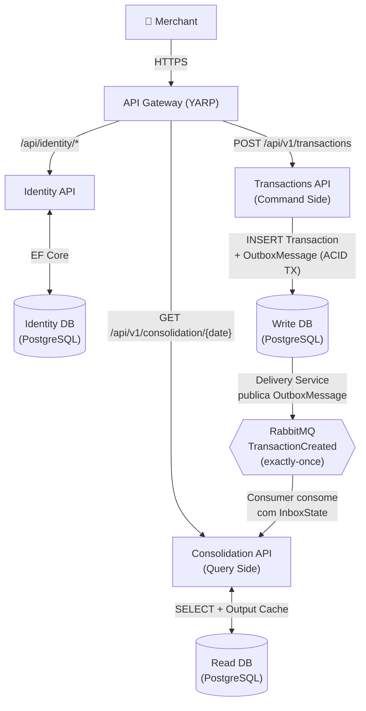

# CashFlow — Sistema de Fluxo de Caixa

Sistema de controle de fluxo de caixa diário para comerciantes, com lançamentos (débitos e créditos) e relatório de saldo diário consolidado.

---

## Sumário

- [Visão Geral](#visão-geral)
- [Arquitetura](#arquitetura)
- [Stack Tecnológica](#stack-tecnológica)
- [Estrutura do Projeto](#estrutura-do-projeto)
- [Pré-requisitos](#pré-requisitos)
- [Como Executar](#como-executar)
- [Como Executar os Testes](#como-executar-os-testes)
- [Exemplos de Uso da API](#exemplos-de-uso-da-api)
- [Requisitos Não-Funcionais](#requisitos-não-funcionais)
- [Decisões Arquiteturais](#decisões-arquiteturais)
- [Evoluções Futuras](#evoluções-futuras)
- [Observabilidade](#observabilidade)
- [CI/CD](#cicd)
- [Documentação](#documentação)

---

## Visão Geral

Um comerciante precisa controlar o seu fluxo de caixa diário com os lançamentos (débitos e créditos), e também precisa de um relatório que disponibilize o saldo diário consolidado.

O sistema resolve esse problema com dois serviços de domínio independentes:

- **Transactions API** (Command Side) — recebe e persiste lançamentos financeiros
- **Consolidation API** (Query Side) — materializa e expõe o saldo consolidado por dia

A comunicação entre eles é assíncrona via eventos (RabbitMQ + MassTransit), garantindo que a **falha no consolidado nunca afete o serviço de lançamentos**.

### Fluxo Principal



1. Merchant cria lançamento via `POST /api/v1/transactions`
2. Transactions API persiste o lançamento + publica evento `TransactionCreated` na **mesma transação** (Bus Outbox)
3. Consolidation API consome o evento e atualiza o saldo diário com **exactly-once** (Consumer Inbox)
4. Merchant consulta saldo via `GET /api/v1/consolidation/{date}` (com Output Cache)

---

## Arquitetura

O sistema adota uma arquitetura de **quatro serviços deployáveis independentes** com Event-Driven Architecture (EDA) e CQRS:

| Serviço | Responsabilidade | Porta de Entrada |
|---|---|---|
| **Gateway** (YARP) | Ponto único de acesso, autenticação JWT, rate limiting, health checks | Externa |
| **Identity API** | Registro de usuários e emissão de tokens JWT | Via Gateway |
| **Transactions API** | Criação e consulta de lançamentos (Command Side) | Via Gateway |
| **Consolidation API** | Saldo consolidado diário (Query Side) | Via Gateway |

O isolamento de processos garante que a falha no serviço de consolidado **nunca** afete a disponibilidade do serviço de lançamentos — requisito crítico do sistema.

Para detalhes completos, diagramas C4 e ADRs, consulte [`docs/architecture.md`](docs/architecture.md) e [`docs/adr/`](docs/adr/).

---

## Stack Tecnológica

| Componente | Tecnologia |
|---|---|
| Plataforma | .NET 10 / C# |
| Orquestração | .NET Aspire |
| API Gateway | YARP (Yet Another Reverse Proxy) |
| Autenticação | ASP.NET Core Identity + JWT Bearer |
| Endpoints | Carter (Minimal APIs) |
| Validação | FluentValidation |
| Banco de Dados | PostgreSQL (3 databases isolados) |
| ORM | Entity Framework Core |
| Mensageria | RabbitMQ + MassTransit |
| Exactly-Once | MassTransit Bus Outbox + Consumer Inbox |
| Observabilidade | OpenTelemetry (traces, metrics, logs) |
| Resiliência | Polly v8 (HTTP), MassTransit Retry + Circuit Breaker (messaging) |
| Testes | xUnit, FluentAssertions, Testcontainers, NetArchTest, NSubstitute, Aspire Testing |
| Load Tests | k6 |

---

## Estrutura do Projeto

```
CashFlow.slnx
├── src/
│   ├── CashFlow.Domain/                  — Domínio (DDD): Aggregates, Value Objects, Eventos
│   ├── CashFlow.ServiceDefaults/         — Defaults do Aspire (OpenTelemetry, Health Checks, Polly)
│   ├── CashFlow.Gateway/                 — API Gateway (YARP) com Auth Offloading
│   ├── CashFlow.Identity.API/            — Serviço de Autenticação (ASP.NET Core Identity)
│   ├── CashFlow.Transactions.API/        — Serviço de Lançamentos (Command side)
│   ├── CashFlow.Consolidation.API/       — Serviço de Consolidado Diário (Query side)
│   └── CashFlow.AppHost/                 — Orquestração (.NET Aspire AppHost)
├── tests/
│   ├── CashFlow.UnitTests/               — Testes de domínio e handlers
│   ├── CashFlow.IntegrationTests/        — Testes de API com Testcontainers
│   ├── CashFlow.ArchitectureTests/       — Testes de dependência (NetArchTest)
│   ├── CashFlow.E2ETests/               — Testes E2E com Aspire Testing
│   └── load/                             — Testes de carga com k6
├── docs/architecture.md                    — Documento de arquitetura completo (C4, domínio, NFRs)
├── docs/adr/                               — Architecture Decision Records (10 ADRs)
└── infra/                                 — Bicep modules para Azure Container Apps
```

---

## Pré-requisitos

| Ferramenta | Versão | Uso |
|---|---|---|
| [.NET 10 SDK](https://dotnet.microsoft.com/download) | 10.0.102+ | Build e execução |
| [Docker](https://www.docker.com/) | 20.10+ | PostgreSQL, RabbitMQ (via Aspire) e Testcontainers |
| [k6](https://k6.io/) *(opcional)* | — | Testes de carga |

> **Nota:** O `global.json` na raiz pina a versão mínima do SDK em `10.0.102`. Verifique com `dotnet --version` antes de prosseguir.

Após instalar o .NET 10 SDK, instale o workload do Aspire (necessário na primeira instalação):

```bash
dotnet workload install aspire
```

---

## Como Executar

```bash
# Clone o repositório
git clone https://github.com/gtkpad/CashFlow.git
cd CashFlow

# Configure os git hooks (garante dotnet format antes de cada commit)
bash .githooks/setup.sh

# Primeira instalação: configure os secrets via user-secrets
cd src/CashFlow.AppHost
dotnet user-secrets set "Parameters:gateway-secret" "cashflow-dev-gateway-secret-2026"
dotnet user-secrets set "Parameters:jwt-signing-key" "cashflow-dev-jwt-signing-key-2026-super-secret"
cd ../..

# Execute o AppHost (inicia todos os serviços + infraestrutura)
dotnet run --project src/CashFlow.AppHost
```

> **Nota:** Os comandos `dotnet user-secrets set` precisam ser executados apenas uma vez por máquina. Os secrets são armazenados de forma segura no perfil do usuário e não são commitados no repositório.

Após iniciar, o Aspire exibirá no console a URL do Dashboard (ex: `http://localhost:15020`). Acesse essa URL no navegador para visualizar todos os serviços, logs, traces e métricas. Em alguns ambientes (Rider/Visual Studio) o browser abre automaticamente.

Todos os recursos são provisionados automaticamente:
- **PostgreSQL** — 3 databases (identity-db, transactions-db, consolidation-db)
- **RabbitMQ** — broker com management plugin
- **4 APIs** — Gateway, Identity, Transactions, Consolidation

> **Nota:** As migrations do Entity Framework Core são executadas automaticamente na inicialização de cada serviço.

Para verificar se todos os serviços subiram corretamente, confirme que todos aparecem como **Running** no Dashboard ou valide via health check (substitua a porta exibida no console):

```bash
curl http://localhost:<GATEWAY_PORT>/health
```

---

## Como Executar os Testes

```bash
# Todos os testes (requer Docker)
dotnet test

# Testes unitários — domínio + handlers (sem Docker)
dotnet test tests/CashFlow.UnitTests

# Testes de integração — API + Testcontainers (requer Docker)
dotnet test tests/CashFlow.IntegrationTests

# Testes de arquitetura — regras de dependência (sem Docker)
dotnet test tests/CashFlow.ArchitectureTests

# Testes E2E — fluxo completo com Aspire Testing (requer Docker, ~2-3 min)
dotnet test tests/CashFlow.E2ETests
```

### Testes de Carga (k6)

Com a aplicação rodando localmente:

```bash
# NFR-2: Consolidation — 50 req/s por 2 minutos, p95 < 200ms
k6 run tests/load/nfr2-consolidation-throughput.js

# NFR-4: Transaction ingestion — 50 req/s por 2 minutos, p95 < 500ms
k6 run tests/load/nfr4-transaction-ingestion.js
```

### Cobertura de Testes

| Camada | Projeto | O que testa |
|---|---|---|
| **Unit** | `CashFlow.UnitTests` | Aggregates, Value Objects, Domain Events, Handlers |
| **Integration** | `CashFlow.IntegrationTests` | API endpoints, Consumer (Testcontainers: PostgreSQL + RabbitMQ) |
| **Architecture** | `CashFlow.ArchitectureTests` | Regras de dependência entre projetos (NetArchTest) |
| **E2E** | `CashFlow.E2ETests` | Fluxo completo: register → login → create transaction → verify consolidation |
| **Load** | `tests/load/` | NFRs de throughput e latência (k6) |

---

## Exemplos de Uso da API

Todos os endpoints são acessados através do **Gateway** (porta única exibida no Aspire Dashboard).

> Substitua `$GATEWAY_URL` pela URL do Gateway exibida no dashboard (ex: `http://localhost:XXXXX`).

### 1. Registrar usuário

```bash
curl -X POST "$GATEWAY_URL/api/identity/register" \
  -H "Content-Type: application/json" \
  -d '{
    "email": "merchant@example.com",
    "password": "MinhaSenh@123"
  }'
```

### 2. Login (obter token JWT)

```bash
curl -X POST "$GATEWAY_URL/api/identity/login" \
  -H "Content-Type: application/json" \
  -d '{
    "email": "merchant@example.com",
    "password": "MinhaSenh@123"
  }'
```

Resposta:
```json
{
  "tokenType": "Bearer",
  "accessToken": "eyJhbGciOiJIUzI1NiIs...",
  "expiresIn": 3600,
  "refreshToken": "..."
}
```

### 3. Criar lançamento (crédito)

```bash
curl -X POST "$GATEWAY_URL/api/v1/transactions" \
  -H "Content-Type: application/json" \
  -H "Authorization: Bearer $TOKEN" \
  -d '{
    "referenceDate": "2026-03-04",
    "type": 1,
    "amount": 1500.00,
    "currency": "BRL",
    "description": "Venda de produtos",
    "createdBy": "merchant@example.com"
  }'
```

> `type`: `1` = Credit, `2` = Debit

Resposta (`201 Created`):
```json
{
  "id": "3fa85f64-5717-4562-b3fc-2c963f66afa6",
  "createdAt": "2026-03-04T18:30:00Z"
}
```

### 4. Criar lançamento (débito)

```bash
curl -X POST "$GATEWAY_URL/api/v1/transactions" \
  -H "Content-Type: application/json" \
  -H "Authorization: Bearer $TOKEN" \
  -d '{
    "referenceDate": "2026-03-04",
    "type": 2,
    "amount": 300.00,
    "currency": "BRL",
    "description": "Pagamento de fornecedor",
    "createdBy": "merchant@example.com"
  }'
```

### 5. Consultar lançamento por ID

```bash
curl "$GATEWAY_URL/api/v1/transactions/{id}" \
  -H "Authorization: Bearer $TOKEN"
```

Resposta:
```json
{
  "id": "3fa85f64-5717-4562-b3fc-2c963f66afa6",
  "merchantId": "...",
  "referenceDate": "2026-03-04",
  "type": "Credit",
  "amount": 1500.00,
  "currency": "BRL",
  "description": "Venda de produtos",
  "createdAt": "2026-03-04T18:30:00Z",
  "createdBy": "merchant@example.com"
}
```

### 6. Consultar saldo consolidado do dia

```bash
curl "$GATEWAY_URL/api/v1/consolidation/2026-03-04" \
  -H "Authorization: Bearer $TOKEN"
```

Resposta:
```json
{
  "date": "2026-03-04",
  "totalCredits": 1500.00,
  "totalDebits": 300.00,
  "balance": 1200.00,
  "transactionCount": 2
}
```

### Resumo dos Endpoints

| Método | Rota | Descrição | Auth |
|---|---|---|---|
| `POST` | `/api/identity/register` | Registrar usuário | Não |
| `POST` | `/api/identity/login` | Login (retorna JWT) | Não |
| `POST` | `/api/v1/transactions` | Criar lançamento (crédito/débito) | JWT |
| `GET` | `/api/v1/transactions/{id}` | Consultar lançamento por ID | JWT |
| `GET` | `/api/v1/consolidation/{date}` | Consultar saldo consolidado do dia | JWT |

---

## Requisitos Não-Funcionais

### Resultados dos Testes de Carga em Produção

> Executado em 2026-03-08 contra Azure Container Apps (Brazil South) com PostgreSQL `Standard_D2ds_v4` + PgBouncer.

| NFR | Metric | Target | Actual | Status |
|-----|--------|--------|--------|--------|
| **NFR-2** | Consolidation p95 | < 200ms | **118.98ms** | PASS |
| **NFR-2** | Error rate | < 1% | **0.01%** | PASS |
| **NFR-4** | Transaction p95 | < 500ms | **139.17ms** | PASS |
| **NFR-4** | Error rate | < 1% | **0.01%** | PASS |

**Cenário:** 50 req/s sustentados por 2 minutos (ramping-arrival-rate), ~7.000 requests por teste.

### NFR-1: Isolamento de Falhas

> *"O serviço de controle de lançamento não deve ficar indisponível se o sistema de consolidado diário cair."*

**Estratégia:** Processos independentes + mensageria assíncrona. A API de Transactions depende apenas de `{PostgreSQL, RabbitMQ}`. A queda de qualquer componente do Consolidation não afeta lançamentos.

**Validação:** Teste E2E `FaultIsolation_TransactionsAcceptsRequestsRegardlessOfConsolidationState`.

### NFR-2: Throughput do Consolidation — 50 req/s

> *"Em dias de picos, o serviço de consolidado diário recebe 50 requisições por segundo."*

**Estratégia:** Output Cache diferenciado — datas passadas (imutáveis) com TTL de 1h; dia corrente com TTL de 5s + invalidação ativa pelo consumer. Thundering herd protection via `AllowLocking`. PgBouncer connection pooling (porta 6432) para multiplexação de conexões.

**Validação:** Teste de carga k6 (`nfr2-consolidation-throughput.js`) — 50 req/s, 2min, p95 = 118.98ms (target < 200ms).

### NFR-3: Máximo 5% de perda de requisições

**Estratégia:** Durable queues + Publisher Confirms + Consumer Inbox (exactly-once) + Dead Letter Queue com delayed redelivery (5min, 15min, 60min) + Circuit Breaker.

### NFR-4: Capacidade de ingestão >= 50 msg/s

**Estratégia:** Consumer com 2 instâncias concorrentes + UsePartitioner(8) particionado por `{MerchantId}:{ReferenceDate}`. PostgreSQL `Standard_D2ds_v4` (2 vCPUs dedicados, 3.450 IOPS) com PgBouncer built-in.

**Validação:** Teste de carga k6 (`nfr4-transaction-ingestion.js`) — 50 req/s, 2min, p95 = 139.17ms (target < 500ms).

---

## Decisões Arquiteturais

As decisões estão documentadas como **Architecture Decision Records (ADRs)** em [`docs/adr/`](docs/adr/):

| ADR | Decisão |
|---|---|
| **ADR-001** | Topologia: Serviços Independentes com API Gateway (vs. Monolito Modular) |
| **ADR-002** | Mensageria: RabbitMQ + MassTransit Bus Outbox + Consumer Inbox |
| **ADR-003** | Banco de Dados: PostgreSQL com databases separados por serviço |
| **ADR-004** | Resiliência: MassTransit Retry, Npgsql e HttpClient Polly v8 |
| **ADR-005** | Concorrência: Append-Only Writes + Optimistic Concurrency (xmin) |
| **ADR-006** | API Gateway e Autenticação: YARP + ASP.NET Core Identity |
| **ADR-007** | Dead Letter Queue: Topologia de redelivery e recuperação operacional |
| **ADR-008** | Alta Disponibilidade: Azure Container Apps + .NET Aspire |
| **ADR-009** | Testes E2E com .NET Aspire Testing |
| **ADR-010** | Handlers via DI Direto (sem MediatR) |
| **ADR-011** | Auto-Scaling: HTTP Scaling Rules + Dimensionamento por Perfil de Carga |
| **ADR-012** | PostgreSQL Scaling: General Purpose SKU + PgBouncer Built-in |

### Padrões Aplicados

- **DDD** — Aggregates (`Transaction`, `DailySummary`), Value Objects (`Money`, `MerchantId`), Domain Events, Ports & Adapters
- **CQRS** — Command Side (Transactions) separado do Query Side (Consolidation)
- **Event-Driven Architecture** — Coreografia via eventos com MassTransit
- **Vertical Slice Architecture** — Código organizado por features, não por camadas
- **Outbox Pattern** — Publicação atômica de eventos na mesma transação do banco
- **Inbox Pattern** — Consumo exactly-once via MassTransit Consumer Outbox

---

## Evoluções Futuras

O tempo para execução do desafio é limitado. Abaixo estão evoluções que agregariam valor ao sistema:

| Evolução | Complexidade | Benefício |
|---|---|---|
| **Event Sourcing** (Marten/EventStoreDB) | Alta | Audit trail perfeito, time travel |
| **Redis** como cache à frente do PostgreSQL | Baixa | Sub-milissegundo para reads (>1000 req/s) |
| **Identity Server / Keycloak** | Custo Operacional Alto | OIDC completo, OAuth2 para 3rd party |
| **Multi-tenancy Isolado (SaaS)** | Média | Múltiplos merchants com DB/schema por cliente |
| **Multi-ambiente ACA** (staging + prod) | Baixa | Promoção via pipeline, canary deployments |
| **Feature Flags** (Azure App Configuration) | Baixa | Dark launches, canary deployments |

---

## Observabilidade

O CashFlow implementa os três pilares de observabilidade — traces, metrics e logs — sobre o SDK do OpenTelemetry, com exportação automática para o Aspire Dashboard em desenvolvimento e para o Azure Monitor/Application Insights em produção. A configuração centralizada está em `src/CashFlow.ServiceDefaults/Extensions.cs` e é aplicada identicamente a todos os quatro serviços via `AddServiceDefaults()`.

### Sinais OpenTelemetry

#### Traces

| Fonte de instrumentação | O que é rastreado |
|---|---|
| `AspNetCore` | Requisições HTTP de entrada (exceto `/health` e `/alive`, filtradas explicitamente) |
| `HttpClient` | Chamadas HTTP de saída entre serviços |
| `EntityFrameworkCore` | Comandos SQL emitidos pelo EF Core |
| `MassTransit` | Publicação e consumo de mensagens no RabbitMQ, incluindo retry e fault |
| `{ApplicationName}` | Activity source próprio de cada serviço |

#### Metrics

| Fonte de instrumentação | O que é medido |
|---|---|
| `AspNetCore` | Throughput HTTP, latência de request, status codes |
| `HttpClient` | Latência e erros de chamadas de saída |
| `Runtime` | GC, thread pool, uso de memória do .NET runtime |
| `MassTransit` | Fila de mensagens, taxa de consumo, faults |
| `CashFlow` | Métricas de negócio customizadas — detalhadas abaixo |

#### Logs

Logs estruturados exportados via OpenTelemetry com `IncludeFormattedMessage = true` e `IncludeScopes = true`. Em produção, filtros suprimem `Information` das categorias `Microsoft.EntityFrameworkCore`, `Microsoft.AspNetCore.Hosting`, `Microsoft.AspNetCore.Routing` e `System.Net.Http.HttpClient` para reduzir volume sem perder sinais relevantes.

---

### Exportadores

| Ambiente | Exportador | Condição de ativação |
|---|---|---|
| Desenvolvimento (Aspire) | OTLP | `OTEL_EXPORTER_OTLP_ENDPOINT` injetada automaticamente pelo Aspire |
| Produção (Azure) | Azure Monitor SDK (`UseAzureMonitor`) | `APPLICATIONINSIGHTS_CONNECTION_STRING` ou connection string `appinsights` presente |
| Ambos podem coexistir | OTLP + Azure Monitor | Ambas as variáveis definidas simultaneamente |

O sampling ratio para o Azure Monitor é configurável via `OTEL_TRACES_SAMPLER_ARG` (valor entre `0.0` e `1.0`). Padrão: `1.0` em desenvolvimento e `0.1` em produção.

---

### Métricas de Negócio Customizadas

Todos os instrumentos estão declarados em `src/CashFlow.ServiceDefaults/CashFlowMetrics.cs` sob o meter `CashFlow`, registrado via `IMeterFactory` como `Singleton` em todos os serviços.

| Instrumento | Tipo | Unidade | Tags | Serviço produtor | O que mede |
|---|---|---|---|---|---|
| `cashflow.transactions.created` | Counter | `transactions` | `type`, `currency` | Transactions API | Transações criadas com sucesso |
| `cashflow.transactions.amount` | Histogram | `{currency}` | `type`, `currency` | Transactions API | Distribuição dos valores monetários |
| `cashflow.consolidation.events_processed` | Counter | `events` | `result` | Consolidation API | Eventos `TransactionCreated` consumidos |
| `cashflow.consolidation.processing_duration_ms` | Histogram | `ms` | — | Consolidation API | Duração do processamento no consumer |
| `cashflow.consolidation.eventual_consistency_ms` | Histogram | `ms` | — | Consolidation API | Tempo entre publicação do evento e conclusão do consumo (janela de consistência eventual) |
| `cashflow.gateway.auth_failures` | Counter | `failures` | `reason` | Gateway | Falhas de autenticação JWT (`unauthorized`, `missing_token`, `missing_sub_claim`) |
| `cashflow.messaging.dlq_faults` | Counter | `faults` | `message_type`, `exception_type` | Consolidation API | Mensagens movidas para DLQ após esgotar retries |

---

### Health Checks

Cada serviço expõe dois endpoints, configurados em `AddDefaultHealthChecks()` e mapeados por `MapDefaultEndpoints()`:

| Endpoint | Propósito | Verificações |
|---|---|---|
| `GET /health` | Readiness — todas as verificações registradas | `self` + `rabbitmq` (Transactions e Consolidation) |
| `GET /alive` | Liveness — apenas verificações com tag `live` | `self` |

O check `rabbitmq` é adicionado pelo MassTransit em Transactions e Consolidation. Gateway e Identity expõem apenas `self`.

No AppHost, os endpoints `/health` de todos os serviços são monitorados via `WithHttpHealthCheck("/health")`. Em testes E2E (`CASHFLOW_E2E_TESTING=true`) esse monitoramento é omitido por compatibilidade com o Aspire Testing host.

---

### Aspire Dashboard (Desenvolvimento)

O Aspire Dashboard é iniciado automaticamente junto com o AppHost e já recebe toda a telemetria dos serviços via OTLP — sem configuração adicional.

A URL do dashboard é exibida no terminal na inicialização. Ele fornece:

- **Resources**: status de saúde e URL de cada serviço, banco de dados e broker
- **Console logs**: stdout/stderr de todos os processos em tempo real
- **Structured logs**: logs estruturados com busca por campo, nível e serviço
- **Traces**: traces distribuídas end-to-end cruzando Gateway → Transactions API → RabbitMQ → Consolidation API em uma única visualização de waterfall
- **Metrics**: gráficos de séries temporais para todas as métricas, incluindo os instrumentos customizados do meter `CashFlow`

---

### Azure Monitor / Application Insights (Produção)

A connection string do Application Insights é injetada pelo Bicep de cada Container App como variável de ambiente `APPLICATIONINSIGHTS_CONNECTION_STRING`. O SDK `Azure.Monitor.OpenTelemetry.AspNetCore` é ativado automaticamente quando essa variável está presente.

**Workbook de NFRs** (`infra/monitoring/workbooks.module.bicep` + `infra/monitoring/workbook-definition.json`):

| Painel | Métricas usadas | NFR monitorado |
|---|---|---|
| Service Health & Uptime | `requests` (success rate por serviço) | NFR-1: disponibilidade |
| Consolidation Processing Latency (p50/p95/p99) | `cashflow.consolidation.processing_duration_ms` | NFR-2: latência |
| Consolidation Throughput (req/s) | `requests` (consolidation) | NFR-2: throughput |
| Production vs Consumption Delta | `cashflow.transactions.created` vs `cashflow.consolidation.events_processed` | NFR-3: consistência eventual |
| Dead Letter Queue Faults | `cashflow.messaging.dlq_faults` | NFR-3: confiabilidade de mensageria |
| Event Ingestion Rate (events/s) | `cashflow.consolidation.events_processed` | NFR-4: taxa de ingestão |
| Eventual Consistency Delay (p50/p95) | `cashflow.consolidation.eventual_consistency_ms` | NFR-4: janela de consistência eventual |

**Alertas configurados** (`infra/monitoring/alerts.module.bicep`):

| Alerta | Condição | Severidade |
|---|---|---|
| Health Check Failure | Qualquer serviço com health check falhando por > 2 min | Crítico |
| Consolidation Latency p95 | `processing_duration_ms` p95 > 200 ms por > 5 min | Aviso |
| Dead Letter Queue Depth | `dlq_faults` > 0 em qualquer janela de 1 min | Aviso |
| Eventual Consistency Delta | Delta entre `transactions.created` e `events_processed` > 100 por > 10 min | Crítico |
| Ingestion Rate Low | Taxa de ingestão < 50 msg/s por > 5 min | Aviso |
| Eventual Consistency p95 | `eventual_consistency_ms` p95 > 5000 ms por > 5 min | Aviso |
| HTTP 5xx Rate | Taxa de erros 5xx > 5% do total por > 5 min | Aviso |

---

## CI/CD

O projeto possui pipelines automatizadas no GitHub Actions:

| Pipeline | Trigger | Etapas |
|---|---|---|
| **PR Check** (`pr-check.yml`) | Pull Request | Format check → Build → Unit Tests |
| **CI** (`ci.yml`) | Push/merge em `main` | Lint → Build → Unit → Integration → Architecture → E2E → Security Scan (Trivy) |
| **CD** (`cd.yml`) | Após CI em `main` | Deploy via `azd` para Azure Container Apps |

---

## Documentação

| Documento | Descrição |
|---|---|
| [`docs/architecture.md`](docs/architecture.md) | Documento de arquitetura completo (C4, domínio, NFRs) |
| [`docs/adr/`](docs/adr/) | Architecture Decision Records (12 ADRs individuais) |
| [`docs/disaster-recovery.md`](docs/disaster-recovery.md) | Plano de Disaster Recovery (runbooks, escalation, RPO/RTO, teste de restore) |
