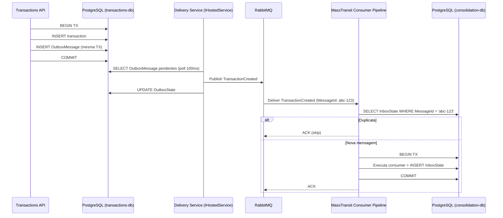

# ADR-002: Mensageria — RabbitMQ + MassTransit (Bus Outbox + Consumer Inbox)

| Campo | Valor |
|---|---|
| **Status** | Aceito |
| **Data** | Março 2026 |
| **Contexto** | A comunicação entre Transactions e Consolidation deve ser assíncrona, durável e tolerante a falhas. O dual-write problem (gravar no DB e publicar no broker como operações separadas) pode causar perda de eventos se o broker estiver indisponível no momento do commit. |
| **Decisão** | **RabbitMQ** como message broker + **MassTransit** como framework de mensageria, usando o **Bus Outbox** (produtor) e o **Consumer Outbox com Inbox** (consumidor). |

## Detalhes

### Como o MassTransit resolve o Outbox/Inbox nativamente

**Bus Outbox (Transactions API):**
- `UseBusOutbox()` substitui `IPublishEndpoint` por uma versão que grava na tabela `OutboxMessage` do banco — na mesma transação ACID do `SaveChangesAsync()`, não no broker.
- Um **Delivery Service** (`IHostedService` embutido na API) faz polling na tabela e entrega ao broker. `QueryDelay = 100ms`.
- `OutboxState` garante ordenação e lock distribuído via advisory locks do PostgreSQL (`UsePostgres()`).

**Consumer Outbox com Inbox (Consolidation API):**
- **Inbox** (`InboxState`): rastreia mensagens por `MessageId` por endpoint. Garante exactly-once processing.
- Antes de invocar o consumer, o MassTransit verifica `InboxState`. Se o `MessageId` já existe, descarta silenciosamente.
- O consumer roda como `IHostedService` embutido na Consolidation API.

### Tabelas gerenciadas pelo MassTransit (via EF Core Migrations)

| Tabela | DB | Propósito |
|---|---|---|
| `OutboxMessage` | transactions-db | Mensagens aguardando entrega ao broker |
| `OutboxState` | transactions-db | Lock distribuído + controle de entrega |
| `InboxState` | consolidation-db | Rastreamento de mensagens processadas |
| `OutboxMessage` | consolidation-db | Mensagens publicadas pelo consumer (se houver) |

## Trade-offs

### MassTransit vs Implementação Manual

| Aspecto | MassTransit | Implementação Manual |
|---|---|---|
| Tabelas | 3 tabelas auto-gerenciadas via migrations | DDL manual |
| Outbox Publisher | `IHostedService` embutido | Worker process separado (~100 linhas) |
| Inbox/Idempotência | `InboxState` automático por `MessageId` | Tabela manual + lógica de dedup (~50 linhas) |
| Lock distribuído | PostgreSQL advisory locks nativo | Implementação manual de row-level lock |
| Processos necessários | 2 (Transactions API + Consolidation API) | 4 (+ Outbox Worker + Consumer Worker) |

### Comparativo de Brokers

| Critério | RabbitMQ | Kafka | Azure Service Bus |
|---|---|---|---|
| Throughput para 50 msg/s | Trivial (~30k msg/s) | Overkill (~1M msg/s) | Suficiente |
| Complexidade | Baixa (1 container) | Média | Nenhuma (PaaS) |
| Custo | Open-source | Open-source | ~$0.05/1k msgs |
| DLQ | Nativo | Requer implementação | Nativo |
| Ecossistema .NET | MassTransit maduro + Outbox/Inbox built-in | Sem Outbox integrado | Azure.Messaging |
| Vendor lock-in | Nenhum | Nenhum | Azure-only |

## Consequências

- Nenhum evento é perdido mesmo com crash do broker: a mensagem sobrevive no `OutboxMessage` do PostgreSQL.
- Deduplicação é automática: `InboxState` garante que redeliveries não causam double-processing.
- `DuplicateDetectionWindow = 30 minutos` — janela de detecção de duplicatas do Bus Outbox.
- Se o volume de mensagens ultrapassar ~5.000/s, avaliar substituição do RabbitMQ por Azure Service Bus.
