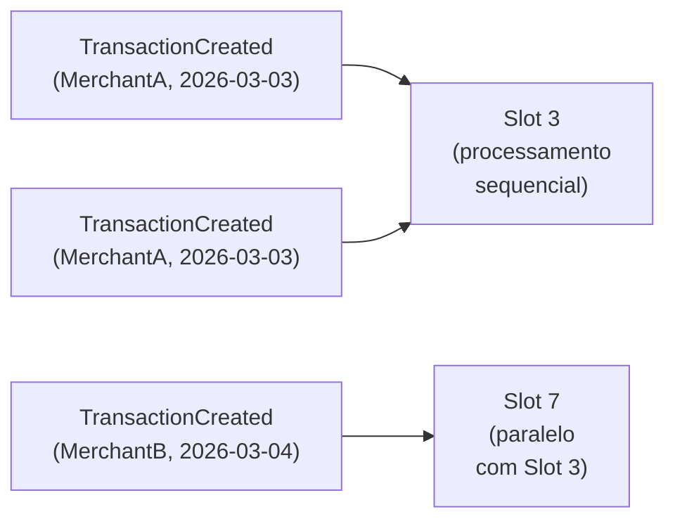

# ADR-005: Concorrência — Append-Only + Optimistic Concurrency + Particionamento

| Campo | Valor |
|---|---|
| **Status** | Aceito |
| **Data** | Março 2026 |
| **Contexto** | Duas transactions simultâneas no mesmo dia para o mesmo merchant podem causar race conditions no Consolidation. Com 2 consumers processando mensagens do mesmo `(MerchantId, ReferenceDate)` em paralelo, a taxa de `DbUpdateConcurrencyException` pode atingir 30–50% em pico — todos os eventos convergem para a mesma linha `daily_summary`. Mesmo com `UseMessageRetry`, esse nível de contenção eleva a latência e desperdiça ciclos de banco. |
| **Decisão** | Três camadas de proteção complementares: (1) Transactions são append-only (INSERT-only). (2) Particionamento do consumer por `(MerchantId, ReferenceDate)` via `UsePartitioner` — elimina concorrência no caso mais comum. (3) Optimistic Concurrency via `xmin` do PostgreSQL como safety net para casos residuais. |

## Detalhes

### O problema sem particionamento

```
Consumer A: lê balance=100  → calcula 100+50=150  → grava 150      ← COMMIT OK
Consumer B: lê balance=100  → calcula 100-30=70   → tenta gravar 70
            xmin esperado: 0, atual: 1             → DbUpdateConcurrencyException!
            → UseMessageRetry reprocessa → lê balance=150 → calcula 150-30=120 → OK
            Taxa de exceção em pico: 30-50%
```

### A solução — 3 camadas

**Camada 1 — Append-Only (write-side):**
Transactions são INSERT-only. Dois INSERTs concorrentes nunca conflitam. Não existe "atualizar balance" no write-side — isso ocorre apenas no consumer do consolidation.

**Camada 2 — Particionamento por `(MerchantId, ReferenceDate)`:**



Mensagens do mesmo merchant e dia caem no mesmo slot e são processadas sequencialmente — sem concorrência, sem `DbUpdateConcurrencyException`. Merchants e dias diferentes processam em paralelo.

**Camada 3 — Optimistic Concurrency (`xmin`):**
`xmin` é uma coluna de sistema do PostgreSQL que muda a cada UPDATE. O EF Core usa como row version (shadow property). Protege contra casos residuais: failover entre instâncias, mensagens fora de ordem entre partições distintas.

### Pipeline de middlewares na ConsumerDefinition (ordem de execução, do mais externo ao mais interno)

1. `UsePartitioner(8)` — roteia para slot por `{MerchantId}:{ReferenceDate}`. Elimina `DbUpdateConcurrencyException` de 30–50% para ~0%.
2. `UseCircuitBreaker` — trip threshold 15%, reset 5 min.
3. `UseMessageRetry` — exponencial 5× (100ms–30s), jitter 50ms. Apenas `DbUpdateConcurrencyException`.
4. `UseEntityFrameworkOutbox` — gerencia a TX. Deve ser o mais interno para que InboxState check, lógica de negócio e COMMIT ocorram em única transação.

## Trade-offs

| Configuração | Throughput | Taxa DbUpdateConcurrencyException |
|---|---|---|
| 1 consumer, sem particionamento | ~33 msg/s | ~0% |
| 2 consumers, sem particionamento | ~50 msg/s (com retries) | 30–50% em pico |
| **2 consumers + UsePartitioner(8)** | **~66 msg/s** | **~0%** |
| 3 consumers + UsePartitioner(16) | ~99 msg/s | ~0% |

## Consequências

- `UsePartitioner(8)` suporta até 8 combinações `(MerchantId, ReferenceDate)` em paralelo por instância de consumer.
- Para sistemas com muitos merchants simultâneos, aumentar para 16 ou 32 slots.
- O `UsePartitioner` deve ser o **primeiro** middleware registrado (mais externo) para rotear antes de qualquer retry ou circuit breaker.
- A invalidação do Output Cache ocorre dentro do consumer, após o COMMIT, via `EvictByTagAsync("balance-{merchantId}-{date}")`.
