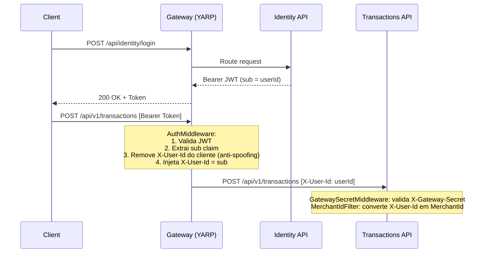

# ADR-006: API Gateway e Auth Offloading (YARP + ASP.NET Core Identity)

| Campo | Valor |
|---|---|
| **Status** | Aceito |
| **Data** | Março 2026 |
| **Contexto** | Com múltiplas APIs independentes, propagar tokens para os backends exigiria que todas as APIs validassem JWT, consultassem chaves ativas e mantivessem middleware de autenticação. Se a emissão e validação de tokens rodassem no mesmo serviço de Transactions, uma queda desse serviço impediria acesso à leitura do Consolidation. |
| **Decisão** | (1) Extrair emissão de tokens para o `Identity.API` independente. (2) Adotar **Gateway Auth Offloading** no YARP: o Gateway é o único serviço exposto, valida o Bearer Token e propaga a identidade via headers limpos (`X-User-Id`) para os backends. (3) Serviços backend confiam completamente nos headers injetados pelo Gateway — não validam tokens. |

## Detalhes

### Fluxo de autenticação e autorização

### Camadas de segurança dos serviços internos

1. **`GatewaySecretMiddleware`** — valida header `X-Gateway-Secret` em todas as requests. Rejeita acesso direto que contorne o Gateway (defense-in-depth).
2. **`MerchantIdFilter`** — extrai `X-User-Id` e converte em `MerchantId` (Value Object). Retorna 401 se ausente ou inválido.
3. **Handlers** — filtram todos os dados por `MerchantId`. Nenhum handler retorna dados de outro merchant.

O Bearer Token é JWT (emitido via `AddBearerToken()` do ASP.NET Core Identity). O YARP valida e decodifica os claims diretamente — sem chamadas síncronas ao Identity API por request.

## Trade-offs

| Aspecto | Auth Offloading no YARP | Validação Distribuída | Identity Server Externo (Keycloak) |
|---|---|---|---|
| Segurança | Focada no perímetro | Fragmentada em cada serviço | Padrão OIDC completo |
| Serviços backend | Extremamente leves (só leem headers) | Middleware Auth em todos | Extremamente robustos, mas pesados |
| Isolamento de falhas | Máximo desacoplamento | Key sharing obrigatório | SPOF no IDP |
| Complexidade | Baixa | Média | Alta (operação do IDP) |

## Consequências

- O Gateway é o único ponto que conhece o mecanismo de autenticação (JWT).
- Serviços backend dependem de rede isolada para segurança efetiva. Em produção, os Container Apps sem `WithExternalHttpEndpoints()` recebem ingress interno — não acessíveis pela internet.
- **Limitação conhecida:** Sem RBAC. Qualquer usuário autenticado acessa todos os endpoints, filtrado ao seu próprio `MerchantId`. Ver [ADR-014](014-resource-authorization.md).
- Quando houver necessidade de padrão OIDC completo ou integração com terceiros, substituir o Identity interno por Keycloak ou Entra ID External.
