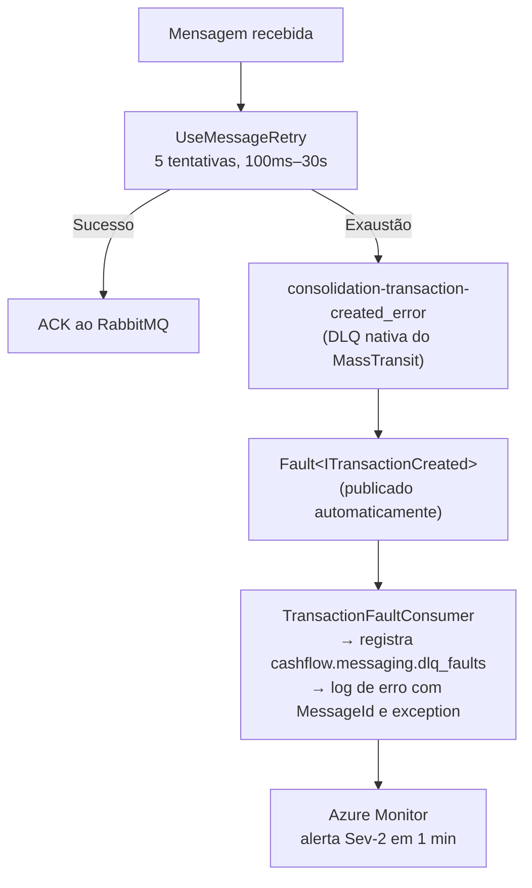

# ADR-007: Dead Letter Queue — Error Queue Nativa do MassTransit + FaultConsumer

| Campo | Valor |
|---|---|
| **Status** | Aceito |
| **Data** | Março 2026 |
| **Contexto** | Mensagens que excedem todas as tentativas de retry precisam ser preservadas de forma auditável e recuperáveis. O plugin `rabbitmq_delayed_message_exchange` (usado anteriormente para `UseDelayedRedelivery`) foi arquivado em janeiro de 2026 pelo time do RabbitMQ, com remoção planejada no RabbitMQ 4.3+, tornando-o uma dependência operacional crítica inaceitável. |
| **Decisão** | Usar a error queue nativa do MassTransit (`*_error`) como DLQ. Após esgotar os 5 retries imediatos, o MassTransit move a mensagem para a error queue automaticamente e publica um evento `Fault<T>`. Um `TransactionFaultConsumer` consome esses faults para registrar métricas e disparar alertas. |

## Detalhes

### Pipeline até a DLQ

### Por que remover o UseDelayedRedelivery

O `UseDelayedRedelivery` do MassTransit dependia do plugin `rabbitmq_delayed_message_exchange`, que foi:
- Arquivado em janeiro de 2026 pelo time do RabbitMQ.
- Baseado em Mnesia, o data store do RabbitMQ que será removido no 4.3 ou 4.4.
- Uma dependência que falhava silenciosamente se o plugin não estivesse instalado.

A remoção simplifica a pipeline e elimina dependência de plugin descontinuado.

### Processo de Replay de Mensagens da DLQ

1. **Detecção:** Alerta Azure Monitor detecta `cashflow.messaging.dlq_faults > 0`.
2. **Inspeção:** Acessar RabbitMQ Management UI, fila `consolidation-transaction-created_error`. Headers `MT-Fault-*` contêm stack trace e metadata.
3. **Diagnóstico:** Application Insights para identificar o tipo de exceção e a mensagem com erro.
4. **Correção:** Corrigir a causa raiz (bug no consumer, dado inválido, schema incompatível).
5. **Replay:** Reencaminhar mensagens via RabbitMQ Management API ou UI (Move messages → fila original).
6. **Validação:** Verificar integridade do `DailySummary` para o merchant/data afetado. Ver [Runbook 5.6 do DR](../disaster-recovery.md).

## Trade-offs

| Aspecto | Pipeline atual (sem delayed redelivery) | Pipeline anterior (com delayed redelivery) |
|---|---|---|
| Tempo até DLQ | ~30s (5 retries, 100ms–30s) | ~80min (5 retries + 3 redeliveries de 5/15/60min) |
| Dependência de plugin | Nenhuma | Plugin descontinuado |
| Detecção de falha persistente | ~30s (imediato) | ~80min |
| Cobertura de falhas transitórias | 5 tentativas | 5 tentativas + 3 redeliveries |

## Consequências

- Nenhuma mensagem é silenciosamente descartada: toda falha persistente é preservada na error queue e gera alerta via `cashflow.messaging.dlq_faults`.
- Falhas persistentes são detectadas em ~30s em vez de ~80min — resposta operacional mais rápida.
- A pipeline depende apenas de funcionalidades nativas do MassTransit e RabbitMQ, sem plugins externos.
- Mensagens na error queue **não expiram automaticamente** — requerem ação manual após correção da causa raiz.
