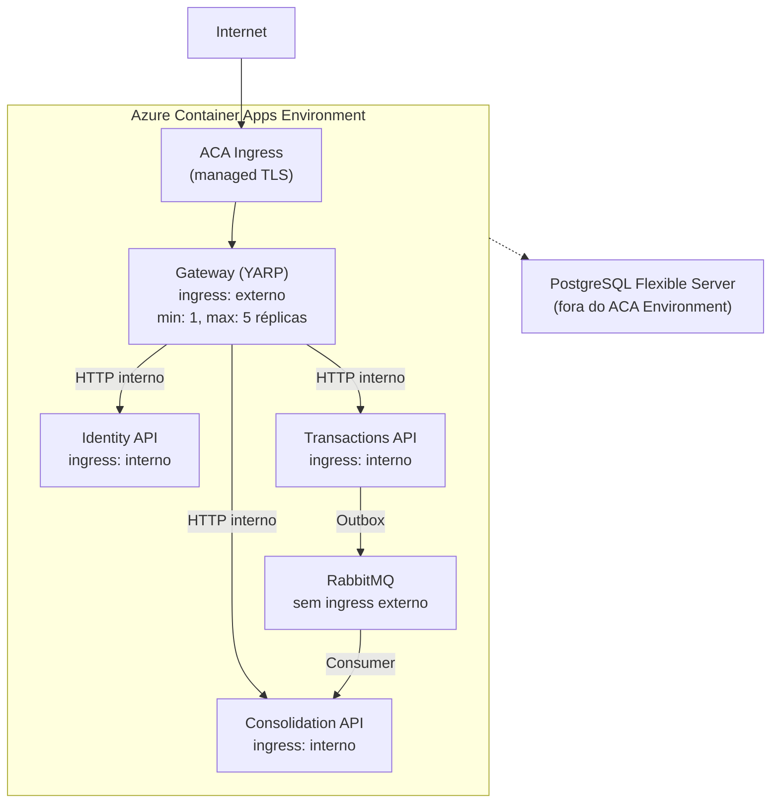

# ADR-008: Alta Disponibilidade do Gateway via Azure Container Apps

| Campo | Valor |
|---|---|
| **Status** | Aceito |
| **Data** | Março 2026 |
| **Contexto** | O [ADR-001](001-topology.md) identifica o YARP como SPOF da topologia: uma única instância do Gateway derruba o acesso externo a todos os serviços, mesmo que Transactions e Consolidation estejam saudáveis. O runtime de produção é Azure Container Apps (ACA). O Azure Developer CLI (`azd`) lê o AppHost e provisiona a infraestrutura ACA automaticamente. |
| **Decisão** | O YARP roda como Azure Container App com ingress externo e múltiplas réplicas. O ACA gerencia automaticamente balanceamento de tráfego, health checks e reinicializações. Não requer Nginx, HAProxy ou Kubernetes. |

## Detalhes

### Topologia no Azure Container Apps



### Por que o ACA resolve o SPOF

| Critério | Nginx/HAProxy | Kubernetes self-managed | Azure Container Apps |
|---|---|---|---|
| Gestão de réplicas | Manual | Automático (Deployment) | Automático (min/max replicas) |
| Rolling update sem downtime | Complexo | Nativo | Nativo (revisões automáticas) |
| TLS/certificados | Manual | cert-manager | Automático (managed TLS) |
| Integração com Aspire/azd | Não | Via aspirate (community) | Nativo (oficial) |
| Complexidade operacional | Alta | Média (requer cluster K8s) | Baixa (serverless gerenciado) |
| Custo | Servidor dedicado | Cluster K8s | Pay-per-use |

### Cálculo de disponibilidade (min 2 réplicas)

```
P(falha de 1 réplica) = 0,001 (99,9% de uptime por réplica)
P(todas as réplicas falharem simultaneamente) = 0,001² = 10⁻⁶
Disponibilidade efetiva: ≥ 99,9999% (~6 nines)
O SPOF move-se para o ACA Environment (SLA Microsoft: 99,95%)
```

### YARP Active + Passive Health Checks

- **Active:** polling a cada 10s no `/health` de cada backend, timeout 5s.
- **Passive:** `TransportFailureRate` — remove destination do balanceamento após falhas reais, reativa após 2 min.

Destinos usam Aspire Service Discovery com prefixo `https+http://` (HTTPS primeiro, HTTP como fallback). Em produção resolvem via DNS interno do ACA Environment.

### Deploy via azd

O `azd` lê o AppHost e provisiona toda a infraestrutura automaticamente:

- `azd provision` — gera Bicep in-memory a partir do AppHost e provisiona recursos Azure.
- `azd deploy` — builda imagens via `dotnet publish /t:PublishContainer` e deploya para ACA.

Não há Dockerfiles nem manifests manuais.

## Trade-offs

| Aspecto | Valor |
|---|---|
| **Elimina SPOF?** | Sim — ACA gerencia réplicas e reinicializações |
| **Rolling updates zero-downtime?** | Sim — revisões automáticas nativas |
| **TLS gerenciado?** | Sim — managed certificates automáticos |
| **Stateless obrigatório?** | Sim — YARP não mantém estado de sessão (sem sticky sessions) |
| **Custo?** | Pay-per-use — escala baseada em tráfego real |

## Consequências

- Serviços backend devem expor `/health` e `/alive` (já configurado via `AddHealthChecks()` do .NET Aspire).
- O YARP deve ser stateless — garantido pelo design atual (auth offloading via headers, sem estado de sessão).
- O AppHost mantém a orquestração para desenvolvimento local (Docker Compose via Aspire).
- Em produção, `azd` provisiona e deploya a partir do AppHost — sem manifests manuais.
- Limite atual: `activeRevisionsMode: Single` — sem blue/green automático. Ver roadmap em [`disaster-recovery.md`](../disaster-recovery.md).
