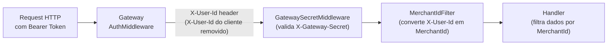

# ADR-014: Autorização Baseada em Recurso via MerchantId (Tenant Isolation)

| Campo | Valor |
|---|---|
| **Status** | Aceito |
| **Data** | Março 2026 |
| **Contexto** | O sistema é multi-tenant: cada usuário autenticado (merchant) deve acessar apenas seus próprios dados. A questão é como garantir isolamento de recursos sem RBAC formal para o cenário atual de single-role. |
| **Decisão** | Isolamento de recursos implementado por filtragem obrigatória de `MerchantId` em todas as camadas: Gateway, middleware de serviço e handlers de consulta/escrita. |

## Detalhes

### Fluxo de isolamento (3 camadas)



**Camada 1 — Gateway (`AuthMiddleware`):**
- Valida JWT Bearer token
- Extrai claim `sub` (user ID) do token
- **Remove** qualquer `X-User-Id` enviado pelo cliente (previne spoofing)
- Injeta `X-User-Id = sub` no request repassado para os serviços internos

**Camada 2 — Serviço (`GatewaySecretMiddleware`):**
- Valida header `X-Gateway-Secret` para garantir que o request veio do Gateway
- Rejeita requests diretos que contornem o Gateway (defense-in-depth)

**Camada 3 — Endpoint (`MerchantIdFilter`):**
- Extrai `X-User-Id` e converte em `MerchantId` (Value Object — rejeita `Guid.Empty`)
- Disponibiliza via `HttpContext.GetMerchantId()` para os handlers
- Retorna 401 se o header estiver ausente ou inválido

### Enforcement nos handlers

Todos os handlers incluem filtragem por `MerchantId`:

```csharp
// Query — GetTransactionHandler
db.Transactions.FirstOrDefaultAsync(t => t.Id == txId && t.MerchantId == mId, ct);

// Query — GetDailyBalanceHandler (compiled query)
ctx.DailySummaries.FirstOrDefault(d => d.MerchantId == merchantId && d.Date == date);

// Command — CreateTransactionHandler
Transaction.Create(new MerchantId(merchantId), ...);
```

### Isolamento do Output Cache

```csharp
context.CacheVaryByRules.HeaderNames = new StringValues("X-User-Id");
context.Tags.Add($"balance-{merchantId}-{dateStr}");
```

Merchants diferentes recebem respostas cacheadas independentes. Invalidação do cache é por tag `balance-{merchantId}-{date}`.

## Trade-offs

| Dimensão | Resource-Based (atual) | RBAC Formal |
|---|---|---|
| Complexidade | Mínima — filtragem por campo | Alta — roles, policies, claims |
| Segurança de dados | Completa para single-role | Necessário para multi-role |
| Performance | Zero overhead | Middleware de autorização adicional |

## Consequências

- Qualquer novo handler ou query **deve** incluir filtro por `MerchantId` — esta é uma invariante arquitetural.
- O teste E2E `MerchantA_ShouldNotSeeDataFromMerchantB` valida o isolamento end-to-end.
- **Limitação conhecida:** sem RBAC. Não há distinção de papéis (Admin, ReadOnly). O isolamento de **dados** é completo; o isolamento de **funcionalidades** por papel não está implementado.
- Quando necessário, evoluir para ASP.NET Core Authorization Policies com claims-based roles via ASP.NET Core Identity Roles.
