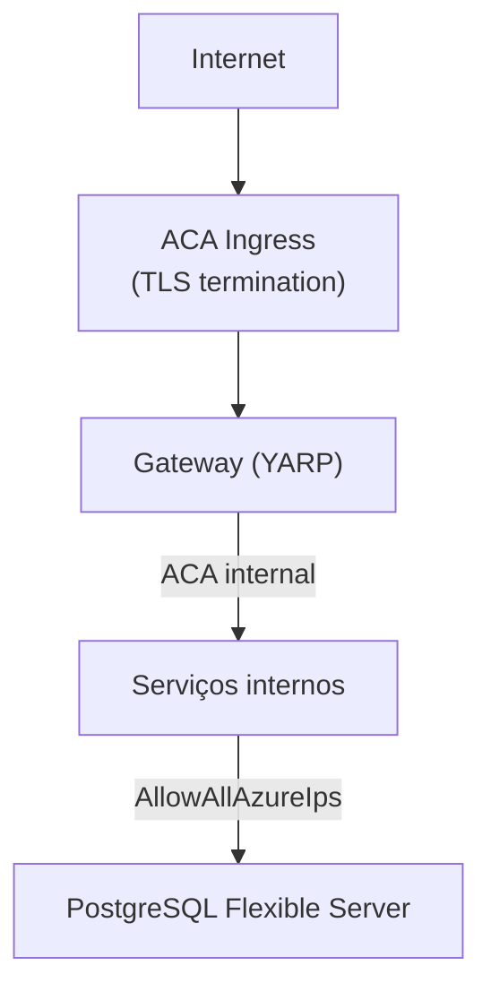

# ADR-015: Segurança de Dados — Encryption at Rest, in Transit e Networking

| Campo | Valor |
|---|---|
| **Status** | Aceito |
| **Data** | Março 2026 |
| **Contexto** | O sistema processa dados financeiros (lançamentos e saldos) que exigem proteção em repouso e em trânsito. A infraestrutura utiliza Azure Managed Services com configurações de segurança padrão. |
| **Decisão** | Utilizar encryption gerenciada pelo Azure (at rest e in transit) com roadmap para Private Endpoints e VNet isolation. |

## Detalhes

### Encryption at Rest

Habilitada por padrão em todos os serviços Azure utilizados. Não requer configuração explícita.

| Componente | Mecanismo | Gestão de Chaves |
|---|---|---|
| PostgreSQL Flexible Server | AES-256 (TDE) | Azure-managed |
| Azure Container Registry | AES-256 | Azure-managed |
| Log Analytics Workspace | AES-256 | Azure-managed |

### Encryption in Transit

| Caminho | Protocolo | Configuração |
|---|---|---|
| Cliente → Gateway | TLS 1.2+ | Gerenciado pelo ACA ingress |
| Gateway → Serviços internos | TLS 1.2+ | ACA internal networking |
| Serviços → PostgreSQL | TLS 1.2+ | `Ssl Mode=Require` na connection string |
| Serviços → RabbitMQ | AMQP/TLS | ACA internal networking |

### Networking atual e limitações

**Limitação:** A firewall rule `AllowAllAzureIps` permite que qualquer serviço Azure na mesma região acesse o PostgreSQL. Embora exija credenciais válidas, não atende ao princípio de least privilege em networking.

### Secrets

| Secret | Armazenamento atual | Status |
|---|---|---|
| PostgreSQL connection strings | ACA secrets (via `azd`) | Manual |
| RabbitMQ connection string | ACA secrets (via `azd`) | Manual |
| JWT signing key | ACA secrets (via `azd`) | Manual |
| Gateway shared secret | ACA secrets (via `azd`) | Manual |

### Roadmap de segurança de rede

| Fase | Ação | Benefício |
|---|---|---|
| Médio prazo | VNet injection para ACA Environment | Isolamento de rede entre serviços e internet |
| Médio prazo | Private Endpoint para PostgreSQL | Elimina `AllowAllAzureIps`, tráfego via VNet |
| Médio prazo | Migrar secrets para Azure Key Vault | Rotação automática, auditoria de acesso |
| Longo prazo | Private Endpoint para ACR | Pull de imagens via rede privada |

## Consequências

- A configuração atual atende requisitos de compliance básicos para dados financeiros não-PCI (encryption at rest + in transit).
- `AllowAllAzureIps` é um gap de segurança de rede documentado, mitigado por autenticação obrigatória no banco.
- VNet injection no ACA Environment tem custo de ~$0.09/hora — avaliar custo-benefício.
- A migração para Private Endpoints requer VNet injection primeiro, pois os Container Apps precisam estar na VNet para alcançar o Private Endpoint do PostgreSQL.
