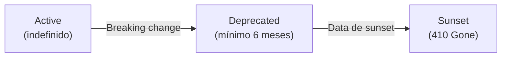

# ADR-016: API Versioning com Asp.Versioning

| Campo | Valor |
|---|---|
| **Status** | Aceito |
| **Data** | Março 2026 |
| **Contexto** | As APIs do CashFlow usam versionamento por URL path (`/api/v1/...`) via Carter `MapGroup`. Não havia tooling formal para reportar versões suportadas, deprecar versões antigas ou comunicar ciclo de vida de API aos consumidores. |
| **Decisão** | Adotar `Asp.Versioning.Http` para gestão formal de versões com reporting automático via headers HTTP. Manter URL path como mecanismo primário de seleção de versão. |

## Detalhes

### Configuração

```csharp
builder.Services.AddApiVersioning(options =>
{
    options.DefaultApiVersion = new ApiVersion(1, 0);
    options.AssumeDefaultVersionWhenUnspecified = true;
    options.ReportApiVersions = true; // Headers automáticos em todas as respostas
});
```

### Headers de resposta

Com `ReportApiVersions = true`, todas as respostas incluem:
- `api-supported-versions: 1.0` — versões ativas
- `api-deprecated-versions:` — versões marcadas para remoção (quando aplicável)

### Integração com Carter

Carter registra rotas via `ICarterModule.AddRoutes()` dentro de um `MapGroup("api/v1")`. O `Asp.Versioning` opera via middleware global, sem necessidade de alterar os módulos Carter.

A API `NewVersionedApi()` do `Asp.Versioning` foi avaliada mas descartada: a integração com `MapCarter()` (que descobre e registra módulos automaticamente) não é garantida. A abordagem híbrida (versioning global + URL path manual) é mais segura.

### Ciclo de vida de versão



| Estado | Headers | Comportamento |
|---|---|---|
| **Active** | `api-supported-versions: 1.0` | Totalmente suportado |
| **Deprecated** | `api-deprecated-versions: 1.0` + `Sunset: <data>` | Funcional com aviso |
| **Sunset** | N/A | Removido, retorna 410 Gone |

### Procedimento de deprecation

1. Criar nova versão (`v2`) com mudanças breaking.
2. Marcar `v1` como deprecated no `Asp.Versioning`.
3. Adicionar header `Sunset` com data mínima 6 meses no futuro (RFC 8594).
4. Documentar no changelog e marcar como `deprecated: true` no OpenAPI.
5. Após a data de sunset, remover e retornar 410 Gone.

## Trade-offs

| Dimensão | Asp.Versioning | Versionamento Manual |
|---|---|---|
| Headers automáticos | Sim (`api-supported-versions`) | Requer middleware customizado |
| Deprecation workflow | Nativo | Manual |
| Integração Carter | Parcial (global, sem `NewVersionedApi`) | Completa (MapGroup simples) |
| Dependência adicional | 1 pacote NuGet | Nenhuma |

## Consequências

- Consumidores de API podem inspecionar headers para detectar versões suportadas e deprecadas.
- O URL path permanece como mecanismo primário (`/api/v1/`, `/api/v2/`).
- A integração com Carter é limitada ao versionamento global — se necessário, futura migração para `NewVersionedApi()` com módulos Carter adaptados.
