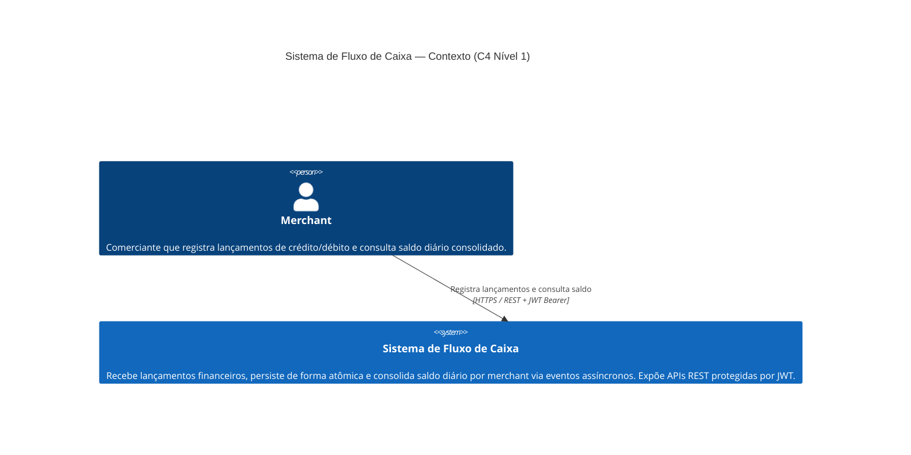
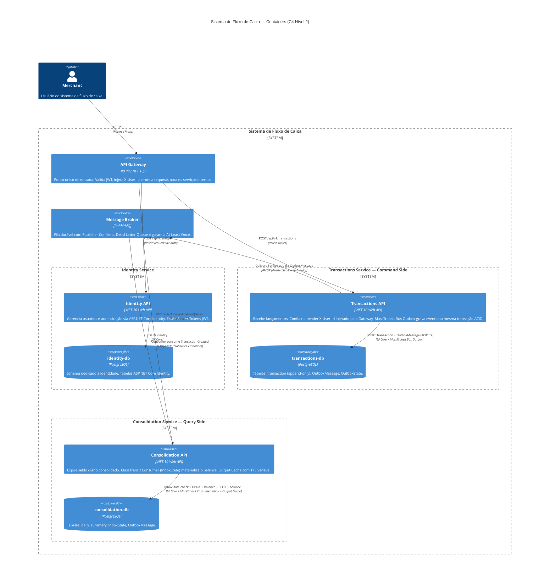
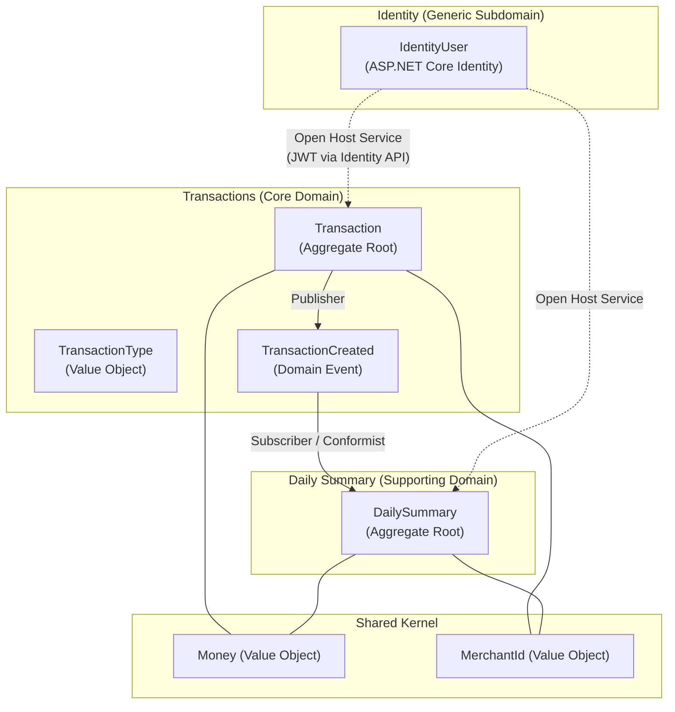
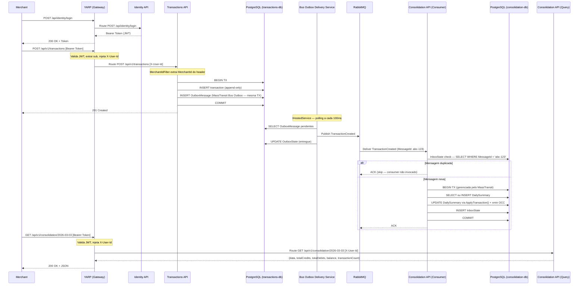
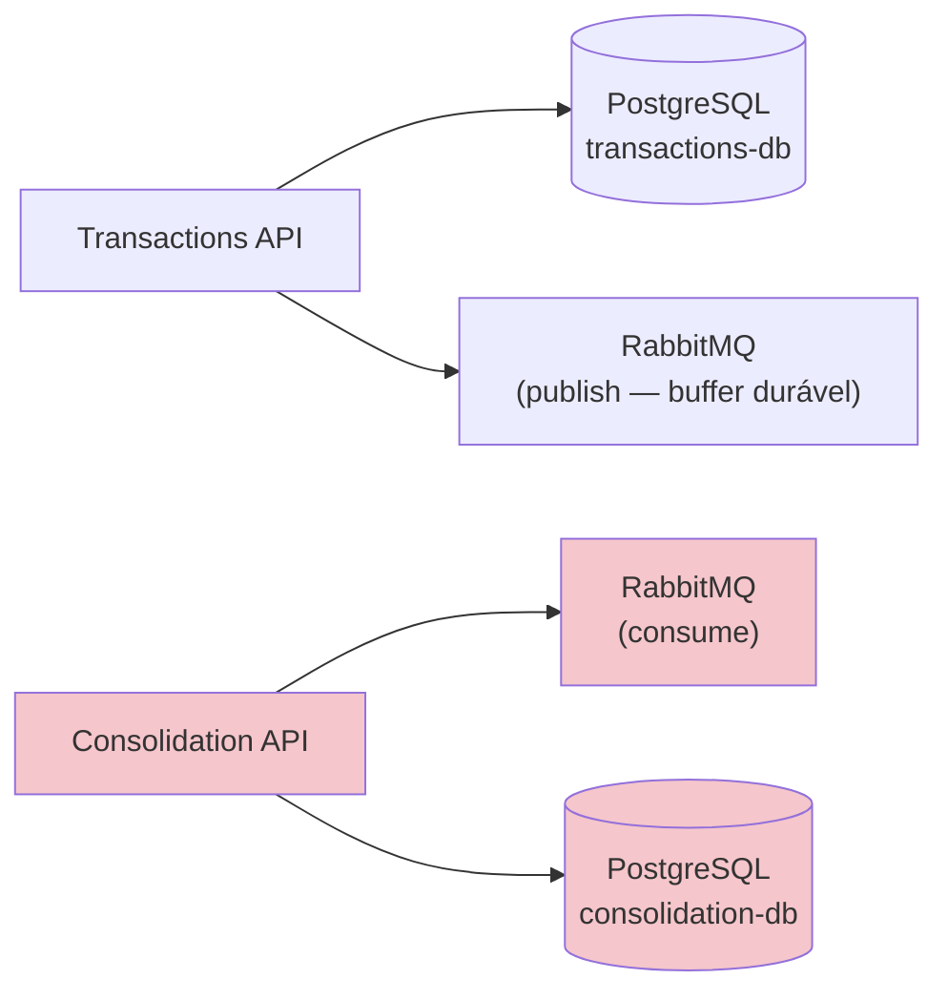
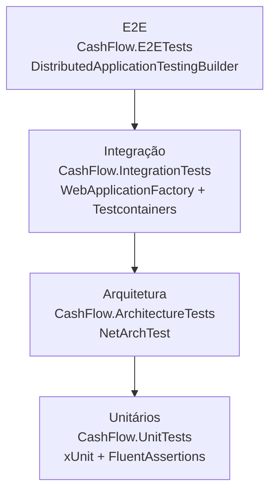

# Documento de Arquitetura — Sistema de Fluxo de Caixa

> **Autor:** Gabriel Padilha
> **Stack:** C# / .NET 10
> **Data:** Março 2026

## Sumário

1. [Visão Geral da Arquitetura](#1-visão-geral-da-arquitetura)
2. [Restrições e Requisitos](#2-restrições-e-requisitos)
3. [Decomposição de Domínio (DDD)](#3-decomposição-de-domínio-ddd)
4. [Architecture Decision Records (ADRs)](#4-architecture-decision-records-adrs)
5. [Fluxo de Dados e Integração](#5-fluxo-de-dados-e-integração)
6. [Garantia de NFRs](#6-garantia-de-nfrs)
7. [Padrões de Código e Testes](#7-padrões-de-código-e-testes)
8. [Evolução](#8-evolução)

---

## 1. Visão Geral da Arquitetura

### Resumo Executivo

O sistema adota **quatro processos deployáveis independentes** com Event-Driven Architecture (EDA) e CQRS: dois serviços de domínio (Transactions e Consolidation), um serviço de Identidade e um API Gateway (YARP). Os serviços de domínio comunicam-se exclusivamente via mensageria assíncrona (RabbitMQ) orquestrada pelo MassTransit. Cada serviço é deployado como um processo independente, garantindo que a falha em um jamais afete a disponibilidade dos demais.

| Princípio | Implementação |
|---|---|
| **Isolamento de Falhas** | Processos separados — crash do consolidation não afeta transactions |
| **CQRS** | Transactions (Command) + Consolidation (Query) |
| **Event-Driven** | Coreografia via eventos com MassTransit (Bus Outbox → RabbitMQ → Consumer Inbox) |
| **Append-Only Writes** | Transactions são imutáveis (INSERT-only), eliminando race conditions no write-side |
| **Idempotência** | MassTransit Consumer Inbox garante exactly-once via `InboxState` |
| **Observabilidade** | .NET Aspire + OpenTelemetry (traces, métricas, logs) |

### Topologia — Por que Não Monolito Modular

O requisito mais crítico do sistema é:

> *"O serviço de controle de transactions NÃO PODE ficar indisponível se o sistema de daily consolidation cair."*

Um Monolito Modular (processo único) não pode atender a este requisito: uma `OutOfMemoryException`, `StackOverflowException` ou crash não-tratado em qualquer módulo derruba o processo inteiro. Isolamento de falhas real exige isolamento de processo.

| Aspecto | Monolito Modular | Serviços Independentes c/ Gateway | Microsserviços Full |
|---|---|---|---|
| Isolamento de falhas | Não garante | Garantido (processos separados) | Garantido |
| Complexidade operacional | Baixa | Moderada (4 processos) | Alta (K8s, service mesh) |
| Repositório | 1 repo | 1 repo (shared codebase) | N repos |
| Deploy | 1 artefato | 4 artefatos | N artefatos + orquestração |
| Custo infra | Mínimo | Baixo | Alto |

A posição escolhida é **Serviços Independentes com Shared Codebase e API Gateway** — documentada em [ADR-001](adr/001-topology.md).

### Diagrama de Contexto (C4 — Nível 1)



### Diagrama de Containers (C4 — Nível 2)



### Estrutura do Projeto

O projeto adota **Vertical Slice Architecture** combinado com **Domain-Driven Design**: código organizado por features em vez de camadas técnicas. O Domain é o núcleo invariante (Aggregates, Value Objects, Domain Events, ports). As Feature Slices são orquestradoras (endpoint → validação → handler → domínio → persistência → resposta).

```
src/
├── CashFlow.Domain/                    # Núcleo invariante (Aggregates, VOs, Events, ports)
│   ├── SharedKernel/                   #   Entity<T>, Money, Result<T>, DomainEvent
│   ├── Transactions/                   #   Transaction (AR), TransactionId, TransactionType,
│   │                                   #   TransactionCreated (Event), ITransactionRepository
│   └── Consolidation/                  #   DailySummary (AR), DailySummaryId,
│                                       #   IDailySummaryRepository
│
├── CashFlow.Gateway/                   # YARP — API Gateway / ponto único de entrada
├── CashFlow.Identity.API/              # API de autenticação independente
│   └── Features/Authentication/        #   MapIdentityApi
│
├── CashFlow.Transactions.API/          # Command Side — API + MassTransit Bus Outbox
│   ├── Features/
│   │   ├── CreateTransaction/          #   Endpoint (Carter), Command, Handler, Validator, Response
│   │   └── GetTransaction/             #   Query + Handler (single-file), Response
│   └── Persistence/                    #   DbContext, Repository, EF Configurations
│
├── CashFlow.Consolidation.API/         # Query Side — API + MassTransit Consumer Inbox
│   ├── Features/
│   │   ├── GetDailyBalance/            #   Query + Handler (single-file), Response
│   │   └── TransactionCreated/         #   Consumer + ConsumerDefinition + FaultConsumer
│   └── Persistence/                    #   DbContext, Repository, EF Configurations
│
├── CashFlow.AppHost/                   # .NET Aspire — orquestração local
└── CashFlow.ServiceDefaults/           # OpenTelemetry, HealthChecks, Resiliência compartilhada

tests/
├── CashFlow.UnitTests/                 # xUnit + FluentAssertions — domain logic e handlers
├── CashFlow.IntegrationTests/          # WebApplicationFactory + Testcontainers — por serviço
├── CashFlow.ArchitectureTests/         # NetArchTest — regras de dependência VSA/DDD
└── CashFlow.E2ETests/                  # DistributedApplicationTestingBuilder — fluxo completo
```

| Processo | Responsabilidade | MassTransit | Auth |
|---|---|---|---|
| `CashFlow.Gateway` (YARP) | Ponto único de entrada. Valida Auth, injeta Headers. | — | Valida JWT, injeta `X-User-Id` |
| `CashFlow.Identity.API` | Cadastro e login de usuários | — | Emite Bearer Token |
| `CashFlow.Transactions.API` | Recebe e persiste lançamentos | Bus Outbox + Delivery Service | Confia no `X-User-Id` do Gateway |
| `CashFlow.Consolidation.API` | Consome eventos + expõe consolidation | Consumer Inbox | Confia no `X-User-Id` do Gateway |

---

## 2. Restrições e Requisitos

### Requisitos Técnicos

| # | Requisito | Status |
|---|---|---|
| RT-1 | Implementação em C# | .NET 10 |
| RT-2 | Testes | Unit, Integration, Architecture, Load, E2E (Aspire) |
| RT-3 | Boas práticas (SOLID, Design Patterns) | Vertical Slice Architecture + DDD (Ports & Adapters) |
| RT-4 | Repositório público (GitHub) | Disponível |
| RT-5 | README com instruções de execução local | `README.md` na raiz |

### Requisitos Não Funcionais

| # | NFR | Estratégia |
|---|---|---|
| NFR-1 | Transactions disponível se consolidation cair | Processos separados + comunicação assíncrona via RabbitMQ |
| NFR-2 | Consolidation suporta 50 req/s | PostgreSQL Standard_D2ds_v4 + Output Cache (TTL variável) |
| NFR-3 | Perda de requisições < 5% | Durable queues + Publisher Confirms + Inbox + DLQ → perda ~0% |
| NFR-4 | Throughput de ingestão ≥ 50 msg/s | 2 consumers + UsePartitioner(8) → ~66 msg/s com ~0% de conflitos |

---

## 3. Decomposição de Domínio (DDD)

### 3.1 Linguagem Ubíqua

| Termo (Código) | Termo (Negócio) | Definição |
|---|---|---|
| `Transaction` | Lançamento | Registro financeiro individual (crédito ou débito). Imutável após criação. |
| `DailySummary` | Consolidado Diário | Resumo materializado do fluxo de caixa de um dia específico. |
| `Balance` | Saldo | `TotalCredits - TotalDebits`. Derivado, não persistido. |
| `MerchantId` | ID do Comerciante | Identificador único do tenant. Derivado do claim `sub` do JWT. |
| `Money` | Valor Monetário | Quantia com moeda ISO 4217. Sempre não-negativa. |
| `ReferenceDate` | Data de Referência | Data do lançamento para fins de consolidação. |
| `TransactionType` | Tipo de Lançamento | `Credit` (entrada) ou `Debit` (saída). |
| `TransactionCreated` | Lançamento Criado | Evento de domínio emitido quando um lançamento é persistido. |

### 3.2 Bounded Contexts e Context Map



O contexto de Daily Summary atua como **Conformist** em relação ao Core Domain de Transactions: consome o evento `TransactionCreated` exatamente no formato publicado, sem necessidade de ACL porque ambos compartilham o Shared Kernel.

### 3.3 Bounded Context — Transactions (Core Domain)

**Localização:** `CashFlow.Domain/Transactions/` (port) + `CashFlow.Transactions.API/Persistence/` (adapter)

**Aggregate Root `Transaction`**: Imutável após criação (append-only). Propriedades: `MerchantId`, `ReferenceDate`, `Type`, `Value` (Money), `Description`, `CreatedAt`, `CreatedBy`. Criação exclusivamente via factory method `Transaction.Create(...)` que usa Result Pattern — retorna `Result.Failure` se valor não for positivo ou descrição estiver vazia.

**Invariantes protegidas:**
- Valor financeiro deve ser estritamente positivo
- Descrição é obrigatória
- Imutabilidade é garantida pós-criação (sem setters públicos)
- `TimeProvider` injetável permite testes determinísticos

### 3.4 Bounded Context — Daily Summary (Supporting Domain)

**Localização:** `CashFlow.Domain/Consolidation/` (port) + `CashFlow.Consolidation.API/Persistence/` (adapter)

**Aggregate Root `DailySummary`**: Possui `MerchantId`, `Date`, `TotalCredits`, `TotalDebits` (Money), `TransactionCount`, `UpdatedAt`. `Balance` é propriedade derivada (`TotalCredits - TotalDebits`), não persistida. Concorrência via `xmin` (shadow property no EF Core).

O método `ApplyTransaction(type, value)` valida que o valor é positivo, incrementa o total correspondente, incrementa o contador e atualiza o timestamp.

> **Nota CQRS:** O endpoint `GetDailyBalance` acessa `ConsolidationDbContext` diretamente via LINQ com `AsNoTracking()` — sem Repository — pois é o lado Query do CQRS. Veja [ADR-013](adr/013-query-side-no-repository.md).

---

## 4. Architecture Decision Records (ADRs)

As decisões arquiteturais estão documentadas individualmente em [`adr/`](adr/).

| ADR | Decisão | Status |
|---|---|---|
| [ADR-001](adr/001-topology.md) | Topologia: Serviços Independentes com API Gateway | Aceito |
| [ADR-002](adr/002-messaging.md) | Mensageria: RabbitMQ + MassTransit Bus Outbox + Consumer Inbox | Aceito |
| [ADR-003](adr/003-database.md) | Banco de Dados: PostgreSQL com databases separados por serviço | Aceito |
| [ADR-004](adr/004-resilience.md) | Resiliência: MassTransit Retry, Npgsql e HttpClient (Polly v8) | Aceito |
| [ADR-005](adr/005-concurrency.md) | Concorrência: Append-Only + Optimistic Concurrency + Particionamento | Aceito |
| [ADR-006](adr/006-gateway-auth.md) | API Gateway e Auth Offloading: YARP + ASP.NET Core Identity | Aceito |
| [ADR-007](adr/007-dlq.md) | Dead Letter Queue: Error Queue nativa do MassTransit + FaultConsumer | Aceito |
| [ADR-008](adr/008-gateway-ha.md) | Alta Disponibilidade: Azure Container Apps + .NET Aspire | Aceito |
| [ADR-009](adr/009-e2e-testing.md) | Testes E2E com .NET Aspire Testing | Aceito |
| [ADR-010](adr/010-di-handlers.md) | Handlers via DI Direto (sem MediatR) | Aceito |
| [ADR-011](adr/011-container-apps-scaling.md) | Auto-Scaling: HTTP Scaling Rules por perfil de carga | Aceito |
| [ADR-012](adr/012-postgresql-scaling.md) | PostgreSQL: Standard_D2ds_v4 + PgBouncer Built-in | Aceito |
| [ADR-013](adr/013-query-side-no-repository.md) | Query-Side com DbContext Direto (sem Repository) | Aceito |
| [ADR-014](adr/014-resource-authorization.md) | Autorização Baseada em Recurso via MerchantId (Tenant Isolation) | Aceito |
| [ADR-015](adr/015-data-security.md) | Segurança de Dados: Encryption at Rest/Transit + Networking Roadmap | Aceito |
| [ADR-016](adr/016-api-versioning.md) | API Versioning com Asp.Versioning + Política de Deprecation | Aceito |

---

## 5. Fluxo de Dados e Integração

### Fluxo End-to-End



### Tratamento de Falhas

| Falha | Efeito | Recuperação Automática |
|---|---|---|
| **RabbitMQ indisponível** | Bus Outbox acumula mensagens no DB | Delivery Service faz retry contínuo; publica quando o broker voltar |
| **Consolidation API crash** | Mensagens ficam na fila (unacked) | RabbitMQ redistribui ao reconectar |
| **DB de consolidation indisponível** | Consumer falha no commit | `UseMessageRetry` com backoff exponencial (5×, 100ms–30s) |
| **Mensagem duplicada** | `InboxState` detecta `MessageId` repetido | Consumer não é invocado — skip automático |
| **Conflito de concorrência (xmin)** | `DbUpdateConcurrencyException` | Retry exponencial — resolvido em < 150ms |
| **Exaustão de retries** | Mensagem não pode ser processada | Movida para error queue; `TransactionFaultConsumer` registra métrica e alerta |

---

## 6. Garantia de NFRs

### NFR-1: Isolamento de Falhas

A API de Transactions depende exclusivamente de `{PostgreSQL Write, RabbitMQ}`. A Consolidation API não está nesse conjunto.



A queda de qualquer componente do lado vermelho (consolidation) não afeta o lado esquerdo (transactions).

### NFR-2: Throughput de Leitura — 50 req/s

| Componente | Capacidade Estimada | Margem sobre 50 req/s |
|---|---|---|
| Kestrel (GET, I/O-bound) | ~2.000 req/s | 40x |
| PgBouncer (porta 6432, pool_size=50) | ~1.600 req/s | 32x |
| PostgreSQL Standard_D2ds_v4 (SELECT indexado) | ~5.000 q/s | 100x |

**Estratégia de cache:**

| Regime | TTL | Justificativa |
|---|---|---|
| Datas passadas (`data < hoje`) | 1 hora | Imutáveis após fechamento do dia |
| Dia corrente (`data == hoje`) | 5 segundos | Muda a cada evento; invalidação ativa pelo consumer |

`AllowLocking = true` previne thundering herd: apenas a primeira requisição em cache miss vai ao banco.

### NFR-3: Perda de Requisições < 5%

Com durable queues + persistent messages + Publisher Confirms + manual ACK + Inbox Pattern + DLQ, a perda efetiva é **~0%** em condições normais.

### NFR-4: Throughput de Ingestão ≥ 50 msg/s

```
Premissas conservadoras:
  T_db_roundtrip  = 5ms
  T_query         = 15ms  (InboxState check + UPSERT + commit com WAL flush)
  T_overhead      = 10ms  (desserialização, DI, MassTransit pipeline)
  ──────────────────────────────────────────────
  T_total         = 30ms/mensagem (sem contenção)
  Throughput/instância: 1000ms / 30ms = ~33 msg/s
```

| Configuração | Throughput | Taxa DbUpdateConcurrencyException |
|---|---|---|
| 1 consumer, sem particionamento | ~33 msg/s | ~0% |
| 2 consumers, sem particionamento | ~50 msg/s (com retries) | 30–50% em pico |
| **2 consumers + UsePartitioner(8)** | **~66 msg/s** | **~0%** |

### Observabilidade

| Pilar | Ferramenta | Implementação |
|---|---|---|
| **Traces** | OpenTelemetry → OTLP | ASP.NET Core, HttpClient, EF Core, MassTransit |
| **Métricas** | OpenTelemetry → OTLP | Runtime .NET + métricas de negócio customizadas (`CashFlowMetrics`) |
| **Logs** | Built-in .NET Logging → OpenTelemetry | Logs estruturados com TraceId/SpanId |
| **Health** | ASP.NET HealthChecks | `/health` (readiness), `/alive` (liveness) |
| **Dashboard** | Aspire Dashboard (dev) / Azure Monitor (prod) | Visualização integrada |

**Métricas de negócio (`CashFlowMetrics`):**

| Métrica | Tipo | Descrição |
|---|---|---|
| `cashflow.transactions.created` | Counter (type, currency) | Lançamentos criados |
| `cashflow.transactions.amount` | Histogram (type, currency) | Valores dos lançamentos |
| `cashflow.consolidation.events_processed` | Counter (result) | Eventos processados pelo consumer |
| `cashflow.consolidation.processing_duration_ms` | Histogram | Duração do processamento do consumer |
| `cashflow.consolidation.eventual_consistency_ms` | Histogram | Latência criação → consolidação |
| `cashflow.gateway.auth_failures` | Counter (reason) | Falhas de autenticação no Gateway |
| `cashflow.messaging.dlq_faults` | Counter (message_type, exception_type) | Mensagens enviadas para DLQ |

### Segurança

| Camada | Mecanismo |
|---|---|
| **Auth Offloading** | YARP valida o Bearer Token, injeta `X-User-Id`, bloqueia spoofing |
| **Identidade** | ASP.NET Core Identity em serviço independente com schema dedicado |
| **Gateway Secret** | `GatewaySecretMiddleware` nos backends valida header `X-Gateway-Secret` |
| **Isolamento de dados** | `MerchantIdFilter` garante filtragem por `MerchantId` em todos os handlers |
| **Transporte** | HTTPS obrigatório (TLS 1.2+); Ssl Mode=Require na connection string do PostgreSQL |
| **Validação de entrada** | FluentValidation em todos os DTOs |
| **Rate Limiting** | ASP.NET Core Fixed Window Limiter no YARP (3600 req/min por IP) |

> Autorização baseada em recurso e isolamento multi-tenant: [ADR-014](adr/014-resource-authorization.md).
> Segurança de dados (encryption, networking): [ADR-015](adr/015-data-security.md).

**Limitação conhecida:** Sem RBAC. Qualquer usuário autenticado acessa todos os endpoints protegidos, filtrado ao seu próprio `MerchantId`. O isolamento de dados é completo; papéis distintos (Admin, ReadOnly) não estão implementados.

### Backup e Disaster Recovery

| Capacidade | Configuração |
|---|---|
| **Backup automático** | `backupRetentionDays: 35` — snapshot diário + WAL contínuo |
| **PITR nativo** | Recuperação para qualquer ponto nos últimos 35 dias |
| **Geo-redundância** | `geoRedundantBackup: Enabled` — backup cross-region |
| **RPO efetivo** | < 5 minutos (WAL contínuo gerenciado) |
| **RTO efetivo** | ~2–4 horas |

Plano de Disaster Recovery completo: [`docs/disaster-recovery.md`](disaster-recovery.md).

---

## 7. Padrões de Código e Testes

### Convenções de Código

| Prática | Implementação |
|---|---|
| **Vertical Slice Architecture + DDD** | Features coesas (Endpoint + Handler + Command/Query + Validator) dentro de cada BC |
| **Carter + Minimal APIs** | `ICarterModule` substitui Controllers tradicionais |
| **Domain Model Rico** | Aggregates e Value Objects com invariantes encapsuladas; sem setters públicos sem validação |
| **Result Pattern** | `Result<T>` para fluxos de negócio controlados — sem exceções nas fronteiras de API |
| **DI Direto** | Handlers como classes POCO registradas via `AddScoped<T>()` — sem MediatR ([ADR-010](adr/010-di-handlers.md)) |

### Regras de Ownership

1. Feature Slice chama o Domain; nunca reimplementa lógica de negócio.
2. Repository interfaces (ports) vivem no Domain; implementações (adapters) em `Persistence/`.
3. Queries do lado Read (CQRS) acessam `DbContext` diretamente via LINQ ([ADR-013](adr/013-query-side-no-repository.md)).
4. EF Configurations vivem em `Persistence/Configurations/` — são cross-feature.
5. Features são caixas fechadas: Feature A não referencia Feature B.

### Estratégia de Testes

| Tipo | Framework | Projeto | Escopo |
|---|---|---|---|
| **Unitário** | xUnit + FluentAssertions + NSubstitute | `CashFlow.UnitTests` | Domain logic, handlers isolados |
| **Integração** | WebApplicationFactory + Testcontainers | `CashFlow.IntegrationTests` | API endpoint, um serviço por vez |
| **Arquitetura** | NetArchTest | `CashFlow.ArchitectureTests` | Regras de dependência VSA/DDD |
| **E2E** | `DistributedApplicationTestingBuilder` | `CashFlow.E2ETests` | Fluxo completo via AppHost ([ADR-009](adr/009-e2e-testing.md)) |
| **Carga** | k6 | `tests/load/` | Validação de NFR-2 e NFR-4 |



---

## 8. Evolução

| Evolução | Complexidade | Benefício |
|---|---|---|
| **Event Sourcing** (Marten/EventStoreDB) | Alta | Audit trail perfeito, time travel |
| **CDC (Debezium)** substituindo Outbox polling | Média | Latência ~10ms (vs ~500ms do polling) |
| **Redis como cache** à frente do PostgreSQL read | Baixa | Sub-milissegundo para reads — justificável em > 1.000 req/s |
| **Identity Server / Keycloak** | Alto custo operacional | Padrão OIDC completo, OAuth2 para 3rd party |
| **Multi-tenancy isolado (schema/DB por tenant)** | Média | Isolamento físico total por merchant |
| **Multi-ambiente ACA** (staging + prod) | Baixa | Canary deployments com ACA revisions |
| **Contract Testing** (PactNet) | Baixa | Barreira contra breaking changes silenciosos nos schemas de eventos |
| **Zero-downtime deployments** | Baixa | `activeRevisionsMode: Multiple` + traffic splitting no ACA |

---

## Apêndice: API Endpoints (via Gateway)

| Método | Endpoint (YARP) | Roteado Para | Auth |
|---|---|---|---|
| `POST` | `/api/identity/register` | `Identity.API` | Anônimo |
| `POST` | `/api/identity/login` | `Identity.API` | Anônimo |
| `POST` | `/api/v1/transactions` | `Transactions.API` | JWT (Gateway injeta `X-User-Id`) |
| `GET` | `/api/v1/transactions/{id}` | `Transactions.API` | JWT (Gateway injeta `X-User-Id`) |
| `GET` | `/api/v1/consolidation/{date}` | `Consolidation.API` | JWT (Gateway injeta `X-User-Id`) |
| `GET` | `/health` | Cada serviço | Anônimo |
| `GET` | `/alive` | Cada serviço | Anônimo |

## Apêndice: .NET Aspire AppHost

O `CashFlow.AppHost` orquestra todos os recursos para desenvolvimento local e serve como fonte de verdade para o `azd` provisionar a infraestrutura em produção (ACA). Declara:

- PostgreSQL com 3 databases dedicados (`identity-db`, `transactions-db`, `consolidation-db`)
- RabbitMQ com management plugin
- 4 serviços (`gateway`, `identity`, `transactions`, `consolidation`) com dependências explícitas via `WaitFor()`
- Gateway com `WithExternalHttpEndpoints()` para ingress externo; demais serviços com ingress interno

Não há Dockerfiles. O `azd` usa `dotnet publish /t:PublishContainer` para build e deploy das imagens.
