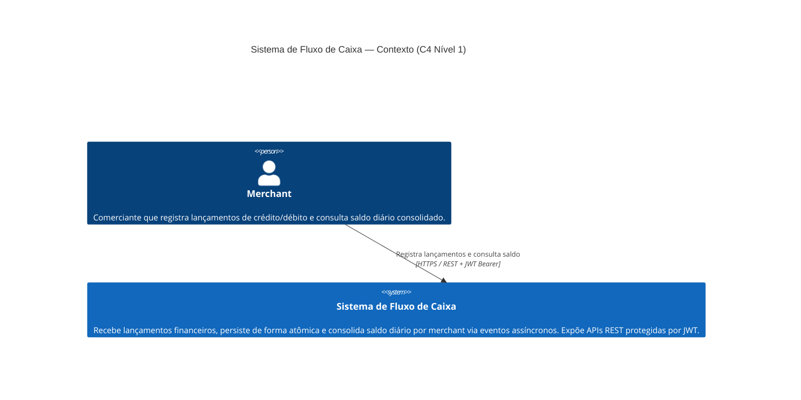
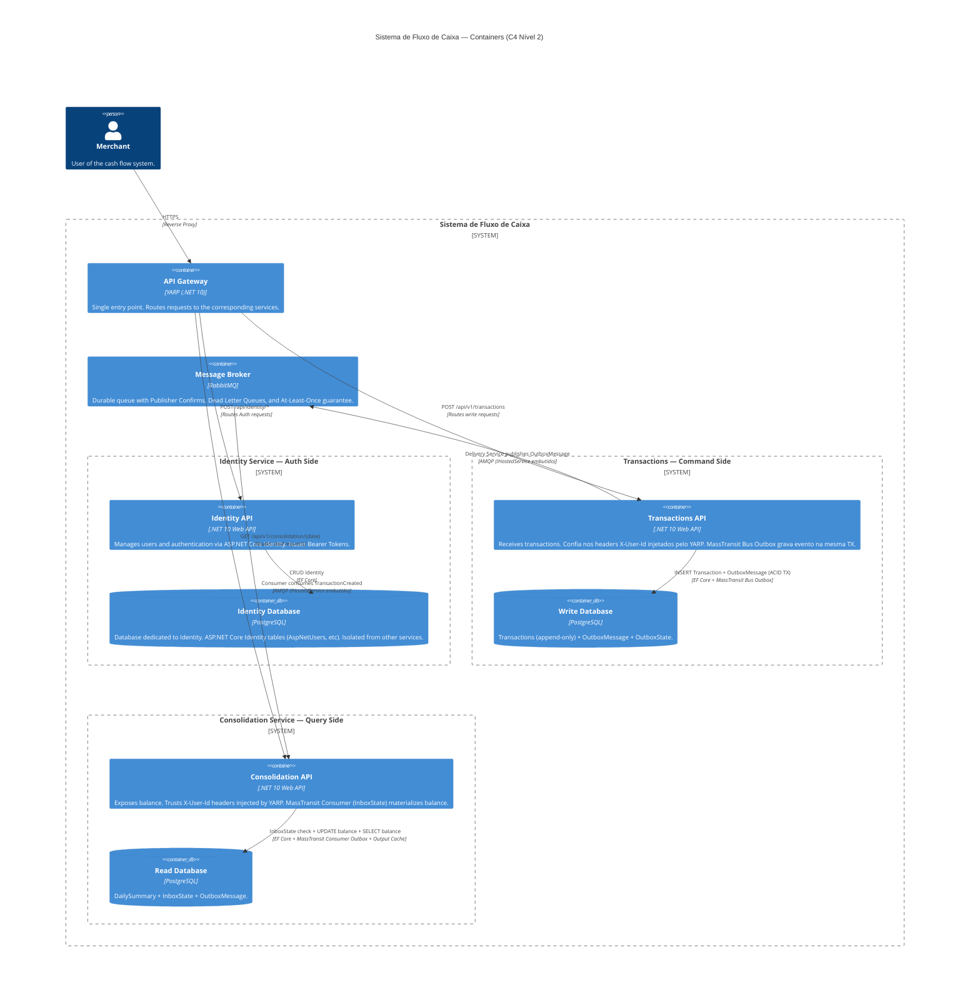
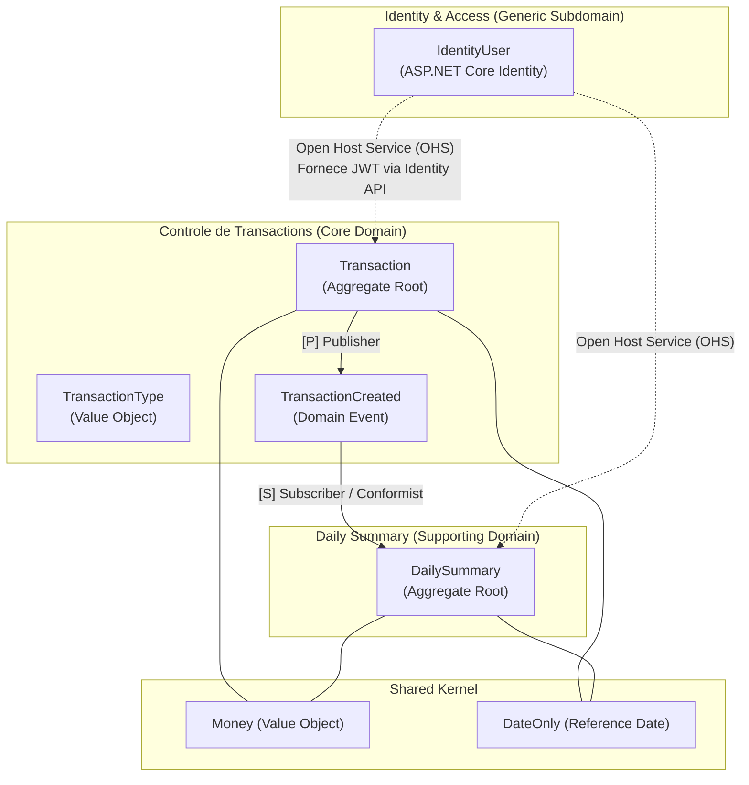
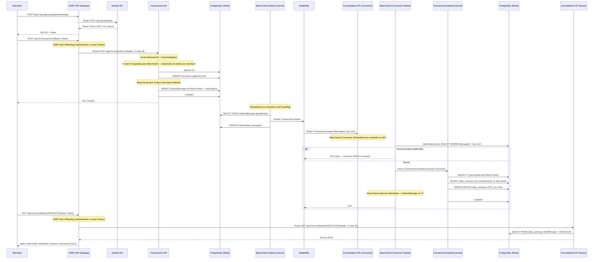

# Documento de Arquitetura — Sistema de Fluxo de Caixa

> **Autor:** Gabriel Padilha
> **Stack:** C# / .NET 10
> **Data:** Março 2026

---

## Sumário

1. [Visão Geral da Arquitetura](#1-visão-geral-da-arquitetura)
2. [Restrições e Requisitos](#2-restrições-e-requisitos)
3. [Decomposição de Domínio (DDD)](#3-decomposição-de-domínio-ddd)
4. [Architecture Decision Records (ADRs)](#4-architecture-decision-records-adrs)
5. [Fluxo de Dados e Integração](#5-fluxo-de-dados-e-integração)
6. [Garantia de NFRs](#6-garantia-de-nfrs)
7. [Boas Práticas e Padrões de Código](#7-boas-práticas-e-padrões-de-código)
8. [Evolução](#8-evolução)
- [Authorization](#authorization)
- [Disaster Recovery](disaster-recovery.md)
- [Apêndice: API Endpoints](#apêndice-api-endpoints-visão-do-cliente-via-gateway)
- [Apêndice: .NET Aspire AppHost](#apêndice-net-aspire-apphost)

---

## 1. Visão Geral da Arquitetura

### Resumo Executivo

O sistema adota uma arquitetura de **quatro processos deployáveis independentes** com Event-Driven Architecture (EDA) e CQRS: dois serviços de domínio (Transactions e Consolidation), um serviço de Identidade e um API Gateway (YARP). Os serviços de domínio comunicam-se exclusivamente via mensageria assíncrona (RabbitMQ) orquestrada pelo **MassTransit**. Cada serviço é deployado como um processo independente, garantindo que a falha em um **jamais** afete a disponibilidade dos demais.

| Princípio | Implementação |
|---|---|
| **Isolamento de Falhas** | Processos separados — crash do consolidation não afeta transactions |
| **CQRS** |  Transactions (Command) +  Consolidation (Query) |
| **Event-Driven** | Coreografia via eventos com **MassTransit** (Bus Outbox → RabbitMQ → Consumer Outbox/Inbox) |
| **Append-Only Writes** | Transactions são imutáveis (INSERT-only), eliminando race conditions |
| **Idempotência** | MassTransit Consumer Outbox garante exactly-once via `InboxState` built-in |
| **Observabilidade** | .NET Aspire + OpenTelemetry (traces, metrics, logs) |

### Topologia — Por que NÃO Monolito Modular

O requisito mais crítico do sistema é:

> *"O serviço de controle de transactions NÃO PODE ficar indisponível se o sistema de daily consolidation cair."*

Um Monolito Modular (processo único) **não pode** atender a este requisito: uma `OutOfMemoryException`, `StackOverflowException` ou crash não-tratado em qualquer módulo derruba o processo inteiro — incluindo módulos saudáveis. **Isolamento de falhas real exige isolamento de processo.**

#### Espectro Topológico e Posição Escolhida

```
Monolito  →  Monolito Modular  →  Serviços Independentes  →  Microsserviços
(1 proc.)    (1 proc., N mods)    (2 proc., repo único)      (N proc., N repos)
                                         ▲
                                    ESCOLHIDO
```

A posição escolhida é **Serviços Independentes com Shared Codebase e API Gateway** — o ponto de equilíbrio entre isolamento de falhas, experiência do cliente (BFF) e simplicidade operacional:

| Aspecto | Monolito Modular ❌ | Serviços Independentes c/ Gateway ✅ | Microsserviços Full ❌ |
|---|---|---|---|
| Isolamento de falhas | Não garante | Garantido (processos separados) | Garantido |
| Complexidade operacional | Baixa | Moderada (4 processos: YARP + 3 APIs) | Alta (K8s, service mesh) |
| Repositório | 1 repo | 1 repo (shared codebase) | N repos |
| Deploy | 1 artefato | 4 artefatos (Gateway, Identity, Transactions, Consolidation) | N artefatos + orquestração |
| API Gateway | Desnecessário | **YARP (Yet Another Reverse Proxy)** | Necessário |
| Shared Kernel | In-process | Projeto NuGet interno | Contratos via DTOs/Protobuf |
| Custo infra | Mínimo | Baixo | Alto |

### Diagrama de Contexto (C4 Model — Nível 1)

O diagrama de contexto mostra o sistema como caixa-preta e suas interações com atores externos. No escopo atual, o único ator é o **Merchant** (comerciante) que interage via APIs REST protegidas por JWT. Não há integrações com sistemas externos (ERP, bancos, gateways de pagamento) — essa é uma decisão deliberada de escopo para a versão 1.0.



### Diagrama de Containers (C4 Model — Nível 2)



### Estrutura do Projeto (Vertical Slice Architecture + DDD)

> **Nota**: O projeto adota **Vertical Slice Architecture** combinado com **Domain-Driven Design**, organizando o código por *Features* (Funcionalidades) em vez de camadas técnicas horizontais. O **Domain** é o núcleo invariante — Aggregate Roots, Value Objects e Domain Events protegem regras de negócio. As **Feature Slices** são orquestradoras — coordenam o fluxo (endpoint → validation → handler → domínio → persistência → resposta). O MassTransit elimina a necessidade de processos separados para Outbox e Consumer. Ambos rodam como `IHostedService` embutidos nas respectivas APIs.

```
src/
├── CashFlow.Domain/                          # Núcleo Invariante (Aggregates, VOs, Events, Ports)
│   ├── SharedKernel/                         #   Entity<T>, ValueObject, Result<T>, DomainEvent, Money
│   ├── Transactions/                     #   Transaction (AR), TransactionId, TransactionType,
│   │                                         #   TransactionCreated (Event), ITransactionRepository (port)
│   └── Consolidation/                         #   DailySummary (AR), DailySummaryId,
│                                             #   IDailySummaryRepository (port)
│
├── CashFlow.Gateway/                         # Projeto YARP (.NET 10) atuando como API Gateway / BFF
│
├── CashFlow.Identity.API/                    # API HTTP independente para Autenticação
│   └── Features/
│       └── Authentication/                   #   Endpoints MapIdentityApi
│
├── CashFlow.Transactions.API/                 # API HTTP + MassTransit Bus Outbox (Command Side)
│   ├── Features/
│   │   ├── CreateTransaction/                  #   Endpoint (Carter), Command, Handler, Validator, Response
│   │   └── GetTransaction/                  #   Endpoint (Carter), Query+Handler (single-file), Response
│   ├── Persistence/                          #   DbContext, Repository, EF Configurations
│   │   ├── TransactionsDbContext.cs
│   │   ├── TransactionRepository.cs           #   ITransactionRepository implementation (adapter)
│   │   └── Configurations/
│   │       └── TransactionConfiguration.cs    #   IEntityTypeConfiguration<Transaction>
│   └── Program.cs
│
├── CashFlow.Consolidation.API/                 # API HTTP + MassTransit Consumer Outbox (Query Side)
│   ├── Features/
│   │   ├── GetDailyBalance/                 #   Endpoint (Carter), Query+Handler (single-file), Response
│   │   └── TransactionCreated/                 #   MassTransit Consumer + ConsumerDefinition
│   ├── Persistence/                          #   DbContext, Repository, EF Configurations
│   │   ├── ConsolidationDbContext.cs
│   │   ├── DailySummaryRepository.cs           #   IDailySummaryRepository implementation (adapter)
│   │   └── Configurations/
│   │       └── DailySummaryConfiguration.cs
│   └── Program.cs
│
├── CashFlow.AppHost/                         # .NET Aspire — orquestração local de todos os recursos
├── CashFlow.ServiceDefaults/                 # OpenTelemetry, HealthChecks, Resiliência compartilhada

tests/
├── CashFlow.UnitTests/                       # xUnit + FluentAssertions — domain logic e handlers
├── CashFlow.IntegrationTests/                # WebApplicationFactory + Testcontainers — testando a fatia inteira
├── CashFlow.ArchitectureTests/               # NetArchTest — dependências de camada + disciplina VSA
├── CashFlow.E2ETests/                        # DistributedApplicationTestingBuilder — fluxo completo via AppHost
```

#### Convenção de Arquivos por Feature Slice

| Tipo de Feature | Convenção | Exemplo |
|---|---|---|
| **Command** (write, validation, domain logic) | Multi-file: Endpoint + Command + Handler + Validator + Response (separados) | `CreateTransaction/` |
| **Query** (read simples, sem validation complexa) | Single-file: Query + Handler no mesmo arquivo + Response separado | `GetTransaction/` |
| **Event Consumer** (MassTransit) | Single-file: Consumer + ConsumerDefinition no mesmo arquivo | `TransactionCreated/` |

> **Regra de Ownership:** Se um artefato serve a uma **única feature**, ele fica dentro da feature. Se serve a **múltiplas features** (DbContext, EF Configurations, Repository), ele fica na pasta `Persistence/` compartilhada do serviço.

**Processos em Runtime (4 deployáveis)**:
| Processo | Responsabilidade | MassTransit | Auth / Rede |
|---|---|---|---|
| `CashFlow.Gateway` (YARP) | Ponto único de entrada. **Valida Auth e injeta Headers.** | — | Oculta a malha e controla acesso |
| `CashFlow.Identity.API` | Cadastro e Login de Usuários | — | Emite Bearer Token via `MapIdentityApi` |
| `CashFlow.Transactions.API` | Recebe e persiste transactions | Bus Outbox + Delivery Service | Confia nos Headers do YARP (`X-User-Id`) |
| `CashFlow.Consolidation.API` | Consome eventos + expõe consolidation | Consumer Outbox/Inbox | Confia nos Headers do YARP (`X-User-Id`) |

---

## 2. Restrições e Requisitos

### Requisitos Técnicos

| # | Requisito | Status |
|---|---|---|
| RT-1 | Implementação em C# | ✅ .NET 10 |
| RT-2 | Testes | ✅ Unit, Integration, Architecture, Load, **E2E (Aspire)** |
| RT-3 | Boas práticas (SOLID, Design Patterns) | ✅ Vertical Slice Architecture + DDD (Ports & Adapters) |
| RT-4 | Repositório público (GitHub) | ✅ |
| RT-5 | README com instruções de como a aplicação funciona e como rodar localmente | ✅ `README.md` na raiz |

### Requisitos Não Funcionais

| # | NFR | Estratégia |
|---|---|---|
| NFR-1 | Transactions disponível se consolidation cair | Processos separados + comunicação assíncrona via RabbitMQ |
| NFR-2 | Consolidation suporta 50 req/s | PostgreSQL indexed query (~5000 q/s) + Output Cache |
| NFR-3 | ≤5% perda de requisições | Durable queues + Publisher Confirms + Inbox + DLQ → perda ~0% |
| NFR-4 | Throughput de ingestão de eventos ≥ 50 msg/s | 2 consumers + UsePartitioner(8) → ~66 msg/s com ~0% DbUpdateConcurrencyException |

---

## 3. Decomposição de Domínio (DDD)

### 3.1 Linguagem Ubíqua (Ubiquitous Language)

A comunicação entre a equipe de desenvolvimento e os especialistas de domínio (merchants/financeiro) baseia-se nos seguintes termos formais:

*   **Transaction:** O registro individual de uma movimentação financeira ocorrida no fluxo de caixa. É imutável após ser concretizado.
*   **Debit:** A cash outflow (expense, payment).
*   **Credit:** A cash inflow (sale, receipt).
*   **Value:** A quantia monetária (sempre positiva) associada a uma transaction.
*   **Daily Summary:** A visão materializada do fluxo de caixa de um dia específico, totalizando todos os credits e debits e exibindo o balance final.
*   **Balance:** O resultado da subtração dos totais de debits em relação aos totais de credits em um Daily Summary.
*   **Merchant:** O usuário (tenant lógico) que registra e visualiza seu fluxo de caixa diário.

### 3.2 Modelagem Estratégica: Subdomínios e Bounded Contexts

O espaço do problema foi particionado conforme as diretrizes do DDD Estratégico:

1.  **Controle de Transactions (Core Domain):** É o coração do negócio. Onde a precisão financeira, a captura da movimentação e a disponibilidade são críticas.
2.  **Daily Summary (Supporting Domain):** Apoia o *Core Domain* fornecendo uma visão compilada e rápida do balance (Read Model).
3.  **Identidade e Acessos (Generic Subdomain):** Necessário para segurança, mas não oferece diferencial competitivo. Utiliza-se ASP.NET Core Identity encapsulada em seu próprio contexto.

### 3.3 Context Map



> **Nota de Design:** O contexto de *Daily Summary* atua de forma **Conformista (Conformist)** em relação aos eventos de *Transactions*, pois consome o evento `TransactionCreated` exatamente no formato publicado pelo upstream, sem necessidade de uma *Anti-Corruption Layer (ACL)* complexa dado que os serviços compartilham o mesmo repositório e compreendem o *Shared Kernel*.

### 3.4 Bounded Context 1 — Controle de Transactions (Core Domain)

**Responsabilidade**: Registrar transações financeiras (debits e credits) com precisão e alta disponibilidade.

**Localização no código**: `CashFlow.Domain/Transactions/` — contém o Aggregate Root, Value Objects, Domain Events e a **interface** do Repository (`ITransactionRepository` — port). A implementação do Repository (adapter) vive em `CashFlow.Transactions.API/Persistence/`.

**Aggregate Root `Transaction`**: Imutável após criação (Append-Only). Propriedades: `MerchantId` (Value Object), `ReferenceDate`, `Type` (Credit/Debit), `Value` (Money), `Description`, `CreatedAt`, `CreatedBy`. Construtor privado; criação exclusivamente via factory method `Transaction.Create(...)` que usa Result Pattern — retorna `Result.Failure` se o valor não for positivo ou a descrição estiver vazia. O factory method emite o Domain Event `TransactionCreated` na mesma transação.

**Value Objects (Shared Kernel)**:
- **`MerchantId`** — `readonly record struct` que rejeita `Guid.Empty` no construtor.
- **`Money`** — `sealed record` com validação ISO 4217, operadores `+` e `-` com validação de moeda compatível, e factory `Money.Zero`.
- **`TransactionType`** — enum com valores `Credit = 1` e `Debit = 2`.

**Invariantes Protegidas**: O valor financeiro deve ser estritamente positivo, a descrição é obrigatória, e a imutabilidade é garantida pós-criação. O `TimeProvider` injetável permite testes determinísticos.

### 3.5 Bounded Context 2 — Daily Summary (Supporting Domain)

**Responsabilidade**: Materializar e projetar o balance consolidado por dia para leitura de altíssima performance.

**Localização no código**: `CashFlow.Domain/Consolidation/` — contém o Aggregate Root e a **interface** do Repository (`IDailySummaryRepository` — port). A implementação do Repository (adapter) vive em `CashFlow.Consolidation.API/Persistence/`. O endpoint de leitura (`GetDailyBalance`) acessa o `ConsolidationDbContext` **diretamente** via projeção LINQ (sem Repository), pois é o lado Query do CQRS.

**Aggregate Root `DailySummary`**: Possui `MerchantId`, `Date`, `TotalCredits`, `TotalDebits` (ambos `Money`, mutáveis apenas via método de domínio), `Balance` (propriedade derivada: `TotalCredits - TotalDebits`, não persistida), `TransactionCount` e `UpdatedAt`. Concorrência via `xmin` (shadow property no EF Core). O método `ApplyTransaction(type, value)` valida que o valor é positivo, incrementa o total correspondente, incrementa o contador e atualiza o timestamp.

---

## 4. Architecture Decision Records (ADRs)

As decisões arquiteturais estão documentadas individualmente em [`adr/README.md`](adr/README.md).

| ADR | Decisão |
|---|---|
| [ADR-001](adr/001-topology.md) | Topologia: Serviços Independentes com API Gateway |
| [ADR-002](adr/002-messaging.md) | Mensageria: RabbitMQ + MassTransit Bus Outbox + Consumer Inbox |
| [ADR-003](adr/003-database.md) | Banco de Dados: PostgreSQL com databases separados |
| [ADR-004](adr/004-resilience.md) | Resiliência: MassTransit Retry, Npgsql e HttpClient Polly v8 |
| [ADR-005](adr/005-concurrency.md) | Concorrência: Append-Only + Optimistic Concurrency + Particionamento |
| [ADR-006](adr/006-gateway-auth.md) | API Gateway e Autenticação: YARP + ASP.NET Core Identity |
| [ADR-007](adr/007-dlq.md) | Dead Letter Queue: Topologia de redelivery e recuperação |
| [ADR-008](adr/008-gateway-ha.md) | Alta Disponibilidade: Azure Container Apps + .NET Aspire |
| [ADR-009](adr/009-e2e-testing.md) | Testes E2E com .NET Aspire Testing |
| [ADR-010](adr/010-di-handlers.md) | Handlers via DI Direto (sem MediatR) |

---

## 5. Fluxo de Dados e Integração

### Fluxo End-to-End (com MassTransit)



### Tratamento de Falhas

| Falha | Efeito | Recuperação Automática (MassTransit) |
|---|---|---|
| **RabbitMQ fora** | Bus Outbox acumula `OutboxMessage` no DB | Delivery Service faz retry contínuo; publica quando RabbitMQ voltar |
| **Consolidation API crash** | Mensagens ficam na fila (unacked) | RabbitMQ redistribui ao reiniciar |
| **DB do consolidation fora** | Consumer falha no commit | `UseMessageRetry` com backoff exponencial |
| **DB de transactions fora** | API retorna 503 | HttpClient standard resilience handler (Polly) abre circuit breaker |
| **Mensagem corrompida** | Desserialização falha | Dead Letter Queue (DLQ) via `UseDelayedRedelivery()` |
| **Mensagem duplicada** | `InboxState` detecta `MessageId` repetido | Consumer NÃO é invocado → skip automático |

---

## 6. Garantia de NFRs

### NFR-1: Isolamento de Falhas

> *"O serviço de transactions não deve ficar indisponível se o consolidation cair."*

**Prova**: A API de Transactions depende de `{PostgreSQL Write, RabbitMQ}`. A Consolidation API **não** está nesse conjunto. Logo, a queda de qualquer componente do consolidation não afeta a transaction.

```
API de Transactions ──→ PostgreSQL (Write)    ← INDEPENDENTE
                   ──→ RabbitMQ (publish)    ← Buffer durável

Consolidation API    ──→ RabbitMQ (consume)    ← Pode cair sem afetar acima
(consumer embutido)──→ PostgreSQL (Read)     ← Isolado
```

### NFR-2: Throughput de Leitura do Consolidation — 50 req/s

**Requisito:** O endpoint `GET /api/v1/consolidation/{date}` deve suportar 50 req/s com no máximo 5% de perda.

#### Capacidade por Componente

| Componente | Capacidade Estimada | Margem sobre 50 req/s |
|---|---|---|
| Kestrel (endpoint GET, I/O-bound) | ~2.000 req/s | **40x** |
| Npgsql connection pool (20 conns max, ~30ms/query) | ~660 req/s | **13x** |
| PostgreSQL read (SELECT por data indexada) | ~5.000 q/s | **100x** |

#### Estratégia de Cache

O consolidation tem dois regimes distintos que exigem estratégias de cache diferentes:

| Regime | Característica | Estratégia |
|---|---|---|
| Datas passadas (`data < hoje`) | **Imutáveis** após fechamento do dia | TTL longo (1h) — resultado nunca muda |
| Dia corrente (`data == hoje`) | Muda a cada evento consumido | TTL curto (5s) + **invalidation ativa** pelo consumer |

A implementação usa uma `IOutputCachePolicy` customizada (`DailyBalanceCachePolicy`) que seleciona o TTL com base na data da rota. O endpoint de leitura é registrado com `.CacheOutput("DailyBalance")` e o consumer invalida o cache por tag `balance-{merchantId}-{date}` após cada evento processado.

> **`AllowLocking = true` e serialização de cache miss são obrigatórios.** Sem essa serialização, N requisições simultâneas encontram cache miss ao mesmo tempo e disparam N queries concorrentes ao PostgreSQL (*thundering herd*). Com o locking ativo, apenas a primeira requisição vai ao banco.

#### Carga Combinada (NFR-2 + NFR-4 simultâneos)

| Origem | Operações/s | Conexões estimadas |
|---|---|---|
| NFR-2: Leitura do consolidation (50 req/s, cache hit ~80%) | ~10 SELECT/s | ~0,05 conns concorrentes |
| NFR-4: Consumer MassTransit (2 consumers + particionamento) | ~66 msg/s | ~2 conns concorrentes |
| **Total combinado** | **~76 ops/s** | **~3 conns concorrentes** |

Capacidade do PostgreSQL single node: ~5.000 ops/s. **Margem: >65x sobre a carga combinada**.

### NFR-3: ≤ 5% de Perda

Com **durable queue + persistent messages + publisher confirms + manual ACK + Inbox Pattern + DLQ**, a perda efetiva é **~0%** em condições normais.

### NFR-4: Capacidade de Ingestão de Eventos de Transaction

#### Dimensionamento do Consumer

```
Premissas conservadoras:
  T_db_roundtrip  = 5ms
  T_query         = 15ms  (InboxState check + UPSERT + commit com WAL flush)
  T_overhead      = 10ms  (desserialização, DI, MassTransit pipeline)
  ─────────────────────────────────────────────────────
  T_total         = 30ms/mensagem  (baseline sem contenção)

Throughput por instância: 1000ms / 30ms = ~33 msg/s
```

| Configuração | Throughput | Taxa DbUpdateConcurrencyException |
|---|---|---|
| 1 consumer, sem particionamento | ~33 msg/s | ~0% |
| 2 consumers, sem particionamento | ~50 msg/s (com retries) | **30-50% em pico** |
| **2 consumers + UsePartitioner(8) (padrão)** | **~66 msg/s** | **~0%** |

#### Latência Real End-to-End (Bus Outbox com QueryDelay)

| Componente | Latência (padrão) | Latência (otimizado) |
|---|---|---|
| Processamento do consumer | ~30ms | ~30ms |
| Polling do Delivery Service (`QueryDelay`) | até ~**1000ms** | até ~**100ms** |
| **Latência total máxima** | **~1030ms** | **~130ms** |

**Configuração otimizada:** `QueryDelay = 100ms` (reduzido do padrão de 1000ms), `DuplicateDetectionWindow = 30 minutos`, lock provider PostgreSQL advisory locks via `UsePostgres()`.

### Observabilidade

| Pilar | Ferramenta | Implementação |
|---|---|---|
| **Traces** | OpenTelemetry → OTLP Exporter | ASP.NET Core, HttpClient, EF Core, MassTransit |
| **Metrics** | OpenTelemetry → OTLP Exporter | Métricas de runtime .NET + métricas de negócio customizadas (`CashFlowMetrics`) |
| **Logs** | Built-in .NET Logging → OpenTelemetry | Logs estruturados com TraceId/SpanId |
| **Health** | ASP.NET HealthChecks | `/health` (readiness), `/alive` (liveness) |
| **Dashboard** | .NET Aspire Dashboard (dev) / Azure Monitor (prod) | Visualização integrada |

#### Métricas de Negócio Customizadas (`CashFlowMetrics`)

| Métrica | Tipo | Tags | Descrição |
|---|---|---|---|
| `cashflow.transactions.created` | Counter | type, currency | Transações criadas |
| `cashflow.transactions.amount` | Histogram | type, currency | Valores das transações |
| `cashflow.consolidation.events_processed` | Counter | result | Eventos de consolidação processados |
| `cashflow.consolidation.processing_duration_ms` | Histogram | — | Duração do processamento do consumer |
| `cashflow.consolidation.eventual_consistency_ms` | Histogram | — | Latência entre criação da transação e consolidação |
| `cashflow.gateway.auth_failures` | Counter | reason | Falhas de autenticação no Gateway |

### Segurança

| Camada | Mecanismo |
|---|---|
| **Defesa de Perímetro (Auth Offloading)** | O **YARP** intercepta e valida o Bearer Token. Injeta Headers limpos (`X-User-Id`). |
| **Identidade** | **ASP.NET Core Identity** em Serviço Independente com schema dedicado. |
| **Gateway Secret** | `GatewaySecretMiddleware` nos backends valida header `X-Gateway-Secret`. |
| **Network Trust** | Microsserviços em rede isolada confiam nos Headers do Gateway. |
| **Transporte** | HTTPS obrigatório (HSTS, TLS 1.3). |
| **Input Validation** | FluentValidation em todos os DTOs. |
| **Rate Limiting** | ASP.NET Core Fixed Window Limiter no YARP. |
| **Auditoria** | Log de operações financeiras com User ID, timestamp e rastreio. |

### Estratégia de Backup, PITR e Disaster Recovery

| Capacidade | Configuração Bicep |
|---|---|
| **Backup automático** | `backupRetentionDays: 35` — snapshot diário + WAL contínuo |
| **PITR nativo** | Recuperação para qualquer ponto nos últimos 35 dias |
| **Geo-redundância** | `geoRedundantBackup: 'Enabled'` — backup cross-region para DR |
| **Storage** | `autoGrow: 'Enabled'` — crescimento automático |
| **RPO efetivo** | < 5 minutos (WAL contínuo gerenciado) |
| **RTO efetivo** | ~2-4 horas |

> **Plano de Disaster Recovery completo:** [`docs/disaster-recovery.md`](disaster-recovery.md).

---

## 7. Boas Práticas e Padrões de Código

| Prática | Implementação |
|---|---|
| **Vertical Slice Architecture + DDD** | Código organizado por *Features* dentro de cada BC. Domain Core compartilhado contém Aggregates e ports. |
| **Carter + Minimal APIs** | Substitui Controllers tradicionais por `ICarterModule`. |
| **DDD Pragmático / Rico** | Aggregates e Value Objects focados em proteger invariantes. |
| **SOLID** | SRP naturalizado pelas fatias verticais; OCP via expansão de novas features. |
| **Design Patterns** | CQRS, Outbox/Inbox corporificado pelo MassTransit, Carter Modules. |
| **Result Pattern** | Railway-oriented error handling (`Result<T>`) — sem exceções para fluxos de negócio. |

### Integração VSA + DDD — Modelo Mental

| Eixo | DDD governa | VSA governa |
|---|---|---|
| **Fronteira externa** | Bounded Context → serviço deployável | — |
| **Fronteira interna** | Aggregate (consistência transacional) | Feature (caso de uso) |
| **Organização de código** | Por domínio (estratégico) | Por funcionalidade (tático) |

#### Regras de Ownership

1. **Feature Slice chama o Domain, nunca reimplementa a lógica.**
2. **Repository interfaces (ports) vivem no Domain**, implementações (adapters) em `Persistence/`.
3. **Queries do lado Read (CQRS) podem acessar o DbContext diretamente** via projeções LINQ.
4. **EF Configurations vivem em `Persistence/Configurations/`** — são cross-feature.
5. **Features são caixas fechadas.** Feature A não referencia Feature B.

#### Anti-Patterns a Evitar

| Anti-Pattern | Descrição | Solução |
|---|---|---|
| **"Every Feature Is An Island"** | Handler reimplementa validações de negócio | Validação vive no Aggregate. Handlers delegam. |
| **"Clean Architecture com Features Folders"** | 4 projetos por serviço | Feature Slice É a camada de aplicação + infraestrutura combinada. |
| **"Transaction Behavior Global"** | Pipeline behavior genérico com TX | Conflita com MassTransit Consumer Outbox que já gerencia a TX. |
| **"Domain Service para Tudo"** | Pass-through entre handler e Aggregate | Domain Services só quando múltiplos Aggregates numa mesma TX. |

#### Architecture Tests — Disciplina VSA

Os testes NetArchTest impõem: (1) Features não referenciam outras Features, (2) Bounded Contexts não se referenciam diretamente — comunicação via eventos.

### Estratégia de Testes

| Tipo | Framework | Projeto | O que testa |
|---|---|---|---|
| **Unitário** | xUnit + FluentAssertions + NSubstitute | `CashFlow.UnitTests` | Domain logic |
| **Integração** | WebApplicationFactory + Testcontainers | `CashFlow.IntegrationTests` | API endpoints, um serviço por vez |
| **Arquitetura** | NetArchTest | `CashFlow.ArchitectureTests` | Regras de dependência |
| **E2E (Aspire)** | `DistributedApplicationTestingBuilder` | `CashFlow.E2ETests` | Fluxo completo (ver [ADR-009](adr/009-e2e-testing.md)) |
| **Carga** | k6 | `tests/load/` | Validação de 50 req/s (NFR-2, NFR-4) |

```
           /\
          /E2E\         CashFlow.E2ETests
         /──────\       DistributedApplicationTestingBuilder
        / Integração \  CashFlow.IntegrationTests
       / (por serviço) \ WebApplicationFactory + Testcontainers
      /──────────────────\
     /   Arquitetura       \ CashFlow.ArchitectureTests
    / (regras de dep.)      \ NetArchTest
   /────────────────────────\
  /   Unitários               \ CashFlow.UnitTests
 /   (domínio puro)            \ xUnit + FluentAssertions
/────────────────────────────────\
```

---

## 8. Evolução

### O que faria diferente com 6 meses e orçamento infinito

| Evolução | Complexidade | Benefício |
|---|---|---|
| **Event Sourcing** com Marten/EventStoreDB | Alta | Audit trail perfeito, time travel |
| **CDC (Debezium)** substituindo Outbox polling | Média | Latência ~10ms (vs ~500ms do polling) |
| **Redis como cache** à frente do PostgreSQL read | Baixa | Sub-milissegundo para reads (útil >1000 req/s) |
| **Identity Server / Keycloak** em vez de Identity interno | Custo Operacional Alto | Padrão completo de OIDC, OAuth2 para 3rd party |
| **Multi-tenancy Isolado (SaaS)** | Média | Múltiplos merchants com DB/schema por cliente |
| **Multi-ambiente ACA** (staging + prod) | Baixa | Promoção via pipeline; canary deployments com ACA revisions |
| **Feature Flags** (Azure App Configuration) | Baixa | Dark launches, canary deployments |
| **Contract Testing** (PactNet) | Baixa | Barreira contra breaking changes silenciosos nos schemas de eventos |

---

## Authorization

### Estado Atual

O sistema utiliza autenticação JWT centralizada no Gateway com header-based tenant isolation (`X-User-Id` + `MerchantIdFilter`). A `DefaultPolicy` requer autenticação para todas as rotas (exceto paths públicos gerenciados pelo `AuthMiddleware`).

### Limitação

Não há role-based access control (RBAC) nem policies granulares. Qualquer usuário autenticado pode acessar qualquer endpoint protegido (desde que forneça seu `MerchantId`). O isolamento de dados é garantido pelo `MerchantIdFilter`, mas não há distinção de papéis.

### Direções Possíveis

| Prioridade | Evolução | Benefício |
|---|---|---|
| Alta | Adicionar roles (`Admin`, `Merchant`, `ReadOnly`) via ASP.NET Core Identity Roles | Segregação de acesso por papel |
| Média | Policies resource-based (`MerchantOwner`) | Validação de ownership no Gateway |
| Baixa | Claims-based authorization para features específicas | Feature flags por claim |

---

## Apêndice: API Endpoints (Visão do Cliente via Gateway)

| Método | Endpoint (YARP) | Roteado Para | Descrição | Auth |
|---|---|---|---|---|
| `POST` | `/api/identity/register` | `Identity.API` | Registra novo merchant | Anônimo |
| `POST` | `/api/identity/login` | `Identity.API` | Login e emissão de Bearer Token | Anônimo |
| `POST` | `/api/v1/transactions` | `Transactions.API` | Cria novo lançamento | YARP (Injeta `X-User-Id`) |
| `GET` | `/api/v1/transactions/{id}` | `Transactions.API` | Consulta lançamento por ID | YARP (Injeta `X-User-Id`) |
| `GET` | `/api/v1/consolidation/{date}` | `Consolidation.API` | Saldo consolidado de um dia | YARP (Injeta `X-User-Id`) |
| `GET` | `/health` | Cada serviço | Readiness check | Anônimo |
| `GET` | `/alive` | Cada serviço | Liveness check | Anônimo |

## Apêndice: .NET Aspire AppHost

O `CashFlow.AppHost` orquestra todos os recursos do sistema para desenvolvimento local e serve como fonte de verdade para o `azd` provisionar a infraestrutura em produção (ACA). Ele declara os recursos de infraestrutura (PostgreSQL com 3 bancos dedicados, RabbitMQ com management plugin), os 3 serviços de aplicação (Identity, Transactions, Consolidation) com suas dependências, e o Gateway YARP com `WithExternalHttpEndpoints()` para ingress externo. Cada serviço recebe referência apenas aos recursos que consome, e o `WaitFor()` garante a ordem de boot correta.

> **4 processos deployáveis** na Orquestração:
> | Process | Primary Responsibility |
> |---|---|
> | `gateway` | YARP Gateway (routes `identity`, `transactions`, and `consolidation`) |
> | `identity` | User Registration (Identity) and Authentication |
> | `transactions` | Validação e Inclusão de Transactions Financeiras (Command) |
> | `consolidation` | Fast Reading of Daily Balance (Query) |
