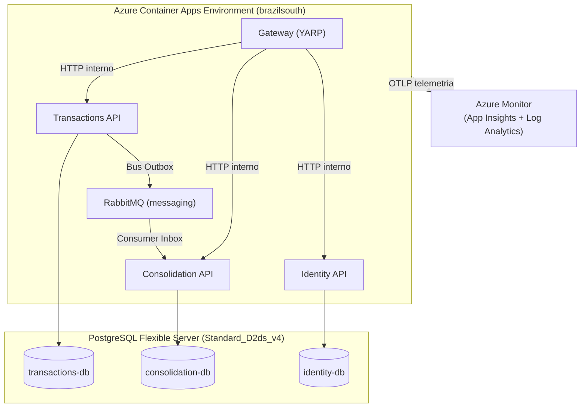
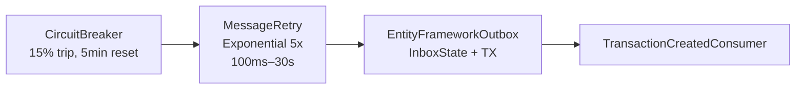

# Plano de Disaster Recovery — CashFlow

> **Última revisão:** Março 2026
> **Infraestrutura:** Azure Container Apps + PostgreSQL Flexible Server (brazilsouth)

## Índice

1. [Objetivos de Recuperação (RPO/RTO)](#1-objetivos-de-recuperação-rporto)
2. [Mapa de Componentes e Dependências](#2-mapa-de-componentes-e-dependências)
3. [Mecanismos de Resiliência Implementados](#3-mecanismos-de-resiliência-implementados)
4. [Classificação de Incidentes](#4-classificação-de-incidentes)
5. [Runbooks por Cenário de Falha](#5-runbooks-por-cenário-de-falha)
6. [Alertas e Detecção](#6-alertas-e-detecção)
7. [Teste de Restore (Procedimento Mensal)](#7-teste-de-restore-procedimento-mensal)
8. [Gaps Conhecidos e Roadmap](#8-gaps-conhecidos-e-roadmap)

---

## 1. Objetivos de Recuperação (RPO/RTO)

| Métrica | Meta | Justificativa |
|---|---|---|
| **RPO** (Recovery Point Objective) | **< 5 minutos** | WAL contínuo do Azure PostgreSQL Flexible Server |
| **RTO** (Recovery Time Objective) | **< 4 horas** | Restore PITR + redeploy de Container Apps |
| **Retenção de backup** | **35 dias (PITR)** | Configurado em `backupRetentionDays: 35` no Bicep |

### Onde os dados vivem

| Dado | Localização | RPO efetivo |
|---|---|---|
| Lançamentos (command side) | `transactions-db` (PostgreSQL) | < 5 min |
| Consolidados diários (query side) | `consolidation-db` (PostgreSQL) | < 5 min |
| Identidade/Usuários | `identity-db` (PostgreSQL) | < 5 min |
| Mensagens no Outbox | `transactions.OutboxMessage` (PostgreSQL) | < 5 min |
| Mensagens em trânsito no broker | RabbitMQ (Azure File volume) | Depende do volume LRS/ZRS |
| Output Cache do Consolidation | In-memory (Kestrel) | N/A — efêmero, reconstruído automaticamente |

O Consolidation é um **read model derivado**. Em perda total, pode ser reconstruído a partir das transactions via republishing de eventos.

---

## 2. Mapa de Componentes e Dependências



### Impacto por dependência

| Serviço | Depende de | Impacto se dependência falhar |
|---|---|---|
| **Gateway** | Transactions, Consolidation, Identity | HTTP 503 nas rotas afetadas (YARP marca destination unhealthy) |
| **Transactions API** | `transactions-db`, RabbitMQ | DB down → HTTP 500. RabbitMQ down → aceita transactions normalmente (outbox persiste no PostgreSQL) |
| **Consolidation API** | `consolidation-db`, RabbitMQ | DB down → consumer falha, circuit breaker abre. RabbitMQ down → consumer desconecta, mensagens acumulam no outbox |
| **Identity API** | `identity-db` | Login/registro falham (HTTP 500) |

---

## 3. Mecanismos de Resiliência Implementados

### Pipeline do Consumer MassTransit



| Camada | Configuração | Falha tratada |
|---|---|---|
| **Circuit Breaker** | 15% trip threshold, 10 msgs mínimo, reset 5 min | Falha sustentada do downstream (DB down) |
| **Message Retry** | Exponencial 5× (100ms → 30s), jitter 50ms. Apenas `DbUpdateConcurrencyException` | Conflito de concorrência otimista (`xmin`) |
| **Consumer Outbox/Inbox** | EF Core inbox table para deduplicação | Mensagem duplicada (redelivery, retry, crash do consumer) |
| **Particionamento** | `UsePartitioner(8)` por `{MerchantId}:{Date}` | Elimina conflitos de concorrência entre consumers paralelos |

Após exaustão de todas as camadas: mensagem vai para `<queue>_error` (DLQ nativa do MassTransit). `TransactionFaultConsumer` registra métrica e dispara alerta.

### Bus Outbox (Transactions API)

| Propriedade | Valor |
|---|---|
| `QueryDelay` | 100ms |
| `DuplicateDetectionWindow` | 30 minutos |
| Lock provider | PostgreSQL advisory locks (`UsePostgres()`) |

Se o serviço crashar entre o `SaveChanges` e o publish para o broker, a mensagem sobrevive no `transactions.OutboxMessage` e é entregue no restart.

### Health Checks

| Endpoint | Tipo | Verifica |
|---|---|---|
| `/health` | Readiness | DB connectivity (SELECT 1) + RabbitMQ (MassTransit HealthCheck) |
| `/alive` | Liveness | Self-check (processo vivo) |

### YARP Health Monitoring

| Tipo | Intervalo | Comportamento |
|---|---|---|
| Active | 10s (timeout 5s) | Polls `/health` dos upstreams; marca unhealthy se falhar |
| Passive | `TransportFailureRate` | Marca unhealthy por falhas de transporte; reativa após 2 min |

---

## 4. Classificação de Incidentes

| Severidade | Critério | Tempo de Resposta |
|---|---|---|
| **SEV-1 (Crítico)** | Sistema indisponível para todos; perda de dados iminente | 15 min |
| **SEV-2 (Alto)** | Funcionalidade principal degradada; sem perda de dados | 1 hora |
| **SEV-3 (Médio)** | Funcionalidade secundária impactada; workaround disponível | 4 horas |
| **SEV-4 (Baixo)** | Anomalia sem impacto em usuários | Próximo dia útil |

---

## 5. Runbooks por Cenário de Falha

### 5.1 PostgreSQL — Banco Indisponível

**Severidade:** SEV-1

**Diagnóstico:**

```bash
# Status do servidor
az postgres flexible-server show \
  --name <server-name> \
  --resource-group rg-cashflow-prod \
  --query "{state:state, fqdn:fullyQualifiedDomainName}"

# Conectividade a partir do Container App
az containerapp exec \
  --name transactions \
  --resource-group rg-cashflow-prod \
  --command "pg_isready -h <hostname>"

# Métricas do servidor
az monitor metrics list \
  --resource <postgres-resource-id> \
  --metrics cpu_percent memory_percent active_connections storage_percent \
  --interval PT1M
```

**Recuperação:**

1. **Storage cheio:** `az postgres flexible-server update --storage-size <GB>`. PostgreSQL para de aceitar writes ao atingir 100%.
2. **CPU/Memória saturados:** `az postgres flexible-server update --sku-name Standard_D4ds_v4` (temporário).
3. **Failover de zona:** Com HA Zone Redundant habilitado, failover automático ocorre em ~60–120s.
4. **Servidor irrecuperável:** Executar restore PITR (vide [5.2](#52-postgresql--restore-pitr)).

**Pós-incidente:**
- Mensagens no outbox são entregues automaticamente quando o DB volta.
- Consumer MassTransit reconecta quando o circuit breaker fecha (5 min de reset).
- Output cache repopulado automaticamente nas próximas requests.

---

### 5.2 PostgreSQL — Restore PITR

**Severidade:** SEV-1

**Procedimento:**

```bash
# 1. Identificar o ponto no tempo ANTES da corrupção
az monitor app-insights query \
  --app <app-insights-name> \
  --analytics-query "customMetrics | where name == 'cashflow.transactions.created' | summarize count() by bin(timestamp, 1m) | order by timestamp desc | take 60"

# 2. Criar servidor a partir de PITR
az postgres flexible-server restore \
  --resource-group rg-cashflow-prod \
  --name cashflow-db-restored \
  --source-server /subscriptions/<sub-id>/resourceGroups/rg-cashflow-prod/providers/Microsoft.DBforPostgreSQL/flexibleServers/<original-server> \
  --restore-point-in-time "2026-03-06T10:00:00Z"

# 3. Validar integridade dos dados
psql "host=cashflow-db-restored.postgres.database.azure.com dbname=transactions-db" \
  -c "SELECT COUNT(*) FROM transactions.transactions;"

psql "host=cashflow-db-restored.postgres.database.azure.com dbname=consolidation-db" \
  -c "SELECT date, total_credits, total_debits, transaction_count FROM consolidation.daily_summary ORDER BY date DESC LIMIT 10;"

# 4. Atualizar connection strings nos Container Apps
az containerapp update \
  --name transactions \
  --resource-group rg-cashflow-prod \
  --set-env-vars "ConnectionStrings__transactions-db=Host=cashflow-db-restored.postgres.database.azure.com;..."

# 5. Reiniciar serviços
for svc in transactions consolidation identity; do
  az containerapp revision restart \
    --name $svc \
    --resource-group rg-cashflow-prod \
    --revision $(az containerapp show --name $svc --resource-group rg-cashflow-prod --query "properties.latestReadyRevisionName" -o tsv)
done
```

**RTO estimado:** 2–4 horas.

---

### 5.3 RabbitMQ — Broker Indisponível

**Severidade:** SEV-2

**Impacto:**
- Transactions API: continua funcionando. Mensagens acumulam no `transactions.OutboxMessage`. Sem perda de dados.
- Consolidation API: para de processar eventos. Saldos consolidados ficam desatualizados.

**Diagnóstico:**

```bash
# Status do Container App
az containerapp show \
  --name messaging \
  --resource-group rg-cashflow-prod \
  --query "{runningStatus:properties.runningStatus, revision:properties.latestReadyRevisionName}"

# Logs do container
az containerapp logs show \
  --name messaging \
  --resource-group rg-cashflow-prod \
  --tail 100

# Mensagens acumuladas no outbox
az monitor app-insights query \
  --app <app-insights-name> \
  --analytics-query "customMetrics | where name == 'cashflow.transactions.created' | summarize sum(valueSum) by bin(timestamp, 5m) | order by timestamp desc | take 12"
```

**Recuperação:**

```bash
# Container em crashloop: reiniciar
az containerapp revision restart \
  --name messaging \
  --resource-group rg-cashflow-prod \
  --revision <active-revision>

# Volume corrompido: recriar via azd
azd deploy --no-prompt
```

Após o broker voltar, o Delivery Service entrega automaticamente as mensagens acumuladas no `OutboxMessage`. O gap de consistência fecha gradualmente.

---

### 5.4 Container App — CrashLoop

**Severidade:** SEV-1

**Diagnóstico:**

```bash
# Listar revisões e status
az containerapp revision list \
  --name <service-name> \
  --resource-group rg-cashflow-prod \
  --query "[].{name:name, active:properties.active, state:properties.runningState}" \
  -o table

# Logs da revisão
az containerapp logs show \
  --name <service-name> \
  --resource-group rg-cashflow-prod \
  --tail 200
```

**Recuperação:**

1. **Bug no código:** Rollback para revisão anterior (vide [5.5](#55-deploy-falhado--rollback)).
2. **Dependência indisponível:** Resolver dependência primeiro. Container reinicia automaticamente.
3. **OOM/CPU:** `az containerapp update --name <svc> --resource-group rg-cashflow-prod --cpu 1.0 --memory 2.0Gi`
4. **Secret incorreto:** `az containerapp secret set --name <svc> --resource-group rg-cashflow-prod --secrets "key=value"` + restart da revisão.

---

### 5.5 Deploy Falhado — Rollback

**Severidade:** SEV-1/SEV-2

Todos os Container Apps usam `activeRevisionsMode: Single`. Cada deploy cria nova revisão e roteia 100% do tráfego imediatamente.

**Opção A — Re-deploy do commit anterior (recomendado):**

```bash
git log --oneline -10
git checkout <last-good-commit>
azd deploy --no-prompt
git checkout main
```

**Opção B — Reativar revisão anterior via CLI (mais rápido):**

```bash
# Listar revisões
az containerapp revision list \
  --name <service-name> \
  --resource-group rg-cashflow-prod \
  -o table

# Mudar para modo multiple (necessário para traffic splitting)
az containerapp revision set-mode \
  --name <service-name> --resource-group rg-cashflow-prod --mode multiple

# Rotear 100% para a revisão anterior
az containerapp ingress traffic set \
  --name <service-name> --resource-group rg-cashflow-prod \
  --revision-weight <old-revision>=100 <bad-revision>=0

# Após estabilizar, voltar para single
az containerapp revision set-mode \
  --name <service-name> --resource-group rg-cashflow-prod --mode single
```

---

### 5.6 Mensagens em Dead Letter Queue

**Severidade:** SEV-2

Mensagens chegam na DLQ (`<queue>_error`) após esgotar 5 retries exponenciais (~30s total de tentativas).

**Diagnóstico:**

```bash
# Identificar erro via Application Insights
az monitor app-insights query \
  --app <app-insights-name> \
  --analytics-query "
    exceptions
    | where cloud_RoleName == 'consolidation'
    | where timestamp > ago(2h)
    | summarize count() by type, outerMessage
    | order by count_ desc
  "
```

**Recuperação:**

1. Corrigir a causa raiz (bug no consumer, schema mismatch, dado inválido).
2. Reprocessar mensagens via RabbitMQ Management UI: Queue `<queue>_error` → Move messages → fila original.
3. Validar integridade do saldo consolidado:

```sql
-- Saldo real do consolidado
SELECT date, total_credits, total_debits, transaction_count
FROM consolidation.daily_summary
WHERE merchant_id = '<affected-merchant>'
  AND date = '<affected-date>';

-- Comparar com soma real das transactions
SELECT
  SUM(CASE WHEN type = 'Credit' THEN value_amount ELSE 0 END) AS expected_credits,
  SUM(CASE WHEN type = 'Debit' THEN value_amount ELSE 0 END) AS expected_debits,
  COUNT(*) AS expected_count
FROM transactions.transactions
WHERE merchant_id = '<affected-merchant>'
  AND reference_date = '<affected-date>';
```

---

### 5.7 Consistência Eventual Degradada

**Severidade:** SEV-1 (delta > 100 eventos por 10+ min)

**Causas e diagnóstico:**

| Causa | Diagnóstico | Ação |
|---|---|---|
| Consumer parado | Logs do Consolidation API | Reiniciar container |
| Circuit breaker aberto | Buscar "circuit breaker" nos logs | Resolver causa raiz do downstream |
| PostgreSQL lento | CPU/connections do DB | Escalar SKU |
| Backlog de outbox | Count de `OutboxMessage` no DB | Aguardar drain; verificar Delivery Service |

**Monitoramento do delta via KQL:**

```
let created = customMetrics | where name == "cashflow.transactions.created" | summarize Created = sum(valueSum) by bin(timestamp, 5m);
let processed = customMetrics | where name == "cashflow.consolidation.events_processed" | summarize Processed = sum(valueSum) by bin(timestamp, 5m);
created | join kind=leftouter processed on timestamp | extend Delta = Created - coalesce(Processed, 0) | render timechart
```

---

### 5.8 Gateway Indisponível

**Severidade:** SEV-1

```bash
# Status do Gateway
az containerapp show \
  --name gateway \
  --resource-group rg-cashflow-prod \
  --query "{fqdn:properties.configuration.ingress.fqdn, status:properties.runningStatus}"

# Testar health diretamente
curl -v https://<gateway-fqdn>/alive
```

Verificar [Azure Status](https://status.azure.com/) se o problema for da plataforma.

---

### 5.9 Perda de Região Azure (Disaster Regional)

**Severidade:** SEV-1 | RTO alvo: < 4 horas

**Pré-requisitos obrigatórios:**
- `geoRedundantBackup: Enabled` no PostgreSQL Flexible Server
- ACR com geo-replicação (Premium SKU)

**Procedimento:**

```bash
# 1. Provisionar na região secundária
azd env set AZURE_LOCATION "<secondary-region>"
azd provision --no-prompt

# 2. Restaurar PostgreSQL a partir do geo-backup
az postgres flexible-server geo-restore \
  --resource-group rg-cashflow-dr \
  --name cashflow-db-dr \
  --source-server /subscriptions/<sub-id>/resourceGroups/rg-cashflow-prod/providers/Microsoft.DBforPostgreSQL/flexibleServers/<original-server> \
  --location <secondary-region>

# 3. Deploy dos serviços
azd deploy --no-prompt

# 4. Atualizar DNS para o novo gateway FQDN
# 5. Validar: criar transaction e verificar consolidation
```

---

## 6. Alertas e Detecção

### Alertas Configurados (Azure Monitor)

| Alerta | Sev | Trigger | Canal |
|---|---|---|---|
| `cashflow-healthcheck-failure` | 1 | Health check falhando por 2 de 5 janelas de 5 min | Email |
| `cashflow-consistency-delta` | 1 | Delta created vs processed > 100 por 10+ min | Email |
| `cashflow-dlq-depth` | 2 | `cashflow.messaging.dlq_faults > 0` em qualquer janela | Email |
| `cashflow-consolidation-latency-p95` | 2 | p95 > 200ms por 5+ min consecutivos | Email |
| `cashflow-http-5xx-rate` | 2 | 5xx rate > 5% (min 10 req/min) por 5+ min | Email |
| `cashflow-eventual-consistency-p95` | 2 | p95 > 5000ms por 5+ min | Email |
| `cashflow-ingestion-rate-low` | 2 | < 50 events/s por 3 de 5 janelas | Email |
| `cashflow-consolidation-throughput-low` | 3 | < 50 req/s por 3 de 5 janelas | Log only |

### Gaps de Alertas (roadmap)

| Gap | Risco | Recomendação |
|---|---|---|
| Sem alerta de CPU/storage do PostgreSQL | Disco cheio sem aviso | Adicionar alert para `storage_percent > 80%` |
| Sem alerta de restart do RabbitMQ | Perda silenciosa de estado do broker | Alert para container restart count |
| Canal único (email) | Resposta lenta fora de horário | Integrar PagerDuty/webhook para SEV-1 |

---

## 7. Teste de Restore (Procedimento Mensal)

> Um backup não testado não é um backup.

**Checklist:**

- [ ] Data do teste: ____
- [ ] Executado por: ____

```bash
# 1. Provisionar servidor de teste a partir do backup do dia anterior
az postgres flexible-server restore \
  --resource-group rg-cashflow-restore-test \
  --name cashflow-restore-$(date +%Y%m%d) \
  --source-server <production-server-name> \
  --restore-point-in-time "$(date -u -v-1d '+%Y-%m-%dT%H:%M:%SZ')"

# 2. Validar integridade
psql "host=cashflow-restore-$(date +%Y%m%d).postgres.database.azure.com dbname=transactions-db" -c "SELECT COUNT(*) FROM transactions.transactions;"
psql "host=cashflow-restore-$(date +%Y%m%d).postgres.database.azure.com dbname=consolidation-db" -c "SELECT merchant_id, date, total_credits, total_debits FROM consolidation.daily_summary ORDER BY date DESC LIMIT 10;"
psql "host=cashflow-restore-$(date +%Y%m%d).postgres.database.azure.com dbname=transactions-db" -c "SELECT COUNT(*) FROM transactions.\"OutboxMessage\" WHERE delivered IS NULL;"

# 3. Limpar recursos de teste
az group delete --name rg-cashflow-restore-test --yes --no-wait
```

**Resultado esperado:**

| Item | Meta |
|---|---|
| RTO medido | < 4 horas |
| Dados íntegros | Sim |
| Mensagens pendentes no outbox | 0 ou poucas |

---

## 8. Gaps Conhecidos e Roadmap

### Infraestrutura

| Gap | Risco | Ação | Prioridade | Status |
|---|---|---|---|---|
| `AllowAllAzureIps` no PostgreSQL | Qualquer serviço Azure pode tentar conexão | Private endpoint + VNet injection | P2 | Aberto |
| RabbitMQ single-replica em LRS | SPOF na mensageria | Azure Service Bus ou ZRS | P2 | Aberto |
| ACR Basic (sem geo-replicação) | Image pull falha se região cair | Upgrade para Premium | P2 | Aberto |
| `activeRevisionsMode: Single` | Deploy sem zero-downtime | Mudar para Multiple + traffic splitting | P2 | Aberto |
| Sem VNet injection | Comunicação exposta | VNet dedicada | P2 | Aberto |

### Operacional

| Gap | Risco | Ação | Prioridade |
|---|---|---|---|
| Alertas apenas por email | Resposta lenta fora de horário | Integrar PagerDuty/OpsGenie | P1 |
| Log Analytics sem daily cap | Custo descontrolado (histórico: 93.6% do custo total) | Manter `dailyQuotaGb: 1` + sampling 10% | P1 |
| Sem rotação automática de secrets | Risco de credenciais expostas | Migrar para Azure Key Vault | P2 |
| Retenção de logs padrão (30 dias) | Perda de logs para auditoria | Configurar 90+ dias | P2 |
| Teste de DR apenas manual | Validação propensa a erro | Script de teste mensal automatizado no CI | P3 |

> Referência: para arquitetura detalhada, ADRs e diagramas C4, consulte [`architecture.md`](architecture.md).
